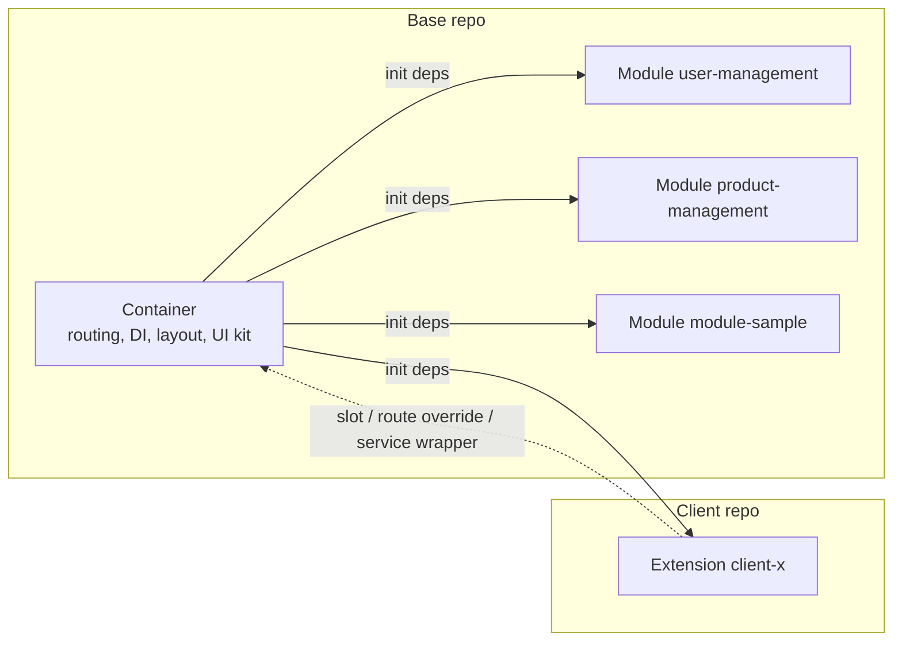

# Architecture Guide — Modular Web Platform

This document explains **how this modular web platform is put together**: one stable *container* (shell), business feature modules selected via config, and one *extension* per client for customization. It targets new developers who already know React hooks and basic TypeScript; every technical term is defined the first time it appears. Part I (§1–§3) provides orientation and a mental model; Part II (§4–§15) covers each mechanism in technical detail. This document explains *how it works*; binding rules (must/must not) live in `CONTRACT`. Indonesian version: `ARCHITECTURE.md`.

**Reader map:**

| If you...                                                            | Start from                       |
| -------------------------------------------------------------------- | -------------------------------- |
| Are new to the project and need the big picture                      | Part I — Orientation (§1–§3)     |
| Need technical detail on one mechanism (DI, routing, slots, build)   | Part II — Detail (§4–§15)        |
| Need normative rules (must/must not)                                 | `CONTRACT`                       |
| Need deployment/operational steps                                    | `DEPLOYMENT-GUIDE`               |
| Need step-by-step code examples                                      | `DEVELOPER-GUIDE`                |

---

## 1. What Is Built & Why Modular

A modular web platform for **multiple clients**: one codebase is deployed for many clients, with per-client module selection and customization. *Modular* means the app is not built as one monolithic block; it is assembled from three kinds of parts:

| Part          | Role                                                                                                           |
| ------------- | -------------------------------------------------------------------------------------------------------------- |
| **Container** | Application shell: boot, config, dependency injection (DI), auth, routing host, layout, and every registry     |
| **Module**    | Self-contained business feature: pages, menu, services, modals, state, and translations                        |
| **Extension** | Customization for one client: slots, route overrides, service wrappers, extra services and translations        |

Jargon: *dependency injection* (DI) means the container prepares a single object holding all services (called `deps`) and hands it to modules and extensions at boot, so they never create those instances themselves.

**Platform characteristics:**

- React 19 + Vite + TypeScript.
- Multi-client: many clients share the same container and modules; differences live in the extension.
- Dozens of business modules — currently `user-management`, `product-management`, and `module-sample`.
- Backend microservices are reached via **path-based routing** (`/api/<service>`), e.g. the `auth` service at `/api/auth` (`web-container/src/di/deps.ts:45`).
- Per-client deployment: the base is built once as a base image, then each client builds a client image `FROM` that base image (see `DEPLOYMENT-GUIDE` §1).

**A quick example.** The `module-sample` module registers its own pages, menu, service, and modal via `init(deps)` (`web-modules/modules/module-sample/index.tsx:14`). The `client-a` extension never touches that module; it fills the `module-sample.overviewPanel` slot and overrides the `/module-sample/extension-points` route (`web-extension-client-a/src/index.tsx:32`). This pattern repeats throughout the document: **the base provides extension points, the client plugs in**.

### 1.1 Without Modular vs With Modular

| Aspect                              | Without modular                        | With modular                                        |
| ----------------------------------- | -------------------------------------- | --------------------------------------------------- |
| A change for client A               | Can break client B                     | Isolated inside client A's extension                |
| Bundle                              | Every feature is loaded                | Only modules listed in `config.modules`             |
| Onboarding a new client developer   | Must dig through the entire codebase   | Base repo (read) + small extension is enough        |
| Product cadence vs client requests  | Get in each other's way                | Run in parallel: stable base, isolated extension    |

### 1.2 Seven Philosophy Principles

These principles shape every design decision. Their hard rules live in `CONTRACT` §1.

| Principle                          | Meaning                                                    | Consequence                                                                     |
| ---------------------------------- | ---------------------------------------------------------- | ------------------------------------------------------------------------------- |
| **Container doesn't know modules** | The shell never imports module code                        | Modules are found from `config.modules` (discovery), not hardcoded              |
| **Modules don't know extensions**  | A module never mentions a client name                      | Customization goes through slots, not `if (client === 'client-a')`              |
| **Extension knows the base**       | An extension may import the container and module public APIs | The extension has one clear entry point: `init(deps)`                         |
| **Public API as contract**         | Each layer exposes only specific files                     | `@arsi/container`, `@arsi/shared`, `modules/<name>/public.ts` (`CONTRACT` §1.4) |
| **Config-driven**                  | Module selection and URLs come from runtime config         | No hardcoding; config is injected when the container starts                     |
| **Fail-fast**                      | Duplicate service, slot, or route throws immediately       | Mistakes surface at boot, not silently in production                            |
| **One image, many environments**   | Staging/production differ only by env vars at start        | Change API base/modules without rebuilding the image                            |

---

## 2. Repo Map & Ownership

In production there are **two kinds of repos**: one **base repo** owned by the platform team, and one **client repo** per client owned by that client's developer. The tables below map their contents.

**Base repo (`arsi-web-base`):**

| Path                           | Contents                                                                                                                             | Owner         |
| ------------------------------ | ------------------------------------------------------------------------------------------------------------------------------------ | ------------- |
| `web-container/`               | Shell: boot (`src/bootstrap/`), DI (`src/di/deps.ts`), auth, routing host, layout, registries, API client, i18n, toast/modal/notifications | Platform team |
| `web-modules/`                 | `shared/` (UI kit, hooks, utils) + `modules/<name>/` (business features)                                                             | Platform team |
| `web-extension-default/`       | No-op extension used to run the base standalone (`client: "base"`)                                                                   | Platform team |
| `web-extension-template/`      | Starting point for a new client repo                                                                                                 | Platform team |
| `docs/`                        | `ARCHITECTURE`, `CONTRACT`, `DEVELOPER-GUIDE`, `DEPLOYMENT-GUIDE`                                                                    | Platform team |
| `Dockerfile` + `.dockerignore` | Builds 2 base images: builder (`node:22-alpine`) and runtime (`nginx:1.27-alpine`)                                                   | Platform team |
| `ci/build-base.sh`             | Base image build + push script                                                                                                       | Platform team |

**Client repo (`arsi-web-client-<x>`, checkout `web-extension-client-<x>`):**

| Path                      | Contents                                                                              | Owner           |
| ------------------------- | ------------------------------------------------------------------------------------- | --------------- |
| `manifest.json`           | Client identity: `client`, `baseVersion` (exact pin to the base tag), modules, overrides | Client developer |
| `src/index.tsx`           | Entry point `init(deps)` — the extension's only way in                                 | Client developer |
| `src/components/`         | Client-specific components (e.g. `AuditButton`)                                        | Client developer |
| `src/overrides/<module>/` | Per-module overrides (e.g. `user-management/ClientAUserDetail.tsx`)                    | Client developer |
| `Dockerfile`              | Client image: `FROM` base builder → `FROM` base runtime                               | Client developer |
| `ci/build-client.sh`      | Client image build + push script                                                       | Client developer |

> **Sample workspace note.** This repo is a sample workspace with a **flat layout**: `web-container/`, `web-modules/`, `web-extension-default/`, `web-extension-template/`, and `web-extension-client-a/` sit side by side in one folder. In production, `web-extension-client-<x>` is the contents of a separate repo `arsi-web-client-<x>`; during development that repo is checked out next to the base repo because path mapping assumes a *sibling* position (`DEPLOYMENT-GUIDE` §3).

### 2.1 Who Changes What

| Change                                        | Changed in                     | Discussion needed?       |
| --------------------------------------------- | ------------------------------ | ------------------------ |
| Add/modify a business module                  | `web-modules/modules/<name>`   | No                       |
| Add a shared UI component                     | `web-modules/shared`           | No                       |
| Change the shell, DI, or container public API | `web-container`                | Yes — lead dev           |
| Customize one client                          | `web-extension-client-<x>`     | No                       |
| Bump the `baseVersion` a client uses          | the client's `manifest.json`   | Yes — schedule base adoption |
| Create a new client repo                      | Copy `web-extension-template`  | Yes                      |

Ownership principle: a client developer **may read** the base repo but **may not change it**; base-level needs are proposed via a PR to the platform team. Conversely, the base never touches extension code.

### 2.2 What Is Not in the Client Repo

The client repo intentionally stays small. It does not contain:

- `web-container/` and `web-modules/` — they come from the base builder image at client image build time (`/app/web-container`, `/app/web-modules`).
- `moduleLoaders.generated.ts` — generated by the container from each module's `package.json`, not copied to clients.
- `/config.json` — written by `entrypoint.sh` at container start from env vars (`VITE_*`), not a committed file.
- Other clients' code — there is no cross-client access.

---

## 3. Ten-Minute Mental Model

### 3.1 Building Analogy

Think of the platform as a **building**:

- The **container** is the building plus its shared facilities — structure, electricity, elevators, security. It provides auth, routing, layout, DI, and registries; it does not know what each room holds.
- A **module** is a tenant that furnishes its own room — a business feature (`user-management`, `module-sample`) complete with its pages, menu, services, and state.
- An **extension** is decoration or renovation for one specific client — adding a panel, replacing a page, or wrapping logic, without changing the building's foundation.

### 3.2 Three Terms

| Term          | Short definition                                                                                                                                                            | Example in this repo                             |
| ------------- | --------------------------------------------------------------------------------------------------------------------------------------------------------------------------- | ------------------------------------------------ |
| **Container** | The React application that boots, provides config, DI, auth, routing host, layout, and every registry. Only its public API (`@arsi/container`) may be used by modules/extensions. | `web-container/src/di/deps.ts:23`                |
| **Module**    | A self-contained business feature package that registers menu, routes, services, modals, and i18n via `init(deps)`; its contract is `public.ts`. Selected per client via `config.modules`. | `web-modules/modules/module-sample/index.tsx:14` |
| **Extension** | A per-client customization package that also has `init(deps)`; it fills slots, overrides routes, and adds services/i18n. It is never imported by the base.                  | `web-extension-client-a/src/index.tsx:32`        |

### 3.3 Block Diagram



Key takeaway: **the container calls, modules and extensions register**. At boot, the container creates one `deps` object holding 13 services — `config`, `logger`, `api`, `apiRegistry`, `events`, `i18n`, `queryClient`, `toast`, `modal`, `notifications`, `slots`, `routes`, `menu` (`web-container/src/di/deps.ts:23`) — then `discover()` calls `init(deps)` for every module in `config.modules`, and finally for the extension (`web-container/src/bootstrap/discover.ts:12`). Modules register themselves; the dotted arrow from the extension means the extension *adjusts* what is already registered, rather than being called back by the container.

### 3.4 The Boot Flow on One Screen

```
main.tsx
  └─ loadConfig()            → fetch /config.json
  └─ bootstrap(config)       → createDeps + discover
       ├─ discover()         → init(deps) for each module in config.modules, then the extension
       └─ createBrowserRouter(...) → build routes from the registry
  └─ createRoot(...).render(<RouterProvider router={router} />)
```

The order matters: config is read first, `deps` is created **once**, all `init` calls finish, and only then are the router and React rendered. Each step is detailed in Part II.

### 3.5 Where to Start Reading Code

| To see...                              | Open                                              |
| -------------------------------------- | ------------------------------------------------- |
| The app entry point and boot           | `web-container/src/main.tsx:11`                   |
| The `deps` contract (13 services)      | `web-container/src/di/deps.ts:23`                 |
| A complete example module              | `web-modules/modules/module-sample/index.tsx:14`  |
| An example client extension            | `web-extension-client-a/src/index.tsx:32`         |

### 3.6 One Real Flow

An example from this repo — log in as client `client-a`, then browse the app:

| What happens                                   | Who handles it                                                                                                       |
| ---------------------------------------------- | -------------------------------------------------------------------------------------------------------------------- |
| The "Users" menu item appears                  | The `user-management` module registers the menu; the client-a extension overrides the i18n label to "Client A Users"  |
| The user list page (`/users`) opens            | A route owned by the `user-management` module; the extension adds an audit button via the `user-management.userTableActions` slot |
| The user detail page (`/users/:id`) opens      | The route is overridden by the client-a extension → the `ClientAUserDetail` component                                 |
| The `/module-sample/extension-points` page opens | The route is overridden by the extension; a panel on that page is also filled via the `module-sample.overviewPanel` slot |

Everything the client "added" happens without changing module code. That is the payoff of this architecture.

Next: Part II (§4–§15) covers the boot sequence, the `deps` contract in detail, routing, slots, overrides, and finally build and deployment.
