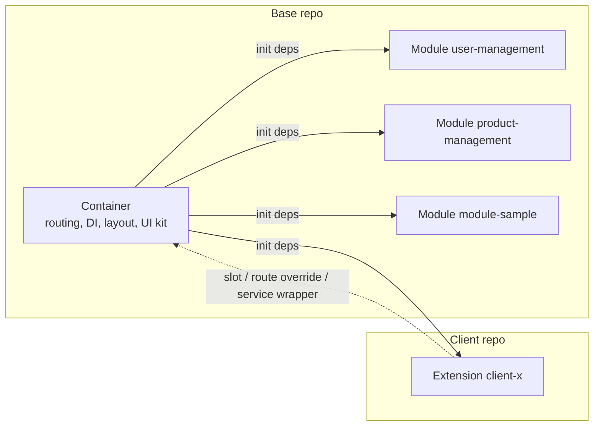
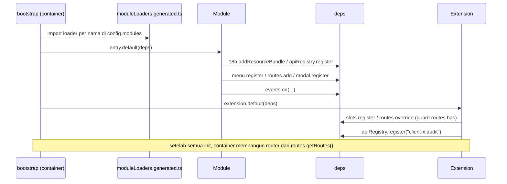
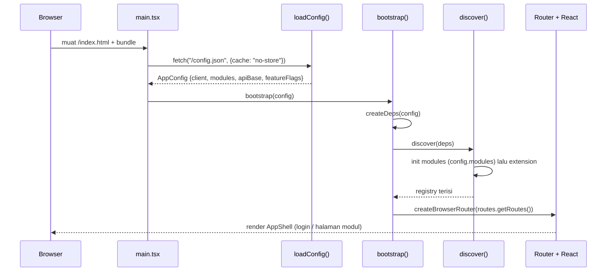

# Architecture Guide — Modular Web Platform

This document explains **how this modular web platform is put together**: one stable *container* (shell), business feature modules selected via config, and one *extension* per client for customization. It targets new developers who already know React hooks and basic TypeScript; every technical term is defined the first time it appears. Part I (§1–§3) provides orientation and a mental model; Part II (§4–§15) covers each mechanism in technical detail. This document explains *how it works*; binding rules (must/must not) live in `CONTRACT`. Indonesian version: `ARCHITECTURE.md`.

**Reader map:**

| If you...                                                            | Start from                       |
| -------------------------------------------------------------------- | -------------------------------- |
| Are new to the project and need the big picture                      | Part I — Orientation (§1–§3)     |
| Need technical detail on one mechanism (DI, routing, slots, build)   | Part II — Detail (§4–§15)        |
| Need normative rules (must/must not)                                 | `CONTRACT`                       |
| Need deployment/operational steps                                    | `DEPLOYMENT-GUIDE`               |
| Need step-by-step code examples                                      | `DEVELOPER-GUIDE`                |

---

## 1. What Is Built & Why Modular

A modular web platform for **multiple clients**: one codebase is deployed for many clients, with per-client module selection and customization. *Modular* means the app is not built as one monolithic block; it is assembled from three kinds of parts:

| Part          | Role                                                                                                           |
| ------------- | -------------------------------------------------------------------------------------------------------------- |
| **Container** | Application shell: boot, config, dependency injection (DI), auth, routing host, layout, and every registry     |
| **Module**    | Self-contained business feature: pages, menu, services, modals, state, and translations                        |
| **Extension** | Customization for one client: slots, route overrides, service wrappers, extra services and translations        |

Jargon: *dependency injection* (DI) means the container prepares a single object holding all services (called `deps`) and hands it to modules and extensions at boot, so they never create those instances themselves.

**Platform characteristics:**

- React 19 + Vite + TypeScript.
- Multi-client: many clients share the same container and modules; differences live in the extension.
- Dozens of business modules — currently `user-management`, `product-management`, and `module-sample`.
- Backend microservices are reached via **path-based routing** (`/api/<service>`), e.g. the `auth` service at `/api/auth` (`web-container/src/di/deps.ts:45`).
- Per-client deployment: the base is built once as a base image, then each client builds a client image `FROM` that base image (see `DEPLOYMENT-GUIDE` §1).

**A quick example.** The `module-sample` module registers its own pages, menu, service, and modal via `init(deps)` (`web-modules/modules/module-sample/index.tsx:14`). The `client-a` extension never touches that module; it fills the `module-sample.overviewPanel` slot and overrides the `/module-sample/extension-points` route (`web-extension-client-a/src/index.tsx:32`). This pattern repeats throughout the document: **the base provides extension points, the client plugs in**.

### 1.1 Without Modular vs With Modular

| Aspect                              | Without modular                        | With modular                                        |
| ----------------------------------- | -------------------------------------- | --------------------------------------------------- |
| A change for client A               | Can break client B                     | Isolated inside client A's extension                |
| Bundle                              | Every feature is loaded                | Only modules listed in `config.modules`             |
| Onboarding a new client developer   | Must dig through the entire codebase   | Base repo (read) + small extension is enough        |
| Product cadence vs client requests  | Get in each other's way                | Run in parallel: stable base, isolated extension    |

### 1.2 Seven Philosophy Principles

These principles shape every design decision. Their hard rules live in `CONTRACT` §1.

| Principle                          | Meaning                                                    | Consequence                                                                     |
| ---------------------------------- | ---------------------------------------------------------- | ------------------------------------------------------------------------------- |
| **Container doesn't know modules** | The shell never imports module code                        | Modules are found from `config.modules` (discovery), not hardcoded              |
| **Modules don't know extensions**  | A module never mentions a client name                      | Customization goes through slots, not `if (client === 'client-a')`              |
| **Extension knows the base**       | An extension may import the container and module public APIs | The extension has one clear entry point: `init(deps)`                         |
| **Public API as contract**         | Each layer exposes only specific files                     | `@arsi/container`, `@arsi/shared`, `modules/<name>/public.ts` (`CONTRACT` §1.4) |
| **Config-driven**                  | Module selection and URLs come from runtime config         | No hardcoding; config is injected when the container starts                     |
| **Fail-fast**                      | Duplicate service, slot, or route throws immediately       | Mistakes surface at boot, not silently in production                            |
| **One image, many environments**   | Staging/production differ only by env vars at start        | Change API base/modules without rebuilding the image                            |

---

## 2. Repo Map & Ownership

In production there are **two kinds of repos**: one **base repo** owned by the platform team, and one **client repo** per client owned by that client's developer. The tables below map their contents.

**Base repo (`arsi-web-base`):**

| Path                           | Contents                                                                                                                             | Owner         |
| ------------------------------ | ------------------------------------------------------------------------------------------------------------------------------------ | ------------- |
| `web-container/`               | Shell: boot (`src/bootstrap/`), DI (`src/di/deps.ts`), auth, routing host, layout, registries, API client, i18n, toast/modal/notifications | Platform team |
| `web-modules/`                 | `shared/` (UI kit, hooks, utils) + `modules/<name>/` (business features)                                                             | Platform team |
| `web-extension-default/`       | No-op extension used to run the base standalone (`client: "base"`)                                                                   | Platform team |
| `web-extension-template/`      | Starting point for a new client repo                                                                                                 | Platform team |
| `docs/`                        | `ARCHITECTURE`, `CONTRACT`, `DEVELOPER-GUIDE`, `DEPLOYMENT-GUIDE`                                                                    | Platform team |
| `Dockerfile` + `.dockerignore` | Builds 2 base images: builder (`node:22-alpine`) and runtime (`nginx:1.27-alpine`)                                                   | Platform team |
| `ci/build-base.sh`             | Base image build + push script                                                                                                       | Platform team |

**Client repo (`arsi-web-client-<x>`, checkout `web-extension-client-<x>`):**

| Path                      | Contents                                                                              | Owner           |
| ------------------------- | ------------------------------------------------------------------------------------- | --------------- |
| `manifest.json`           | Client identity: `client`, `baseVersion` (exact pin to the base tag), modules, overrides | Client developer |
| `src/index.tsx`           | Entry point `init(deps)` — the extension's only way in                                 | Client developer |
| `src/components/`         | Client-specific components (e.g. `AuditButton`)                                        | Client developer |
| `src/overrides/<module>/` | Per-module overrides (e.g. `user-management/ClientAUserDetail.tsx`)                    | Client developer |
| `Dockerfile`              | Client image: `FROM` base builder → `FROM` base runtime                               | Client developer |
| `ci/build-client.sh`      | Client image build + push script                                                       | Client developer |

> **Sample workspace note.** This repo is a sample workspace with a **flat layout**: `web-container/`, `web-modules/`, `web-extension-default/`, `web-extension-template/`, and `web-extension-client-a/` sit side by side in one folder. In production, `web-extension-client-<x>` is the contents of a separate repo `arsi-web-client-<x>`; during development that repo is checked out next to the base repo because path mapping assumes a *sibling* position (`DEPLOYMENT-GUIDE` §3).

### 2.1 Who Changes What

| Change                                        | Changed in                     | Discussion needed?       |
| --------------------------------------------- | ------------------------------ | ------------------------ |
| Add/modify a business module                  | `web-modules/modules/<name>`   | No                       |
| Add a shared UI component                     | `web-modules/shared`           | No                       |
| Change the shell, DI, or container public API | `web-container`                | Yes — lead dev           |
| Customize one client                          | `web-extension-client-<x>`     | No                       |
| Bump the `baseVersion` a client uses          | the client's `manifest.json`   | Yes — schedule base adoption |
| Create a new client repo                      | Copy `web-extension-template`  | Yes                      |

Ownership principle: a client developer **may read** the base repo but **may not change it**; base-level needs are proposed via a PR to the platform team. Conversely, the base never touches extension code.

### 2.2 What Is Not in the Client Repo

The client repo intentionally stays small. It does not contain:

- `web-container/` and `web-modules/` — they come from the base builder image at client image build time (`/app/web-container`, `/app/web-modules`).
- `moduleLoaders.generated.ts` — generated by the container from each module's `package.json`, not copied to clients.
- `/config.json` — written by `entrypoint.sh` at container start from env vars (`VITE_*`), not a committed file.
- Other clients' code — there is no cross-client access.

---

## 3. Ten-Minute Mental Model

### 3.1 Building Analogy

Think of the platform as a **building**:

- The **container** is the building plus its shared facilities — structure, electricity, elevators, security. It provides auth, routing, layout, DI, and registries; it does not know what each room holds.
- A **module** is a tenant that furnishes its own room — a business feature (`user-management`, `module-sample`) complete with its pages, menu, services, and state.
- An **extension** is decoration or renovation for one specific client — adding a panel, replacing a page, or wrapping logic, without changing the building's foundation.

### 3.2 Three Terms

| Term          | Short definition                                                                                                                                                            | Example in this repo                             |
| ------------- | --------------------------------------------------------------------------------------------------------------------------------------------------------------------------- | ------------------------------------------------ |
| **Container** | The React application that boots, provides config, DI, auth, routing host, layout, and every registry. Only its public API (`@arsi/container`) may be used by modules/extensions. | `web-container/src/di/deps.ts:23`                |
| **Module**    | A self-contained business feature package that registers menu, routes, services, modals, and i18n via `init(deps)`; its contract is `public.ts`. Selected per client via `config.modules`. | `web-modules/modules/module-sample/index.tsx:14` |
| **Extension** | A per-client customization package that also has `init(deps)`; it fills slots, overrides routes, and adds services/i18n. It is never imported by the base.                  | `web-extension-client-a/src/index.tsx:32`        |

### 3.3 Block Diagram



Key takeaway: **the container calls, modules and extensions register**. At boot, the container creates one `deps` object holding 13 services — `config`, `logger`, `api`, `apiRegistry`, `events`, `i18n`, `queryClient`, `toast`, `modal`, `notifications`, `slots`, `routes`, `menu` (`web-container/src/di/deps.ts:23`) — then `discover()` calls `init(deps)` for every module in `config.modules`, and finally for the extension (`web-container/src/bootstrap/discover.ts:12`). Modules register themselves; the dotted arrow from the extension means the extension *adjusts* what is already registered, rather than being called back by the container.

### 3.4 The Boot Flow on One Screen

```
main.tsx
  └─ loadConfig()            → fetch /config.json
  └─ bootstrap(config)       → createDeps + discover
       ├─ discover()         → init(deps) for each module in config.modules, then the extension
       └─ createBrowserRouter(...) → build routes from the registry
  └─ createRoot(...).render(<RouterProvider router={router} />)
```

The order matters: config is read first, `deps` is created **once**, all `init` calls finish, and only then are the router and React rendered. Each step is detailed in Part II.

### 3.5 Where to Start Reading Code

| To see...                              | Open                                              |
| -------------------------------------- | ------------------------------------------------- |
| The app entry point and boot           | `web-container/src/main.tsx:11`                   |
| The `deps` contract (13 services)      | `web-container/src/di/deps.ts:23`                 |
| A complete example module              | `web-modules/modules/module-sample/index.tsx:14`  |
| An example client extension            | `web-extension-client-a/src/index.tsx:32`         |

### 3.6 One Real Flow

An example from this repo — log in as client `client-a`, then browse the app:

| What happens                                   | Who handles it                                                                                                       |
| ---------------------------------------------- | -------------------------------------------------------------------------------------------------------------------- |
| The "Users" menu item appears                  | The `user-management` module registers the menu; the client-a extension overrides the i18n label to "Client A Users"  |
| The user list page (`/users`) opens            | A route owned by the `user-management` module; the extension adds an audit button via the `user-management.userTableActions` slot |
| The user detail page (`/users/:id`) opens      | The route is overridden by the client-a extension → the `ClientAUserDetail` component                                 |
| The `/module-sample/extension-points` page opens | The route is overridden by the extension; a panel on that page is also filled via the `module-sample.overviewPanel` slot |

Everything the client "added" happens without changing module code. That is the payoff of this architecture.

Next: Part II (§4–§15) covers the boot sequence, the `deps` contract in detail, routing, slots, overrides, and finally build and deployment.

---

## 4. Modular Mechanism In Depth

§1–§3 gave the big picture. This part dissects, one by one, the mechanisms modules and extensions use to plug into the container. They all rest on the same pattern: a **registry** — a name → data map object — that the container creates once at boot and hands over through `deps`; modules and extensions register, and the container reads the contents after all init calls finish.

### 4.1 Discovery & Loader Map

*Discovery* means the container finds modules from runtime data (`config.modules`), not from a hardcoded list of `import`s. Between a module name and its code sits a **loader map** of dynamic imports:

```ts
// web-container/src/bootstrap/moduleLoaders.generated.ts:12
export const moduleLoaders: Record<string, () => Promise<ModuleEntryPoint>> = {
  'module-sample': () => import('@arsi/module-module-sample/entry'),
  'product-management': () => import('@arsi/module-product-management/entry'),
  'user-management': () => import('@arsi/module-user-management/entry'),
};
```

This file is **generated**: `scripts/generate-module-loaders.mjs` builds it from each module's `package.json` via `npm run gen:modules`; never edit it by hand. The `predev`, `pretypecheck`, `pretest`, and `prebuild` hooks run it automatically (`web-container/package.json:10-23`).

The loop lives in `discover()`:

```ts
// web-container/src/bootstrap/discover.ts:13
for (const moduleName of deps.config.modules) {
  const load = moduleLoaders[moduleName];
  if (!load) {
    throw new Error(
      `[bootstrap] module "${moduleName}" is declared in config.modules but is not wired in moduleLoaders.generated.ts (run \`npm run gen:modules\`)`,
    );
  }
  const entry = await load();
  await entry.default(deps);
  deps.logger.info(`module "${moduleName}" initialized`);
}
```

Key points:

- Init order follows the order of names in `config.modules`.
- A name in config with no loader in the map → **fail-fast**: boot stops with a message telling you to run `npm run gen:modules` (`discover.ts:16`). A missing feature due to misconfiguration is better surfaced at boot than discovered silently in production.
- After all modules, `discover()` loads the extension through the `@arsi/extension` alias (`discover.ts:10`; mapped at build time to `web-container/current-client/src/index.tsx`, `aliases.cjs:21-24`) and calls `extension.default(deps)` (`discover.ts:26`). The extension **always inits last**; this order is what makes route overrides (§4.4) valid.

### 4.2 `deps` — The Single Services Object (DI)

`deps` is the only channel between the container and module/extension code. `createDeps(config)` (`web-container/src/di/deps.ts:39`) creates it once at boot (`web-container/src/bootstrap/index.tsx:19`), then the same object is handed to every `init(deps)`. It holds 13 services (`web-container/src/di/deps.ts:23`):

| Field           | Purpose                                                                             |
| --------------- | ----------------------------------------------------------------------------------- |
| `config`        | `AppConfig` produced by `loadConfig()`: `client`, `modules`, `apiBase`, `featureFlags` |
| `logger`        | Client-prefixed logger; level `debug` in dev, `info` in production                  |
| `api`           | Base axios instance for the platform backend                                        |
| `apiRegistry`   | Per-name service registry (§4.5); the core `auth` service is pre-registered         |
| `events`        | Cross-module event bus (§4.7)                                                       |
| `i18n`          | i18next instance; `addResourceBundle` registers per-namespace translations          |
| `queryClient`   | React Query query client                                                            |
| `toast`         | Toast service (lightweight, self-dismissing notifications)                          |
| `modal`         | Modal registry + controls (§4.6)                                                    |
| `notifications` | Persistent notification service                                                     |
| `slots`         | UI slot registry (§4.3)                                                             |
| `routes`        | Host route registry (§4.4)                                                          |
| `menu`          | Sidebar menu registry (§4.6)                                                        |

The only registration `createDeps` performs itself is the core `auth` service:

```ts
// web-container/src/di/deps.ts:45
apiRegistry.register('auth', createServiceClient('/api/auth'));
```

Modules and extensions **never** create their own i18n, router, or query client instances — they receive `deps` and register into it.

### 4.3 Slot — UI Extension Point

A **slot** is a named placeholder in the UI that a component from outside the module can fill. Three steps:

**1. The module declares the slot name.** The name lives in `slots.ts` and is exported through `public.ts` so extensions can import it (`web-modules/modules/module-sample/public.ts:8`):

```ts
// web-modules/modules/module-sample/slots.ts:2
export const sampleSlots = {
  overviewPanel: 'module-sample.overviewPanel',
} as const;
```

The convention is `<module>.<slot>` so names cannot collide across modules.

**2. The module's component consumes the slot** through the `useSlot` hook from `@arsi/container`:

```tsx
// web-modules/modules/module-sample/pages/SampleExtensionPage.tsx:11
const Panel = useSlot<{ label?: string }>(sampleSlots.overviewPanel);
```

`useSlot` only reads the registry (`web-container/src/hooks/useSlot.ts:5`; exported from `web-container/src/public/index.ts:16`). When nothing has filled the slot yet, it returns `undefined` and the module renders its own fallback (`SampleExtensionPage.tsx:49`).

**3. The extension fills the slot** via `deps.slots.register(name, component)` — e.g. `AuditButton` for `userSlots.userTableActions` (`web-extension-client-a/src/index.tsx:62`) and `ClientASamplePanel` for `sampleSlots.overviewPanel` (`:70`):

```tsx
// web-extension-client-a/src/index.tsx:70
deps.slots.register(sampleSlots.overviewPanel, ClientASamplePanel);
```

A slot may hold only **one** component: a second registration throws `[slots] slot "..." already has a component registered` (`web-container/src/slots/slotRegistry.ts:17`). `get` and `has` (`:21`, `:24`) cover reads. The rule of the game: the module declares, the extension fills, and the module never knows who filled it.

### 4.4 Route — Host Route Registry

Modules register routes via `deps.routes.add({ path, element, meta })`:

```tsx
// web-modules/modules/module-sample/index.tsx:36
deps.routes.add({
  path: '/module-sample',
  element: <SampleOverviewPage />,
  meta: { group: 'sample', module: 'module-sample' },
});
```

- `meta.module` is **required** — the host uses it to tie a route to its owning module (and `group` for navigation grouping).
- A duplicate path → error `[routes] route "..." is already registered` (`web-container/src/routes/routeRegistry.ts:27`). Without this rule, two modules could silently overwrite each other's pages.
- Extensions adjust routes with `override(path, { element, meta })`; this is only allowed for an already-registered path, otherwise → error `[routes] cannot override unknown route "..."` (`routeRegistry.ts:33`).

Because the same extension may be installed for clients with a different subset of modules, it checks with `has(path)` first. The `overrideIfPresent` pattern in client-a:

```tsx
// web-extension-client-a/src/index.tsx:25
if (!deps.routes.has(path)) {
  deps.logger.warn(`[client-a] route "${path}" belum terdaftar; override dilewati`);
  return;
}
deps.routes.override(path, definition);
```

If the `user-management` module is not in `config.modules`, the `/users/:id` override is skipped with a warning instead of failing boot.

The container builds the router from `getRoutes()` **after** discovery: module routes are attached as children under `/` (behind `ProtectedRoute` + `AppShell`, `web-container/src/bootstrap/index.tsx:28-41`), with the leading slash stripped during mapping (`bootstrap/index.tsx:24`). The full flow is in §5.

### 4.5 Service Registry (`apiRegistry`)

All backend access goes through a named registry so modules never import each other's axios instances. A module registers its own instance:

```ts
// web-modules/modules/module-sample/index.tsx:23
const sampleClient = axios.create({
  baseURL: deps.config.apiBase,
  timeout: 8000,
});
deps.apiRegistry.register('module-sample', sampleClient);
```

- A module's service name = the module name (`'module-sample'`).
- Extension convention: **client name prefix** — `<client>.<service>` — e.g. `deps.apiRegistry.register('client-a.audit', auditClient)` (`web-extension-client-a/src/index.tsx:60`). That makes it impossible for an extension service to collide with a base service.
- The core `auth` service is registered by the container (`web-container/src/di/deps.ts:45`).
- Duplicate → error `[apiRegistry] service "..." is already registered` (`web-container/src/api/apiRegistry.ts:15`); `get(name)` throws for an unknown name (`:22`); `has` is available for checks.
- In components, the registry is read through `useApiRegistry` from `@arsi/container` (`web-container/src/public/index.ts:4`), for example `SampleExtensionPage.tsx:14`.

### 4.6 Menu & Modal

**Menu.** The host sidebar is built from `deps.menu.getAll()`. A module registers one item per main page:

```ts
// web-modules/modules/module-sample/index.tsx:29
deps.menu.register({
  path: '/module-sample',
  label: 'menu.root',
  namespace: 'module-sample',
  order: 30,
});
```

`label` is an **i18n key**, not final text; `namespace` points at the translation bundle the module registered in `index.tsx:20`, so labels follow the active language. `getAll()` returns items sorted by `order` ascending (`web-container/src/menu/menuRegistry.ts:23`). A duplicate path → error `[menu] menu item "..." is already registered` (`:19`).

**Modal.** A modal is a React component the host renders when opened, with an arbitrary payload:

```ts
// web-modules/modules/module-sample/index.tsx:50
deps.modal.register(sampleModals.info, SampleInfoModal);
```

`sampleModals.info` equals `'module-sample.info'` (`web-modules/modules/module-sample/modals.ts:2`) — the `<module>.<modal>` convention. A modal component receives `{ payload, close }` props (`web-container/src/modal/modalService.ts:3`); open it via `deps.modal.open(name, payload)` (`:42`) or the `useModal` hook (`web-container/src/public/index.ts:11`). A duplicate name → error `[modal] "..." is already registered` (`modalService.ts:38`).

### 4.7 Event Bus — Communication Without Coupling

`deps.events` is a simple **event bus** (publish–subscribe): a sender calls `emit(name, payload)` and every handler registered via `on(name, handler)` is invoked — neither side knows the other. The implementation is a `Map<string, Set<handler>>` (`web-container/src/events/eventBus.ts:11`); `on` returns an unsubscribe function (`:18`).

```tsx
// web-modules/modules/module-sample/index.tsx:52 — publisher
deps.events.on<SamplePostCreatedPayload>(sampleEvents.postCreated, (payload) => {
  deps.logger.info('module-sample: post created', payload);
});
```

```tsx
// web-extension-client-a/src/index.tsx:78 — subscriber
deps.events.on<UserUpdatedPayload>(userEvents.updated, (payload) => {
  void deps.queryClient.invalidateQueries({ queryKey: userKeys.detail(payload.id) });
});
```

Event names are always namespaced (`module-sample.sample.postCreated`, `web-modules/modules/module-sample/events.ts:2`) and payload types are exported through `public.ts`, so the receiving side never needs to know the module's internals. This is the main channel for cross-module actions — e.g. the client-a extension refreshes its React Query cache when the `user-management` module `emit`s `userEvents.updated`. Details in §10.

**Init order at a glance.** This diagram summarizes who calls what:



---

## 5. End-to-End Boot Sequence

Here is the full journey from the browser opening the app to React rendering, in six steps:

1. **The browser loads the bundle.** `/index.html` and the built JS bundle load; the entry point is `main()` in `web-container/src/main.tsx:11`.
2. **Config is read.** `loadConfig()` calls `fetch('/config.json', { cache: 'no-store' })` (`web-container/src/config/loadConfig.ts:25`) and normalizes the body into `AppConfig`: `{ client, modules, apiBase, featureFlags }`.
3. **`deps` is created.** `main.tsx:13` calls `bootstrap(config)`; inside, `createDeps(config)` creates `deps` once (`web-container/src/bootstrap/index.tsx:19`) — including the core `auth` service (`web-container/src/di/deps.ts:45`) — then `discover(deps)` (`:20`).
4. **Modules & extension init.** `discover()` imports and calls `init(deps)` for each name in `config.modules` in config order, then the extension last (`web-container/src/bootstrap/discover.ts:13-27`). Every registry is filled during this step.
5. **The router is built.** `bootstrap` maps `deps.routes.getRoutes()` into `RouteObject`s, attaches them as children under `/` (behind `ProtectedRoute` + `AppShell`), then adds `/login`, the `HomePage` index, and the `*` `NotFoundPage` fallback (`bootstrap/index.tsx:22-41`).
6. **Render.** `main.tsx:20` runs `createRoot(...).render(<AppProviders deps={deps}><RouterProvider router={router} /></AppProviders>)`. `AppProviders` exposes `deps` through React context — the origin of every hook such as `useSlot` — and the router shows the login page or a module page according to auth state.



**Three things to underline.**

- **Failed config → fallback, not a crash.** If `fetch` fails (missing file, network trouble, invalid JSON), `loadConfig` logs a warning and uses `DEFAULT_CONFIG`: `{ client: 'default', modules: [], apiBase: '', featureFlags: {} }` (`web-container/src/config/loadConfig.ts:31`, `web-container/src/config/types.ts:8`). The app still boots as a shell without modules. Fail-fast applies to *wiring* mistakes in code, not to runtime config that may be absent in some environment.
- **Bad wiring → fail-fast.** Boot stops with a clear message for: a module not wired in the loader map (`discover.ts:16`), a duplicate route (`routeRegistry.ts:27`), an override of an unknown route (`routeRegistry.ts:33`), and duplicate slot/service/menu/modal (`slotRegistry.ts:17`, `apiRegistry.ts:15`, `menuRegistry.ts:19`, `modalService.ts:38`).
- **The extension is always last.** Because every module finishes init first, module routes already exist when the extension overrides them — this order is what makes overrides valid. `bootstrap` also memoizes its promise (`bootstrap/index.tsx:46-52`), so `deps` and the router are created only once per page load.
