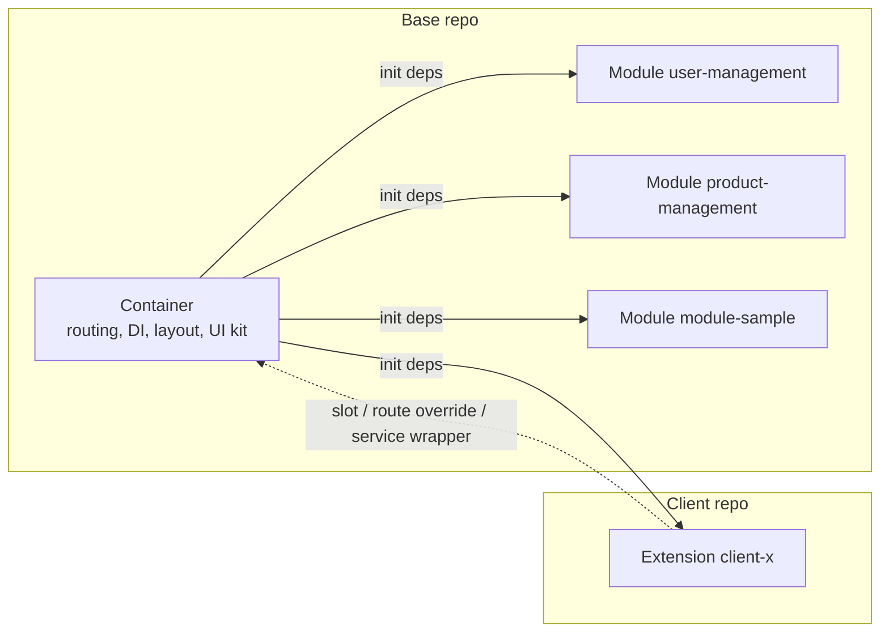
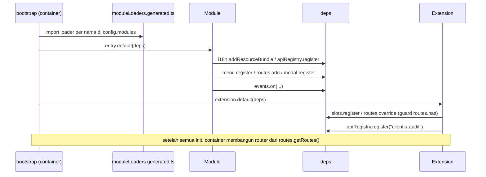
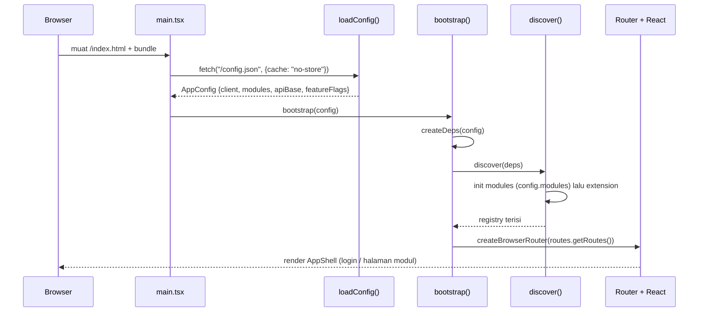

# Panduan Arsitektur — Platform Web Modular

Dokumen ini menjelaskan **bagaimana platform web modular ini disusun**: satu *container* (shell) yang stabil, modul-modul fitur bisnis yang dipilih lewat config, dan satu *extension* per klien untuk customization. Pembaca sasaran adalah developer baru dengan bekal React hooks dan TypeScript dasar; setiap istilah teknis dijelaskan saat pertama muncul. Bagian I (§1–§3) memberi orientasi dan model mental, Bagian II (§4–§15) membahas tiap mekanisme secara teknis. Dokumen ini menjelaskan *cara kerja*; aturan yang mengikat (wajib/dilarang) ada di `CONTRACT`. Padanan bahasa Inggris: `ARCHITECTURE.en.md`.

**Peta pembaca:**

| Jika Anda...                                                  | Mulai dari                       |
| ------------------------------------------------------------- | -------------------------------- |
| Baru di proyek dan butuh gambaran besar                       | Bagian I — Orientasi (§1–§3)     |
| Butuh detail teknis satu mekanisme (DI, routing, slot, build) | Bagian II — Detail (§4–§15)      |
| Butuh aturan normatif (wajib/dilarang)                        | `CONTRACT`                       |
| Butuh langkah deploy/operasional                              | `DEPLOYMENT-GUIDE`               |
| Butuh contoh kode langkah demi langkah                        | `DEVELOPER-GUIDE`                |

---

## 1. Apa yang Dibangun & Mengapa Modular

Platform web modular untuk **beberapa klien**: satu basis kode dipasang untuk banyak klien, dengan pilihan modul dan customization masing-masing. *Modular* berarti aplikasi tidak dibangun sebagai satu blok monolitik, melainkan dirakit dari tiga jenis bagian:

| Bagian        | Peran                                                                                                          |
| ------------- | -------------------------------------------------------------------------------------------------------------- |
| **Container** | Shell aplikasi: boot, config, dependency injection (DI), auth, routing host, layout, dan semua registry        |
| **Module**    | Fitur bisnis mandiri: halaman, menu, service, modal, state, dan terjemahan                                      |
| **Extension** | Customization satu klien: slot, route override, service wrapper, service dan terjemahan tambahan                |

Jargon: *dependency injection* (DI) artinya container menyediakan satu objek berisi semua layanan (disebut `deps`) yang diserahkan ke modul dan extension saat boot, sehingga mereka tidak perlu membuat instance sendiri.

**Karakteristik platform:**

- React 19 + Vite + TypeScript.
- Multi-client: banyak klien memakai container dan modul yang sama; perbedaan ada di extension.
- Puluhan modul bisnis — saat ini contohnya `user-management`, `product-management`, dan `module-sample`.
- Backend microservice diakses lewat **path-based routing** (`/api/<service>`), mis. service `auth` di `/api/auth` (`web-container/src/di/deps.ts:45`).
- Deploy per klien: base dibangun sekali menjadi image base, lalu tiap klien membangun image client `FROM` base image tersebut (lihat `DEPLOYMENT-GUIDE` §1).

**Contoh singkat.** Modul `module-sample` mendaftarkan halaman, menu, service, dan modalnya sendiri lewat `init(deps)` (`web-modules/modules/module-sample/index.tsx:14`). Extension `client-a` tidak menyentuh modul itu; ia mengisi slot `module-sample.overviewPanel` dan meng-override route `/module-sample/extension-points` (`web-extension-client-a/src/index.tsx:32`). Pola ini berulang di seluruh dokumen: **base menyediakan titik sambung, klien menyambung**.

### 1.1 Tanpa Modular vs Dengan Modular

| Aspek                            | Tanpa modular                       | Dengan modular                                       |
| -------------------------------- | ----------------------------------- | ---------------------------------------------------- |
| Perubahan untuk klien A          | Bisa merusak klien B                | Terisolasi di extension klien A                      |
| Bundle                           | Semua fitur ikut dimuat             | Hanya modul yang tercantum di `config.modules`       |
| Onboarding developer klien baru  | Harus menyelami seluruh basis kode  | Cukup repo base (baca) + extension kecil             |
| Ritme product vs kebutuhan klien | Saling mengganggu                   | Berjalan paralel: base stabil, extension terisolasi  |

### 1.2 Tujuh Prinsip Filosofi

Inilah prinsip yang membentuk seluruh keputusan desain. Aturan kerasnya ada di `CONTRACT` §1.

| Prinsip                            | Artinya                                                    | Konsekuensi                                                                      |
| ---------------------------------- | ---------------------------------------------------------- | -------------------------------------------------------------------------------- |
| **Container tidak tahu modul**     | Shell tidak pernah meng-import kode modul                  | Modul ditemukan dari `config.modules` (discovery), bukan hardcode                |
| **Modul tidak tahu extension**     | Modul tidak pernah menyebut nama klien                     | Customization lewat slot, bukan `if (client === 'client-a')`                     |
| **Extension tahu base**            | Extension boleh meng-import public API container dan modul | Extension punya titik masuk yang jelas: `init(deps)`                             |
| **Public API sebagai kontrak**     | Setiap lapisan hanya mengekspos file tertentu              | `@arsi/container`, `@arsi/shared`, `modules/<name>/public.ts` (`CONTRACT` §1.4)  |
| **Config-driven**                  | Pilihan modul dan URL dibaca dari config runtime           | Tanpa hardcode; config di-inject saat container start                            |
| **Fail-fast**                      | Duplikasi service, slot, atau route langsung error         | Kesalahan ketahuan saat boot, bukan diam-diam di production                      |
| **Satu image, banyak environment** | Perbedaan staging/production hanya env var saat start      | Ganti API base/modul tanpa rebuild image                                         |

---

## 2. Peta Repo & Ownership

Di produksi ada **dua jenis repo**: satu **repo base** milik platform team, dan satu **repo klien** per klien milik developer klien. Tabel berikut memetakan isinya.

**Repo base (`arsi-web-base`):**

| Path                           | Isi                                                                                                                                | Pemilik       |
| ------------------------------ | ---------------------------------------------------------------------------------------------------------------------------------- | ------------- |
| `web-container/`               | Shell: boot (`src/bootstrap/`), DI (`src/di/deps.ts`), auth, routing host, layout, registry, API client, i18n, toast/modal/notifications | Platform team |
| `web-modules/`                 | `shared/` (UI kit, hooks, utils) + `modules/<name>/` (fitur bisnis)                                                                | Platform team |
| `web-extension-default/`       | Extension no-op untuk menjalankan base standalone (`client: "base"`)                                                               | Platform team |
| `web-extension-template/`      | Titik awal repo klien baru                                                                                                         | Platform team |
| `docs/`                        | `ARCHITECTURE`, `CONTRACT`, `DEVELOPER-GUIDE`, `DEPLOYMENT-GUIDE`                                                                  | Platform team |
| `Dockerfile` + `.dockerignore` | Build 2 image base: builder (`node:22-alpine`) dan runtime (`nginx:1.27-alpine`)                                                   | Platform team |
| `ci/build-base.sh`             | Skrip build + push image base                                                                                                      | Platform team |

**Repo klien (`arsi-web-client-<x>`, checkout `web-extension-client-<x>`):**

| Path                      | Isi                                                                                | Pemilik         |
| ------------------------- | ---------------------------------------------------------------------------------- | --------------- |
| `manifest.json`           | Identitas klien: `client`, `baseVersion` (pin exact ke tag base), modul, override   | Developer klien |
| `src/index.tsx`           | Entry point `init(deps)` — satu-satunya pintu masuk extension                       | Developer klien |
| `src/components/`         | Komponen khusus klien (mis. `AuditButton`)                                          | Developer klien |
| `src/overrides/<module>/` | Override per modul (mis. `user-management/ClientAUserDetail.tsx`)                   | Developer klien |
| `Dockerfile`              | Image klien: `FROM` base builder → `FROM` base runtime                              | Developer klien |
| `ci/build-client.sh`      | Skrip build + push image klien                                                      | Developer klien |

> **Catatan workspace contoh.** Repo ini adalah workspace sample dengan **layout flat**: `web-container/`, `web-modules/`, `web-extension-default/`, `web-extension-template/`, dan `web-extension-client-a/` bersebelahan di satu folder. Di produksi, `web-extension-client-<x>` adalah isi repo terpisah `arsi-web-client-<x>`; saat dev repo itu di-checkout bersebelahan dengan repo base karena path mapping mengasumsikan posisi *sibling* (`DEPLOYMENT-GUIDE` §3).

### 2.1 Siapa Mengubah Apa

| Perubahan                                | Diubah di                      | Perlu diskusi?             |
| ---------------------------------------- | ------------------------------ | -------------------------- |
| Tambah/ubah modul bisnis                 | `web-modules/modules/<name>`   | Tidak                      |
| Tambah komponen UI bersama               | `web-modules/shared`           | Tidak                      |
| Ubah shell, DI, atau public API container | `web-container`               | Ya — lead dev              |
| Customization satu klien                 | `web-extension-client-<x>`     | Tidak                      |
| Naikkan `baseVersion` yang dipakai klien | `manifest.json` repo klien     | Ya — jadwalkan adopsi base |
| Buat repo klien baru                     | Salin `web-extension-template` | Ya                         |

Prinsip ownership: developer klien **boleh membaca** repo base tetapi **tidak mengubahnya**; kebutuhan yang menyangkut base diusulkan lewat PR ke platform team. Sebaliknya, base tidak pernah menyentuh kode extension.

### 2.2 Yang Tidak Ada di Repo Klien

Repo klien sengaja tetap kecil. Yang tidak ada di sana:

- `web-container/` dan `web-modules/` — tersedia dari base builder image saat build image klien (`/app/web-container`, `/app/web-modules`).
- `moduleLoaders.generated.ts` — digenerate container dari `package.json` tiap modul, bukan disalin ke klien.
- `/config.json` — ditulis `entrypoint.sh` saat container start dari env (`VITE_*`), bukan file yang di-commit.
- Kode klien lain — tidak ada akses lintas klien.

---

## 3. Model Mental 10 Menit

### 3.1 Analogi Gedung

Bayangkan platform ini sebagai sebuah **gedung**:

- **Container** adalah gedung beserta fasilitas umumnya — struktur, listrik, lift, keamanan. Ia menyediakan auth, routing, layout, DI, dan registries; ia tidak tahu isi tiap ruangan.
- **Module** adalah tenant yang menata ruangannya sendiri — fitur bisnis (`user-management`, `module-sample`) lengkap dengan halaman, menu, service, dan state-nya.
- **Extension** adalah dekorasi atau renovasi khusus satu klien — menambah panel, mengganti halaman, atau membungkus logic, tanpa mengubah fondasi gedung.

### 3.2 Tiga Istilah

| Istilah       | Definisi ringkas                                                                                                                                                          | Contoh di repo ini                               |
| ------------- | ------------------------------------------------------------------------------------------------------------------------------------------------------------------------- | ------------------------------------------------ |
| **Container** | Aplikasi React yang melakukan boot, menyediakan config, DI, auth, routing host, layout, dan semua registry. Hanya public API-nya (`@arsi/container`) yang boleh dipakai modul/extension. | `web-container/src/di/deps.ts:23`                |
| **Module**    | Paket fitur bisnis mandiri yang mendaftarkan menu, route, service, modal, dan i18n lewat `init(deps)`; kontraknya `public.ts`. Dipilih per klien lewat `config.modules`. | `web-modules/modules/module-sample/index.tsx:14` |
| **Extension** | Paket customization per klien yang juga punya `init(deps)`; mengisi slot, meng-override route, dan menambah service/i18n. Tidak pernah di-import oleh base.               | `web-extension-client-a/src/index.tsx:32`        |

### 3.3 Diagram Blok



Yang perlu diingat: **container memanggil, modul dan extension mendaftar**. Saat boot, container membuat satu objek `deps` berisi 13 layanan — `config`, `logger`, `api`, `apiRegistry`, `events`, `i18n`, `queryClient`, `toast`, `modal`, `notifications`, `slots`, `routes`, `menu` (`web-container/src/di/deps.ts:23`) — lalu `discover()` memanggil `init(deps)` untuk setiap modul di `config.modules`, dan terakhir untuk extension (`web-container/src/bootstrap/discover.ts:12`). Modul mendaftarkan dirinya; panah putus-putus dari extension menunjukkan bahwa extension *menyesuaikan* yang sudah terdaftar, bukan dipanggil balik oleh container.

### 3.4 Alur Boot dalam Satu Layar

```
main.tsx
  └─ loadConfig()            → fetch /config.json
  └─ bootstrap(config)       → createDeps + discover
       ├─ discover()         → init(deps) tiap modul di config.modules, lalu extension
       └─ createBrowserRouter(...) → susun route dari registry
  └─ createRoot(...).render(<RouterProvider router={router} />)
```

Urutannya penting: config dibaca dulu, `deps` dibuat **sekali**, semua `init` selesai, baru router dibentuk dan React dirender. Detail tiap langkah ada di Bagian II.

### 3.5 Di Mana Mulai Membaca Kode

| Ingin melihat...              | Buka                                             |
| ----------------------------- | ------------------------------------------------ |
| Titik masuk aplikasi dan boot | `web-container/src/main.tsx:11`                  |
| Kontrak `deps` (13 layanan)   | `web-container/src/di/deps.ts:23`                |
| Contoh modul lengkap          | `web-modules/modules/module-sample/index.tsx:14` |
| Contoh extension klien        | `web-extension-client-a/src/index.tsx:32`        |

### 3.6 Satu Alur Nyata

Contoh dari repo ini — login sebagai klien `client-a`, lalu jelajahi aplikasi:

| Kejadian                                         | Yang menanganinya                                                                                                    |
| ------------------------------------------------ | -------------------------------------------------------------------------------------------------------------------- |
| Menu "Users" tampil                              | Modul `user-management` mendaftarkan menunya; extension client-a meng-override label i18n menjadi "Client A Users"   |
| Halaman daftar user (`/users`) dibuka            | Route milik modul `user-management`; extension menambah tombol audit lewat slot `user-management.userTableActions`   |
| Detail user (`/users/:id`) dibuka                | Route di-override extension client-a → komponen `ClientAUserDetail`                                                 |
| Halaman `/module-sample/extension-points` dibuka | Route di-override extension; panel di halaman itu juga diisi lewat slot `module-sample.overviewPanel`                |

Semua yang "ditambahkan klien" terjadi tanpa mengubah kode modul. Inilah hasil akhir arsitektur ini.

Selanjutnya: Bagian II (§4–§15) membahas urutan boot, kontrak `deps` secara rinci, routing, slot, override, sampai build dan deployment.

---

## 4. Mekanisme Modular (Mendalam)

§1–§3 sudah menunjukkan gambaran besarnya. Bagian ini membedah satu per satu mekanisme yang dipakai modul dan extension untuk menyambung ke container. Semuanya bertumpu pada pola yang sama: **registry** — objek peta nama → data — yang dibuat container sekali saat boot dan diserahkan lewat `deps`; modul dan extension mendaftar, container membaca isinya setelah semua init selesai.

### 4.1 Discovery & Loader Map

*Discovery* berarti container menemukan modul dari data runtime (`config.modules`), bukan dari daftar `import` yang di-hardcode. Antara nama modul dan kode modul ada **loader map** berisi dynamic import:

```ts
// web-container/src/bootstrap/moduleLoaders.generated.ts:12
export const moduleLoaders: Record<string, () => Promise<ModuleEntryPoint>> = {
  'module-sample': () => import('@arsi/module-module-sample/entry'),
  'product-management': () => import('@arsi/module-product-management/entry'),
  'user-management': () => import('@arsi/module-user-management/entry'),
};
```

File ini **generated**: `scripts/generate-module-loaders.mjs` menyusunnya dari `package.json` tiap modul lewat `npm run gen:modules`; jangan diedit manual. Pre-hook `predev`, `pretypecheck`, `pretest`, `prebuild` menjalankannya otomatis (`web-container/package.json:10-23`).

Loop-nya ada di `discover()`:

```ts
// web-container/src/bootstrap/discover.ts:13
for (const moduleName of deps.config.modules) {
  const load = moduleLoaders[moduleName];
  if (!load) {
    throw new Error(
      `[bootstrap] module "${moduleName}" is declared in config.modules but is not wired in moduleLoaders.generated.ts (run \`npm run gen:modules\`)`,
    );
  }
  const entry = await load();
  await entry.default(deps);
  deps.logger.info(`module "${moduleName}" initialized`);
}
```

Poin penting:

- Urutan init mengikuti urutan nama di `config.modules`.
- Nama di config yang tidak ada di loader map → **fail-fast**: boot berhenti dengan pesan yang meminta menjalankan `npm run gen:modules` (`discover.ts:16`). Kehilangan fitur karena salah konfigurasi lebih baik ketahuan saat boot daripada diam-diam di production.
- Setelah semua modul, `discover()` memuat extension lewat alias `@arsi/extension` (`discover.ts:10`; dipetakan saat build ke `web-container/current-client/src/index.tsx`, `aliases.cjs:21-24`) dan memanggil `extension.default(deps)` (`discover.ts:26`). Extension **selalu init terakhir**; urutan inilah yang membuat override route (§4.4) valid.

### 4.2 `deps` — Satu Objek Layanan (DI)

`deps` adalah satu-satunya kanal antara container dan kode modul/extension. `createDeps(config)` (`web-container/src/di/deps.ts:39`) membuatnya sekali saat boot (`web-container/src/bootstrap/index.tsx:19`), lalu objek yang sama diserahkan ke setiap `init(deps)`. Isinya 13 layanan (`web-container/src/di/deps.ts:23`):

| Field           | Kegunaan                                                                          |
| --------------- | --------------------------------------------------------------------------------- |
| `config`        | `AppConfig` hasil `loadConfig()`: `client`, `modules`, `apiBase`, `featureFlags`  |
| `logger`        | Logger ber-prefix nama klien; level `debug` saat dev, `info` di production        |
| `api`           | Instance axios dasar untuk backend platform                                       |
| `apiRegistry`   | Registry service per nama (§4.5); service core `auth` sudah terisi                |
| `events`        | Event bus lintas modul (§4.7)                                                     |
| `i18n`          | Instance i18next; `addResourceBundle` mendaftarkan terjemahan per namespace       |
| `queryClient`   | Query client React Query                                                          |
| `toast`         | Service toast (notifikasi ringan, hilang sendiri)                                 |
| `modal`         | Registry + kontrol modal (§4.6)                                                   |
| `notifications` | Service notifikasi persisten                                                      |
| `slots`         | Registry slot UI (§4.3)                                                           |
| `routes`        | Registry route host (§4.4)                                                        |
| `menu`          | Registry menu sidebar (§4.6)                                                      |

Satu-satunya pendaftaran bawaan `createDeps` adalah service core `auth`:

```ts
// web-container/src/di/deps.ts:45
apiRegistry.register('auth', createServiceClient('/api/auth'));
```

Modul dan extension **tidak pernah** membuat instance i18n, router, atau query client sendiri — mereka menerima `deps` dan mendaftar ke dalamnya.

### 4.3 Slot — Titik Sambung UI

**Slot** adalah placeholder bernama di UI yang bisa diisi komponen dari luar modul. Tiga langkahnya:

**1. Modul mendeklarasikan nama slot.** Nama disimpan di `slots.ts` dan diekspor lewat `public.ts` supaya extension bisa mengimpornya (`web-modules/modules/module-sample/public.ts:8`):

```ts
// web-modules/modules/module-sample/slots.ts:2
export const sampleSlots = {
  overviewPanel: 'module-sample.overviewPanel',
} as const;
```

Konvensinya `<module>.<slot>` supaya nama tidak bentrok antar modul.

**2. Komponen modul mengonsumsi slot** lewat hook `useSlot` dari `@arsi/container`:

```tsx
// web-modules/modules/module-sample/pages/SampleExtensionPage.tsx:11
const Panel = useSlot<{ label?: string }>(sampleSlots.overviewPanel);
```

`useSlot` hanya membaca registry (`web-container/src/hooks/useSlot.ts:5`; diekspor di `web-container/src/public/index.ts:16`). Bila belum ada yang mengisi, hasilnya `undefined` dan modul merender fallback miliknya (`SampleExtensionPage.tsx:49`).

**3. Extension mengisi slot** lewat `deps.slots.register(name, component)` — mis. `AuditButton` untuk `userSlots.userTableActions` (`web-extension-client-a/src/index.tsx:62`) dan `ClientASamplePanel` untuk `sampleSlots.overviewPanel` (`:70`):

```tsx
// web-extension-client-a/src/index.tsx:70
deps.slots.register(sampleSlots.overviewPanel, ClientASamplePanel);
```

Satu slot hanya boleh diisi **satu** komponen: pendaftaran kedua melempar `[slots] slot "..." already has a component registered` (`web-container/src/slots/slotRegistry.ts:17`). Pembacaan lain lewat `get` dan `has` (`:21`, `:24`). Aturan mainnya: modul mendeklarasikan, extension mengisi, dan modul tidak pernah tahu siapa pengisinya.

### 4.4 Route — Registry Route Host

Route modul didaftarkan lewat `deps.routes.add({ path, element, meta })`:

```tsx
// web-modules/modules/module-sample/index.tsx:36
deps.routes.add({
  path: '/module-sample',
  element: <SampleOverviewPage />,
  meta: { group: 'sample', module: 'module-sample' },
});
```

- `meta.module` **wajib** diisi — host memakainya untuk menautkan route ke modul pemiliknya (dan `group` untuk pengelompokan navigasi).
- Path duplikat → error `[routes] route "..." is already registered` (`web-container/src/routes/routeRegistry.ts:27`). Tanpa aturan ini, dua modul bisa saling menimpa halaman tanpa ketahuan.
- Extension menyesuaikan route dengan `override(path, { element, meta })`; ini hanya boleh untuk path yang sudah terdaftar, jika tidak → error `[routes] cannot override unknown route "..."` (`routeRegistry.ts:33`).

Karena extension yang sama bisa dipasang pada klien dengan subset modul berbeda, extension memeriksa dulu dengan `has(path)`. Pola `overrideIfPresent` di client-a:

```tsx
// web-extension-client-a/src/index.tsx:25
if (!deps.routes.has(path)) {
  deps.logger.warn(`[client-a] route "${path}" belum terdaftar; override dilewati`);
  return;
}
deps.routes.override(path, definition);
```

Jika modul `user-management` tidak ada di `config.modules`, override `/users/:id` dilewati dengan warning, bukan menggagalkan boot.

Container menyusun router dari `getRoutes()` **setelah** discovery: route modul ditempel sebagai children di bawah `/` (di belakang `ProtectedRoute` + `AppShell`, `web-container/src/bootstrap/index.tsx:28-41`), dan leading slash dilepas saat pemetaan (`bootstrap/index.tsx:24`). Alur lengkapnya di §5.

### 4.5 Service Registry (`apiRegistry`)

Semua akses backend lewat registry bernama supaya modul tidak saling meng-import instance axios. Modul mendaftarkan instance miliknya:

```ts
// web-modules/modules/module-sample/index.tsx:23
const sampleClient = axios.create({
  baseURL: deps.config.apiBase,
  timeout: 8000,
});
deps.apiRegistry.register('module-sample', sampleClient);
```

- Nama service modul = nama modul (`'module-sample'`).
- Konvensi extension: **prefix nama klien** — `<client>.<service>` — mis. `deps.apiRegistry.register('client-a.audit', auditClient)` (`web-extension-client-a/src/index.tsx:60`). Dengan begitu service extension tidak mungkin bentrok dengan service base.
- Service core `auth` sudah didaftarkan container (`web-container/src/di/deps.ts:45`).
- Duplikat → error `[apiRegistry] service "..." is already registered` (`web-container/src/api/apiRegistry.ts:15`); `get(name)` melempar bila nama tidak dikenal (`:22`); `has` tersedia untuk pengecekan.
- Di komponen, registry dibaca lewat `useApiRegistry` dari `@arsi/container` (`web-container/src/public/index.ts:4`), contohnya `SampleExtensionPage.tsx:14`.

### 4.6 Menu & Modal

**Menu.** Sidebar host dibangun dari `deps.menu.getAll()`. Modul mendaftarkan satu item per halaman utama:

```ts
// web-modules/modules/module-sample/index.tsx:29
deps.menu.register({
  path: '/module-sample',
  label: 'menu.root',
  namespace: 'module-sample',
  order: 30,
});
```

`label` adalah **key i18n**, bukan teks jadi; `namespace` menunjuk bundle terjemahan yang didaftarkan modul di `index.tsx:20`, sehingga label mengikuti bahasa aktif. `getAll()` mengembalikan item terurut `order` menaik (`web-container/src/menu/menuRegistry.ts:23`). Path duplikat → error `[menu] menu item "..." is already registered` (`:19`).

**Modal.** Modal adalah komponen React yang dirender host saat dibuka, dengan payload bebas:

```ts
// web-modules/modules/module-sample/index.tsx:50
deps.modal.register(sampleModals.info, SampleInfoModal);
```

`sampleModals.info` bernilai `'module-sample.info'` (`web-modules/modules/module-sample/modals.ts:2`) — konvensi `<module>.<modal>`. Komponen modal menerima props `{ payload, close }` (`web-container/src/modal/modalService.ts:3`); membukanya lewat `deps.modal.open(name, payload)` (`:42`) atau hook `useModal` (`web-container/src/public/index.ts:11`). Nama duplikat → error `[modal] "..." is already registered` (`modalService.ts:38`).

### 4.7 Event Bus — Komunikasi Tanpa Coupling

`deps.events` adalah **event bus** (publish–subscribe) sederhana: pengirim memanggil `emit(nama, payload)`, dan setiap handler yang mendaftar lewat `on(nama, handler)` dipanggil — kedua pihak tidak saling mengenal. Implementasinya `Map<string, Set<handler>>` (`web-container/src/events/eventBus.ts:11`); `on` mengembalikan fungsi unsubscribe (`:18`).

```tsx
// web-modules/modules/module-sample/index.tsx:52 — publisher
deps.events.on<SamplePostCreatedPayload>(sampleEvents.postCreated, (payload) => {
  deps.logger.info('module-sample: post created', payload);
});
```

```tsx
// web-extension-client-a/src/index.tsx:78 — subscriber
deps.events.on<UserUpdatedPayload>(userEvents.updated, (payload) => {
  void deps.queryClient.invalidateQueries({ queryKey: userKeys.detail(payload.id) });
});
```

Nama event selalu ber-namespace (`module-sample.sample.postCreated`, `web-modules/modules/module-sample/events.ts:2`) dan tipe payload-nya diekspor lewat `public.ts`, sehingga penerima tidak perlu tahu isi modul. Ini kanal utama aksi lintas modul — mis. extension client-a menyegarkan cache React Query-nya saat modul `user-management` meng-`emit` `userEvents.updated`. Detail di §10.

**Ringkasan urutan init.** Diagram ini merangkum siapa memanggil apa:



---

## 5. Boot Sequence End-to-End

Berikut perjalanan lengkap dari browser membuka aplikasi sampai React dirender, dalam enam langkah:

1. **Browser memuat bundle.** `/index.html` dan bundle JS hasil build dimuat; titik masuknya `main()` di `web-container/src/main.tsx:11`.
2. **Config dibaca.** `loadConfig()` memanggil `fetch('/config.json', { cache: 'no-store' })` (`web-container/src/config/loadConfig.ts:25`) lalu menormalkan isinya menjadi `AppConfig`: `{ client, modules, apiBase, featureFlags }`.
3. **`deps` dibuat.** `main.tsx:13` memanggil `bootstrap(config)`; di dalamnya `createDeps(config)` membuat `deps` sekali (`web-container/src/bootstrap/index.tsx:19`) — termasuk service core `auth` (`web-container/src/di/deps.ts:45`) — lalu `discover(deps)` (`:20`).
4. **Modul & extension init.** `discover()` meng-import dan memanggil `init(deps)` untuk tiap nama di `config.modules` sesuai urutan config, lalu extension terakhir (`web-container/src/bootstrap/discover.ts:13-27`). Semua registry terisi di langkah ini.
5. **Router dibangun.** `bootstrap` memetakan `deps.routes.getRoutes()` menjadi `RouteObject`, menempelkannya sebagai children di bawah `/` (di belakang `ProtectedRoute` + `AppShell`), lalu menambahkan `/login`, index `HomePage`, dan fallback `*` `NotFoundPage` (`bootstrap/index.tsx:22-41`).
6. **Render.** `main.tsx:20` menjalankan `createRoot(...).render(<AppProviders deps={deps}><RouterProvider router={router} /></AppProviders>)`. `AppProviders` menyediakan `deps` lewat React context — asal semua hook seperti `useSlot` — dan router menampilkan halaman login atau halaman modul sesuai status auth.



**Tiga hal yang perlu digarisbawahi.**

- **Config gagal → fallback, bukan crash.** Bila `fetch` gagal (file tidak ada, jaringan bermasalah, JSON tidak valid), `loadConfig` menulis warning ke console dan memakai `DEFAULT_CONFIG`: `{ client: 'default', modules: [], apiBase: '', featureFlags: {} }` (`web-container/src/config/loadConfig.ts:31`, `web-container/src/config/types.ts:8`). Aplikasi tetap boot sebagai shell tanpa modul. Fail-fast berlaku untuk kesalahan *wiring* di kode, bukan untuk config runtime yang bisa absen.
- **Wiring salah → fail-fast.** Boot berhenti dengan pesan jelas untuk: module yang tak ter-wire di loader map (`discover.ts:16`), route duplikat (`routeRegistry.ts:27`), override route tak dikenal (`routeRegistry.ts:33`), serta slot/service/menu/modal duplikat (`slotRegistry.ts:17`, `apiRegistry.ts:15`, `menuRegistry.ts:19`, `modalService.ts:38`).
- **Extension selalu terakhir.** Karena semua modul selesai init lebih dulu, route milik modul sudah ada saat extension meng-override — urutan ini yang membuat override valid. `bootstrap` juga meng-cache promise-nya (`bootstrap/index.tsx:46-52`), jadi `deps` dan router hanya dibuat sekali per halaman.
