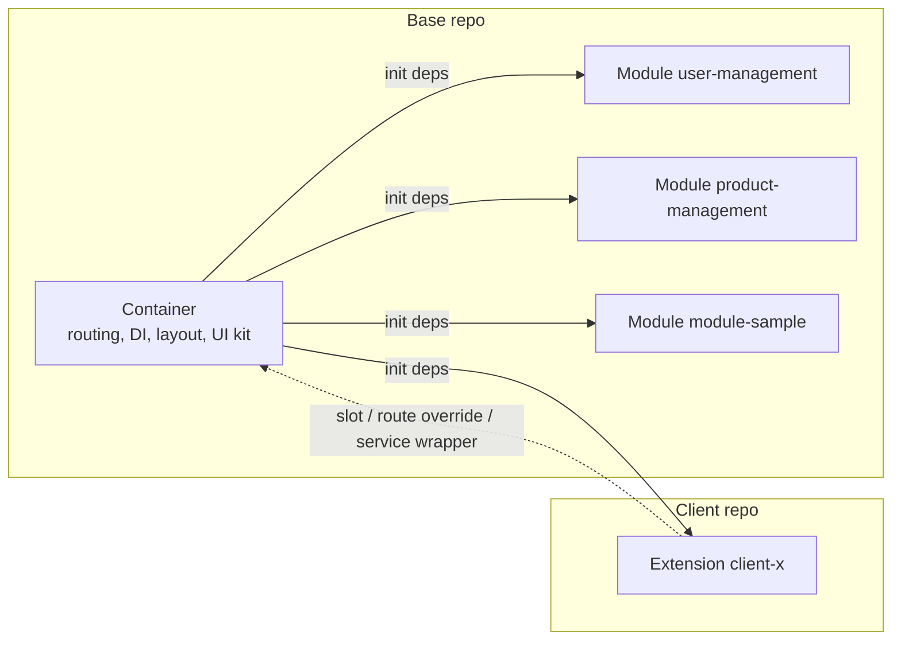
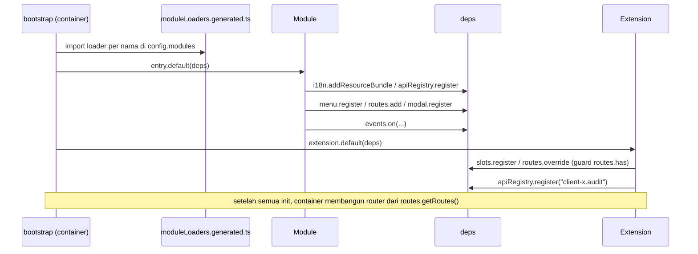
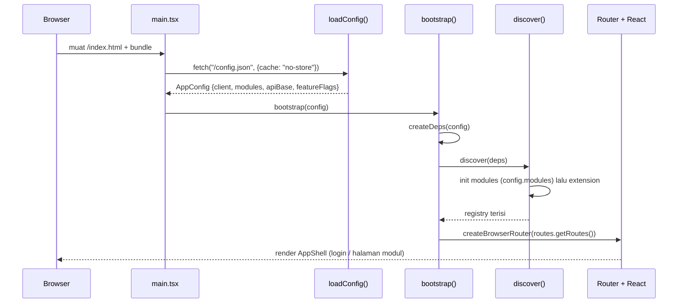
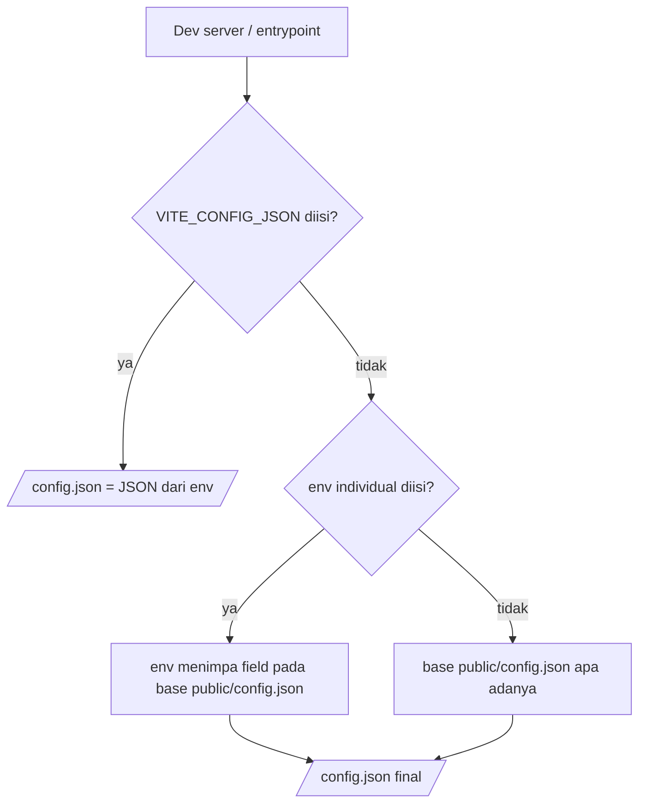
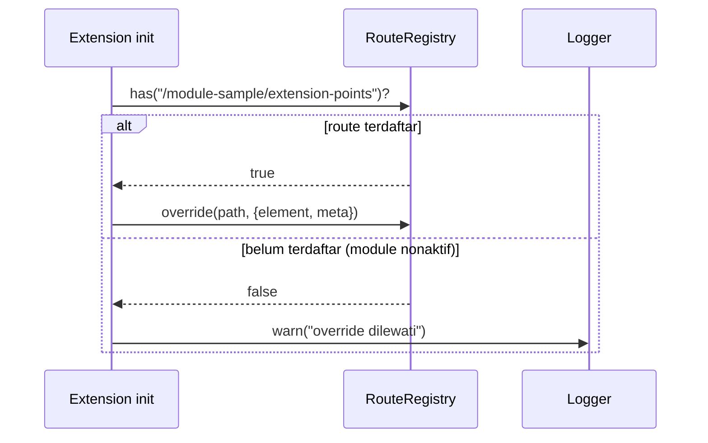
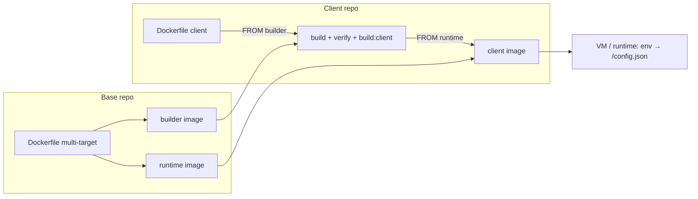
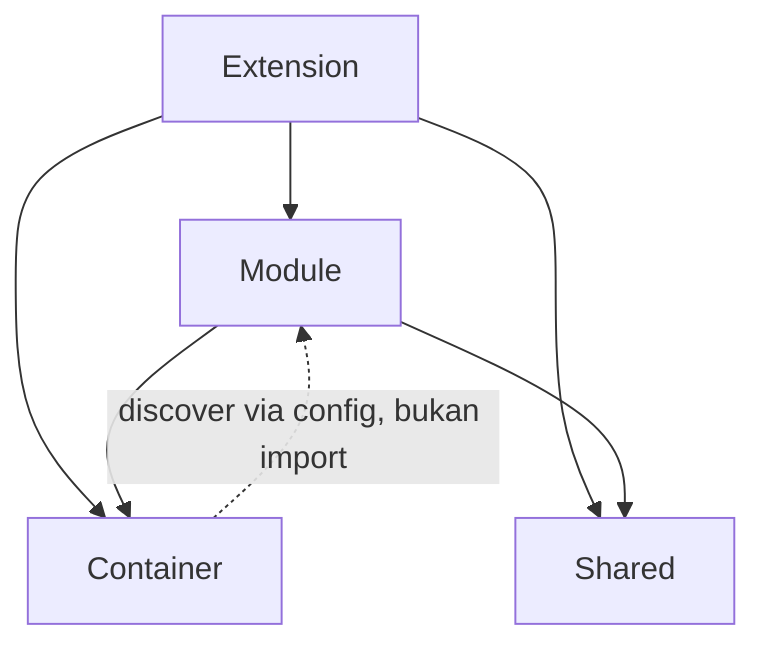

# Panduan Arsitektur — Platform Web Modular

Dokumen ini menjelaskan **bagaimana platform web modular ini disusun**: satu *container* (shell) yang stabil, modul-modul fitur bisnis yang dipilih lewat config, dan satu *extension* per klien untuk customization. Pembaca sasaran adalah developer baru dengan bekal React hooks dan TypeScript dasar; setiap istilah teknis dijelaskan saat pertama muncul. Bagian I (§1–§8) memberi orientasi dan membedah tiap mekanisme, Bagian II (§9–§15) adalah referensi kerja. Dokumen ini menjelaskan *cara kerja*; aturan yang mengikat (wajib/dilarang) ada di `CONTRACT`. Padanan bahasa Inggris: `ARCHITECTURE.en.md`.

**Peta pembaca:**

| Jika Anda...                                                  | Mulai dari                        |
| ------------------------------------------------------------- | --------------------------------- |
| Baru di proyek dan butuh gambaran besar                       | Bagian I — Orientasi (§1–§3)      |
| Butuh detail teknis satu mekanisme (DI, routing, slot, build) | Bagian I — Mekanisme (§4–§8)      |
| Butuh ringkasan referensi (layer, pola, alias, governance)    | Bagian II — Referensi (§9–§15)    |
| Butuh aturan normatif (wajib/dilarang)                        | `CONTRACT`                        |
| Butuh langkah deploy/operasional                              | `DEPLOYMENT-GUIDE`                |
| Butuh contoh kode langkah demi langkah                        | `DEVELOPER-GUIDE`                 |

---

## 1. Apa yang Dibangun & Mengapa Modular

Platform web modular untuk **beberapa klien**: satu basis kode dipasang untuk banyak klien, dengan pilihan modul dan customization masing-masing. *Modular* berarti aplikasi tidak dibangun sebagai satu blok monolitik, melainkan dirakit dari tiga jenis bagian:

| Bagian        | Peran                                                                                                          |
| ------------- | -------------------------------------------------------------------------------------------------------------- |
| **Container** | Shell aplikasi: boot, config, dependency injection (DI), auth, routing host, layout, dan semua registry        |
| **Module**    | Fitur bisnis mandiri: halaman, menu, service, modal, state, dan terjemahan                                      |
| **Extension** | Customization satu klien: slot, route override, service wrapper, service dan terjemahan tambahan                |

Jargon: *dependency injection* (DI) artinya container menyediakan satu objek berisi semua layanan (disebut `deps`) yang diserahkan ke modul dan extension saat boot, sehingga mereka tidak perlu membuat instance sendiri.

**Karakteristik platform:**

- React 19 + Vite + TypeScript.
- Multi-client: banyak klien memakai container dan modul yang sama; perbedaan ada di extension.
- Puluhan modul bisnis — saat ini contohnya `user-management`, `product-management`, dan `module-sample`.
- Backend microservice diakses lewat **path-based routing** (`/api/<service>`), mis. service `auth` di `/api/auth` (`web-container/src/di/deps.ts:45`).
- Deploy per klien: base dibangun sekali menjadi image base, lalu tiap klien membangun image client `FROM` base image tersebut (lihat `DEPLOYMENT-GUIDE` §1).

**Contoh singkat.** Modul `module-sample` mendaftarkan halaman, menu, service, dan modalnya sendiri lewat `init(deps)` (`web-modules/modules/module-sample/index.tsx:14`). Extension `client-a` tidak menyentuh modul itu; ia mengisi slot `module-sample.overviewPanel` dan meng-override route `/module-sample/extension-points` (`web-extension-client-a/src/index.tsx:32`). Pola ini berulang di seluruh dokumen: **base menyediakan titik sambung, klien menyambung**.

### 1.1 Tanpa Modular vs Dengan Modular

| Aspek                            | Tanpa modular                       | Dengan modular                                       |
| -------------------------------- | ----------------------------------- | ---------------------------------------------------- |
| Perubahan untuk klien A          | Bisa merusak klien B                | Terisolasi di extension klien A                      |
| Bundle                           | Semua fitur ikut dimuat             | Hanya modul yang tercantum di `config.modules`       |
| Onboarding developer klien baru  | Harus menyelami seluruh basis kode  | Cukup repo base (baca) + extension kecil             |
| Ritme product vs kebutuhan klien | Saling mengganggu                   | Berjalan paralel: base stabil, extension terisolasi  |

### 1.2 Tujuh Prinsip Filosofi

Inilah prinsip yang membentuk seluruh keputusan desain. Aturan kerasnya ada di `CONTRACT` §1.

| Prinsip                            | Artinya                                                    | Konsekuensi                                                                      |
| ---------------------------------- | ---------------------------------------------------------- | -------------------------------------------------------------------------------- |
| **Container tidak tahu modul**     | Shell tidak pernah meng-import kode modul                  | Modul ditemukan dari `config.modules` (discovery), bukan hardcode                |
| **Modul tidak tahu extension**     | Modul tidak pernah menyebut nama klien                     | Customization lewat slot, bukan `if (client === 'client-a')`                     |
| **Extension tahu base**            | Extension boleh meng-import public API container dan modul | Extension punya titik masuk yang jelas: `init(deps)`                             |
| **Public API sebagai kontrak**     | Setiap lapisan hanya mengekspos file tertentu              | `@arsi/container`, `@arsi/shared`, `modules/<name>/public.ts` (`CONTRACT` §1.4)  |
| **Config-driven**                  | Pilihan modul dan URL dibaca dari config runtime           | Tanpa hardcode; config di-inject saat container start                            |
| **Fail-fast**                      | Duplikasi service, slot, atau route langsung error         | Kesalahan ketahuan saat boot, bukan diam-diam di production                      |
| **Satu image, banyak environment** | Perbedaan staging/production hanya env var saat start      | Ganti API base/modul tanpa rebuild image                                         |

---

## 2. Peta Repo & Ownership

Di produksi ada **dua jenis repo**: satu **repo base** milik platform team, dan satu **repo klien** per klien milik developer klien. Tabel berikut memetakan isinya.

**Repo base (`arsi-web-base`):**

| Path                           | Isi                                                                                                                                | Pemilik       |
| ------------------------------ | ---------------------------------------------------------------------------------------------------------------------------------- | ------------- |
| `web-container/`               | Shell: boot (`src/bootstrap/`), DI (`src/di/deps.ts`), auth, routing host, layout, registry, API client, i18n, toast/modal/notifications | Platform team |
| `web-modules/`                 | `shared/` (UI kit, hooks, utils) + `modules/<name>/` (fitur bisnis)                                                                | Platform team |
| `web-extension-default/`       | Extension no-op untuk menjalankan base standalone (`client: "base"`)                                                               | Platform team |
| `web-extension-template/`      | Titik awal repo klien baru                                                                                                         | Platform team |
| `docs/`                        | `ARCHITECTURE`, `CONTRACT`, `DEVELOPER-GUIDE`, `DEPLOYMENT-GUIDE`                                                                  | Platform team |
| `Dockerfile` + `.dockerignore` | Build 2 image base: builder (`node:22-alpine`) dan runtime (`nginx:1.27-alpine`)                                                   | Platform team |
| `ci/build-base.sh`             | Skrip build + push image base                                                                                                      | Platform team |

**Repo klien (`arsi-web-client-<x>`, checkout `web-extension-client-<x>`):**

| Path                      | Isi                                                                                | Pemilik         |
| ------------------------- | ---------------------------------------------------------------------------------- | --------------- |
| `manifest.json`           | Identitas klien: `client`, `baseVersion` (pin exact ke tag base), modul, override   | Developer klien |
| `src/index.tsx`           | Entry point `init(deps)` — satu-satunya pintu masuk extension                       | Developer klien |
| `src/components/`         | Komponen khusus klien (mis. `AuditButton`)                                          | Developer klien |
| `src/overrides/<module>/` | Override per modul (mis. `user-management/ClientAUserDetail.tsx`)                   | Developer klien |
| `Dockerfile`              | Image klien: `FROM` base builder → `FROM` base runtime                              | Developer klien |
| `ci/build-client.sh`      | Skrip build + push image klien                                                      | Developer klien |

> **Catatan workspace contoh.** Repo ini adalah workspace sample dengan **layout flat**: `web-container/`, `web-modules/`, `web-extension-default/`, `web-extension-template/`, dan `web-extension-client-a/` bersebelahan di satu folder. Di produksi, `web-extension-client-<x>` adalah isi repo terpisah `arsi-web-client-<x>`; saat dev repo itu di-checkout bersebelahan dengan repo base karena path mapping mengasumsikan posisi *sibling* (`DEPLOYMENT-GUIDE` Tutorial A).

### 2.1 Siapa Mengubah Apa

| Perubahan                                | Diubah di                      | Perlu diskusi?             |
| ---------------------------------------- | ------------------------------ | -------------------------- |
| Tambah/ubah modul bisnis                 | `web-modules/modules/<name>`   | Tidak                      |
| Tambah komponen UI bersama               | `web-modules/shared`           | Tidak                      |
| Ubah shell, DI, atau public API container | `web-container`               | Ya — lead dev              |
| Customization satu klien                 | `web-extension-client-<x>`     | Tidak                      |
| Naikkan `baseVersion` yang dipakai klien | `manifest.json` repo klien     | Ya — jadwalkan adopsi base |
| Buat repo klien baru                     | Salin `web-extension-template` | Ya                         |

Prinsip ownership: developer klien **boleh membaca** repo base tetapi **tidak mengubahnya**; kebutuhan yang menyangkut base diusulkan lewat PR ke platform team. Sebaliknya, base tidak pernah menyentuh kode extension.

### 2.2 Yang Tidak Ada di Repo Klien

Repo klien sengaja tetap kecil. Yang tidak ada di sana:

- `web-container/` dan `web-modules/` — tersedia dari base builder image saat build image klien (`/app/web-container`, `/app/web-modules`).
- `moduleLoaders.generated.ts` — digenerate container dari `package.json` tiap modul, bukan disalin ke klien.
- `/config.json` — ditulis `entrypoint.sh` saat container start dari env (`VITE_*`), bukan file yang di-commit.
- Kode klien lain — tidak ada akses lintas klien.

---

## 3. Model Mental 10 Menit

### 3.1 Analogi Gedung

Bayangkan platform ini sebagai sebuah **gedung**:

- **Container** adalah gedung beserta fasilitas umumnya — struktur, listrik, lift, keamanan. Ia menyediakan auth, routing, layout, DI, dan registries; ia tidak tahu isi tiap ruangan.
- **Module** adalah tenant yang menata ruangannya sendiri — fitur bisnis (`user-management`, `module-sample`) lengkap dengan halaman, menu, service, dan state-nya.
- **Extension** adalah dekorasi atau renovasi khusus satu klien — menambah panel, mengganti halaman, atau membungkus logic, tanpa mengubah fondasi gedung.

### 3.2 Tiga Istilah

| Istilah       | Definisi ringkas                                                                                                                                                          | Contoh di repo ini                               |
| ------------- | ------------------------------------------------------------------------------------------------------------------------------------------------------------------------- | ------------------------------------------------ |
| **Container** | Aplikasi React yang melakukan boot, menyediakan config, DI, auth, routing host, layout, dan semua registry. Hanya public API-nya (`@arsi/container`) yang boleh dipakai modul/extension. | `web-container/src/di/deps.ts:23`                |
| **Module**    | Paket fitur bisnis mandiri yang mendaftarkan menu, route, service, modal, dan i18n lewat `init(deps)`; kontraknya `public.ts`. Dipilih per klien lewat `config.modules`. | `web-modules/modules/module-sample/index.tsx:14` |
| **Extension** | Paket customization per klien yang juga punya `init(deps)`; mengisi slot, meng-override route, dan menambah service/i18n. Tidak pernah di-import oleh base.               | `web-extension-client-a/src/index.tsx:32`        |

### 3.3 Diagram Blok



Yang perlu diingat: **container memanggil, modul dan extension mendaftar**. Saat boot, container membuat satu objek `deps` berisi 13 layanan — `config`, `logger`, `api`, `apiRegistry`, `events`, `i18n`, `queryClient`, `toast`, `modal`, `notifications`, `slots`, `routes`, `menu` (`web-container/src/di/deps.ts:23`) — lalu `discover()` memanggil `init(deps)` untuk setiap modul di `config.modules`, dan terakhir untuk extension (`web-container/src/bootstrap/discover.ts:12`). Modul dan extension mendaftarkan dirinya saat `init(deps)` dipanggil container; panah putus-putus dari extension menunjukkan arah *penyesuaian* terhadap yang sudah terdaftar, bukan panggilan tambahan dari container.

### 3.4 Alur Boot dalam Satu Layar

```
main.tsx
  └─ loadConfig()            → fetch /config.json
  └─ bootstrap(config)       → createDeps + discover
       ├─ discover()         → init(deps) tiap modul di config.modules, lalu extension
       └─ createBrowserRouter(...) → susun route dari registry
  └─ createRoot(...).render(<RouterProvider router={router} />)
```

Urutannya penting: config dibaca dulu, `deps` dibuat **sekali**, semua `init` selesai, baru router dibentuk dan React dirender. Detail tiap langkah ada di §4–§8.

### 3.5 Di Mana Mulai Membaca Kode

| Ingin melihat...              | Buka                                             |
| ----------------------------- | ------------------------------------------------ |
| Titik masuk aplikasi dan boot | `web-container/src/main.tsx:11`                  |
| Kontrak `deps` (13 layanan)   | `web-container/src/di/deps.ts:23`                |
| Contoh modul lengkap          | `web-modules/modules/module-sample/index.tsx:14` |
| Contoh extension klien        | `web-extension-client-a/src/index.tsx:32`        |

### 3.6 Satu Alur Nyata

Contoh dari repo ini — login sebagai klien `client-a`, lalu jelajahi aplikasi:

| Kejadian                                         | Yang menanganinya                                                                                                    |
| ------------------------------------------------ | -------------------------------------------------------------------------------------------------------------------- |
| Menu "Users" tampil                              | Modul `user-management` mendaftarkan menunya; extension client-a meng-override label i18n menjadi "Client A Users"   |
| Halaman daftar user (`/users`) dibuka            | Route milik modul `user-management`; extension menambah tombol audit lewat slot `user-management.userTableActions`   |
| Detail user (`/users/:id`) dibuka                | Route di-override extension client-a → komponen `ClientAUserDetail`                                                 |
| Halaman `/module-sample/extension-points` dibuka | Route di-override extension; panel di halaman itu juga diisi lewat slot `module-sample.overviewPanel`                |

Semua yang "ditambahkan klien" terjadi tanpa mengubah kode modul. Inilah hasil akhir arsitektur ini.

Selanjutnya: §4–§8 membahas urutan boot, kontrak `deps` secara rinci, routing, slot, override, sampai build dan deployment.

---

## 4. Mekanisme Modular (Mendalam)

§1–§3 sudah menunjukkan gambaran besarnya. Bagian ini membedah satu per satu mekanisme yang dipakai modul dan extension untuk menyambung ke container. Semuanya bertumpu pada pola yang sama: **registry** — objek peta nama → data — yang dibuat container sekali saat boot dan diserahkan lewat `deps`; modul dan extension mendaftar, container membaca isinya setelah semua init selesai.

### 4.1 Discovery & Loader Map

*Discovery* berarti container menemukan modul dari data runtime (`config.modules`), bukan dari daftar `import` yang di-hardcode. Antara nama modul dan kode modul ada **loader map** berisi dynamic import:

```ts
// web-container/src/bootstrap/moduleLoaders.generated.ts:12
export const moduleLoaders: Record<string, () => Promise<ModuleEntryPoint>> = {
  'module-sample': () => import('@arsi/module-module-sample/entry'),
  'product-management': () => import('@arsi/module-product-management/entry'),
  'user-management': () => import('@arsi/module-user-management/entry'),
};
```

File ini **generated**: `scripts/generate-module-loaders.mjs` menyusunnya dari `package.json` tiap modul lewat `npm run gen:modules`; jangan diedit manual. Pre-hook `predev`, `pretypecheck`, `pretest`, `prebuild` menjalankannya otomatis (`web-container/package.json:10-23`).

Loop-nya ada di `discover()`:

```ts
// web-container/src/bootstrap/discover.ts:13
for (const moduleName of deps.config.modules) {
  const load = moduleLoaders[moduleName];
  if (!load) {
    throw new Error(
      `[bootstrap] module "${moduleName}" is declared in config.modules but is not wired in moduleLoaders.generated.ts (run \`npm run gen:modules\`)`,
    );
  }
  const entry = await load();
  await entry.default(deps);
  deps.logger.info(`module "${moduleName}" initialized`);
}
```

Poin penting:

- Urutan init mengikuti urutan nama di `config.modules`.
- Nama di config yang tidak ada di loader map → **fail-fast**: boot berhenti dengan pesan yang meminta menjalankan `npm run gen:modules` (`discover.ts:16`). Kehilangan fitur karena salah konfigurasi lebih baik ketahuan saat boot daripada diam-diam di production.
- Setelah semua modul, `discover()` memuat extension lewat alias `@arsi/extension` (`discover.ts:10`; dipetakan saat build ke `web-container/current-client/src/index.tsx`, `aliases.cjs:21-24`) dan memanggil `extension.default(deps)` (`discover.ts:26`). Extension **selalu init terakhir**; urutan inilah yang membuat override route (§4.4) valid.

### 4.2 `deps` — Satu Objek Layanan (DI)

`deps` adalah satu-satunya kanal antara container dan kode modul/extension. `createDeps(config)` (`web-container/src/di/deps.ts:39`) membuatnya sekali saat boot (`web-container/src/bootstrap/index.tsx:19`), lalu objek yang sama diserahkan ke setiap `init(deps)`. Isinya 13 layanan (`web-container/src/di/deps.ts:23`):

| Field           | Kegunaan                                                                          |
| --------------- | --------------------------------------------------------------------------------- |
| `config`        | `AppConfig` hasil `loadConfig()`: `client`, `modules`, `apiBase`, `featureFlags`  |
| `logger`        | Logger ber-prefix nama klien; level `debug` saat dev, `info` di production        |
| `api`           | Instance axios dasar untuk backend platform                                       |
| `apiRegistry`   | Registry service per nama (§4.5); service core `auth` sudah terisi                |
| `events`        | Event bus lintas modul (§4.7)                                                     |
| `i18n`          | Instance i18next; `addResourceBundle` mendaftarkan terjemahan per namespace       |
| `queryClient`   | Query client React Query                                                          |
| `toast`         | Service toast (notifikasi ringan, hilang sendiri)                                 |
| `modal`         | Registry + kontrol modal (§4.6)                                                   |
| `notifications` | Service notifikasi persisten                                                      |
| `slots`         | Registry slot UI (§4.3)                                                           |
| `routes`        | Registry route host (§4.4)                                                        |
| `menu`          | Registry menu sidebar (§4.6)                                                      |

Satu-satunya pendaftaran bawaan `createDeps` adalah service core `auth`:

```ts
// web-container/src/di/deps.ts:45
apiRegistry.register('auth', createServiceClient('/api/auth'));
```

Modul dan extension **tidak pernah** membuat instance i18n, router, atau query client sendiri — mereka menerima `deps` dan mendaftar ke dalamnya.

### 4.3 Slot — Titik Sambung UI

**Slot** adalah placeholder bernama di UI yang bisa diisi komponen dari luar modul. Tiga langkahnya:

**1. Modul mendeklarasikan nama slot.** Nama disimpan di `slots.ts` dan diekspor lewat `public.ts` supaya extension bisa mengimpornya (`web-modules/modules/module-sample/public.ts:8`):

```ts
// web-modules/modules/module-sample/slots.ts:2
export const sampleSlots = {
  overviewPanel: 'module-sample.overviewPanel',
} as const;
```

Konvensinya `<module>.<slot>` supaya nama tidak bentrok antar modul.

**2. Komponen modul mengonsumsi slot** lewat hook `useSlot` dari `@arsi/container`:

```tsx
// web-modules/modules/module-sample/pages/SampleExtensionPage.tsx:11
const Panel = useSlot<{ label?: string }>(sampleSlots.overviewPanel);
```

`useSlot` hanya membaca registry (`web-container/src/hooks/useSlot.ts:5`; diekspor di `web-container/src/public/index.ts:16`). Bila belum ada yang mengisi, hasilnya `undefined` dan modul merender fallback miliknya (`SampleExtensionPage.tsx:49`).

**3. Extension mengisi slot** lewat `deps.slots.register(name, component)` — mis. `AuditButton` untuk `userSlots.userTableActions` (`web-extension-client-a/src/index.tsx:62`) dan `ClientASamplePanel` untuk `sampleSlots.overviewPanel` (`:70`):

```tsx
// web-extension-client-a/src/index.tsx:70
deps.slots.register(sampleSlots.overviewPanel, ClientASamplePanel);
```

Satu slot hanya boleh diisi **satu** komponen: pendaftaran kedua melempar `[slots] slot "..." already has a component registered` (`web-container/src/slots/slotRegistry.ts:17`). Pembacaan lain lewat `get` dan `has` (`:21`, `:24`). Aturan mainnya: modul mendeklarasikan, extension mengisi, dan modul tidak pernah tahu siapa pengisinya.

### 4.4 Route — Registry Route Host

Route modul didaftarkan lewat `deps.routes.add({ path, element, meta })`:

```tsx
// web-modules/modules/module-sample/index.tsx:36
deps.routes.add({
  path: '/module-sample',
  element: <SampleOverviewPage />,
  meta: { group: 'sample', module: 'module-sample' },
});
```

- `meta.module` **wajib** diisi — host memakainya untuk menautkan route ke modul pemiliknya (dan `group` untuk pengelompokan navigasi).
- Path duplikat → error `[routes] route "..." is already registered` (`web-container/src/routes/routeRegistry.ts:27`). Tanpa aturan ini, dua modul bisa saling menimpa halaman tanpa ketahuan.
- Extension menyesuaikan route dengan `override(path, { element, meta })`; ini hanya boleh untuk path yang sudah terdaftar, jika tidak → error `[routes] cannot override unknown route "..."` (`routeRegistry.ts:33`).

Karena extension yang sama bisa dipasang pada klien dengan subset modul berbeda, extension memeriksa dulu dengan `has(path)`. Pola `overrideIfPresent` di client-a:

```tsx
// web-extension-client-a/src/index.tsx:25
if (!deps.routes.has(path)) {
  deps.logger.warn(`[client-a] route "${path}" belum terdaftar; override dilewati`);
  return;
}
deps.routes.override(path, definition);
```

Jika modul `user-management` tidak ada di `config.modules`, override `/users/:id` dilewati dengan warning, bukan menggagalkan boot.

Container menyusun router dari `getRoutes()` **setelah** discovery: route modul ditempel sebagai children di bawah `/` (di belakang `ProtectedRoute` + `AppShell`, `web-container/src/bootstrap/index.tsx:28-41`), dan leading slash dilepas saat pemetaan (`bootstrap/index.tsx:23`). Alur lengkapnya di §5.

**Route dinamis & query string.** Registry menyimpan path **sebagai string** (`web-container/src/routes/routeRegistry.ts:22-29`); saat boot, container memetakan setiap path ke React Router dengan melepas leading `/` lalu meneruskannya ke `createBrowserRouter` (`web-container/src/bootstrap/index.tsx:22-26`).

- React Router v6 mencocokkan segmen dinamis `:id` secara bawaan; pola statis menang atas pola dinamis. Halaman membaca param lewat `useParams` — contoh nyata: `/users/:id` didaftarkan di `web-modules/modules/user-management/index.tsx:42` dan dibaca di `web-modules/modules/user-management/pages/UserDetailPage.tsx:12`.
- `has`/`override` mencocokkan **string persis**: extension yang mengganti route dinamis menulis pola yang sama (`'/users/:id'`, mis. `web-extension-client-a/src/index.tsx:64`), bukan URL konkret.
- Query string (`/users?state=online`) tidak pernah bagian dari registrasi atau pencocokan route. Halaman membacanya lewat `useSearchParams`, lalu nilainya diteruskan ke service/query key React Query; belum ada contohnya di sample ini.
- Deploy: fallback SPA nginx (`try_files $uri $uri/ /index.html`, `web-container/nginx.conf:18`) melayani deep link mana pun, dan query string dipertahankan browser.

```tsx
// Halaman dinamis: param dari path, filter dari query string.
const { id } = useParams<{ id: string }>();
const [searchParams] = useSearchParams();
const state = searchParams.get('state');
```

### 4.5 Service Registry (`apiRegistry`)

Service dengan client sendiri didaftarkan ke registry bernama supaya modul tidak saling meng-import instance axios. Modul mendaftarkan instance miliknya:

```ts
// web-modules/modules/module-sample/index.tsx:23
const sampleClient = axios.create({
  baseURL: deps.config.apiBase,
  timeout: 8000,
});
deps.apiRegistry.register('module-sample', sampleClient);
```

- Nama service modul tidak selalu sama dengan nama modul: ikuti `CONTRACT` §4.6 — `user-management` → `user`, `product-management` → `product`, `module-sample` → `module-sample`.
- Konvensi extension: **prefix nama klien** — `<client>.<service>` — mis. `deps.apiRegistry.register('client-a.audit', auditClient)` (`web-extension-client-a/src/index.tsx:60`). Dengan begitu service extension tidak mungkin bentrok dengan service base.
- Service core `auth` sudah didaftarkan container (`web-container/src/di/deps.ts:45`).
- Duplikat → error `[apiRegistry] service "..." is already registered` (`web-container/src/api/apiRegistry.ts:15`); `get(name)` melempar bila nama tidak dikenal (`:22`); `has` tersedia untuk pengecekan.
- Di komponen, registry dibaca lewat `useApiRegistry` dari `@arsi/container` (`web-container/src/public/index.ts:4`), contohnya `SampleExtensionPage.tsx:14`.

### 4.6 Menu & Modal

**Menu.** Sidebar host dibangun dari `deps.menu.getAll()`. Modul mendaftarkan satu item per halaman utama:

```ts
// web-modules/modules/module-sample/index.tsx:29
deps.menu.register({
  path: '/module-sample',
  label: 'menu.root',
  namespace: 'module-sample',
  order: 30,
});
```

`label` adalah **key i18n**, bukan teks jadi; `namespace` menunjuk bundle terjemahan yang didaftarkan modul di `index.tsx:20`, sehingga label mengikuti bahasa aktif. `getAll()` mengembalikan item terurut `order` menaik (`web-container/src/menu/menuRegistry.ts:23`). Path duplikat → error `[menu] menu item "..." is already registered` (`:19`).

**Modal.** Modal adalah komponen React yang dirender host saat dibuka, dengan payload bebas:

```ts
// web-modules/modules/module-sample/index.tsx:50
deps.modal.register(sampleModals.info, SampleInfoModal);
```

`sampleModals.info` bernilai `'module-sample.info'` (`web-modules/modules/module-sample/modals.ts:2`) — konvensi `<module>.<modal>`. Komponen modal menerima props `{ payload, close }` (`web-container/src/modal/modalService.ts:3`); membukanya lewat `deps.modal.open(name, payload)` (`:42`) atau hook `useModal` (`web-container/src/public/index.ts:11`). Nama duplikat → error `[modal] "..." is already registered` (`modalService.ts:38`).

### 4.7 Event Bus — Komunikasi Tanpa Coupling

`deps.events` adalah **event bus** (publish–subscribe) sederhana: pengirim memanggil `emit(nama, payload)`, dan setiap handler yang mendaftar lewat `on(nama, handler)` dipanggil — kedua pihak tidak saling mengenal. Implementasinya `Map<string, Set<handler>>` (`web-container/src/events/eventBus.ts:11`); `on` mengembalikan fungsi unsubscribe (`:18`). Di dalam komponen, bus yang sama diakses lewat hook `useEventBus` (`web-container/src/public/index.ts:5`) yang mengembalikan `deps.events` (`web-container/src/hooks/useEventBus.ts:5`).

```tsx
// web-modules/modules/user-management/hooks/useUser.ts:75 — publisher (emit)
events.emit(userEvents.updated, { id: user.id, changes: input.changes });
```

```tsx
// web-extension-client-a/src/index.tsx:78 — subscriber
deps.events.on<UserUpdatedPayload>(userEvents.updated, (payload) => {
  void deps.queryClient.invalidateQueries({ queryKey: userKeys.detail(payload.id) });
});
```

Nama event selalu ber-namespace (`module-sample.sample.postCreated`, `web-modules/modules/module-sample/events.ts:2`) dan tipe payload-nya diekspor lewat `public.ts`, sehingga penerima tidak perlu tahu isi modul. Ini kanal utama aksi lintas modul — mis. extension client-a menyegarkan cache React Query-nya saat modul `user-management` meng-`emit` `userEvents.updated`. Detail di §10.

**Ringkasan urutan init.** Diagram ini merangkum siapa memanggil apa:



---

## 5. Boot Sequence End-to-End

Berikut perjalanan lengkap dari browser membuka aplikasi sampai React dirender, dalam enam langkah:

1. **Browser memuat bundle.** `/index.html` dan bundle JS hasil build dimuat; titik masuknya `main()` di `web-container/src/main.tsx:11`.
2. **Config dibaca.** `loadConfig()` memanggil `fetch('/config.json', { cache: 'no-store' })` (`web-container/src/config/loadConfig.ts:25`) lalu menormalkan isinya menjadi `AppConfig`: `{ client, modules, apiBase, featureFlags }`.
3. **`deps` dibuat.** `main.tsx:13` memanggil `bootstrap(config)`; di dalamnya `createDeps(config)` membuat `deps` sekali (`web-container/src/bootstrap/index.tsx:19`) — termasuk service core `auth` (`web-container/src/di/deps.ts:45`) — lalu `discover(deps)` (`:20`).
4. **Modul & extension init.** `discover()` meng-import dan memanggil `init(deps)` untuk tiap nama di `config.modules` sesuai urutan config, lalu extension terakhir (`web-container/src/bootstrap/discover.ts:13-27`). Semua registry terisi di langkah ini.
5. **Router dibangun.** `bootstrap` memetakan `deps.routes.getRoutes()` menjadi `RouteObject`, menempelkannya sebagai children di bawah `/` (di belakang `ProtectedRoute` + `AppShell`), lalu menambahkan `/login`, index `HomePage`, dan fallback `*` `NotFoundPage` (`bootstrap/index.tsx:22-41`).
6. **Render.** `main.tsx:20` menjalankan `createRoot(...).render(<AppProviders deps={deps}><RouterProvider router={router} /></AppProviders>)`. `AppProviders` menyediakan `deps` lewat React context — asal semua hook seperti `useSlot` — dan router menampilkan halaman login atau halaman modul sesuai status auth.



**Tiga hal yang perlu digarisbawahi.**

- **Config gagal → fallback, bukan crash.** Bila `fetch` gagal (file tidak ada, jaringan bermasalah, JSON tidak valid), `loadConfig` menulis warning ke console dan memakai `DEFAULT_CONFIG`: `{ client: 'default', modules: [], apiBase: '', featureFlags: {} }` (`web-container/src/config/loadConfig.ts:31`, `web-container/src/config/types.ts:8`). Aplikasi tetap boot sebagai shell tanpa modul. Fail-fast berlaku untuk kesalahan *wiring* di kode, bukan untuk config runtime yang bisa absen.
- **Wiring salah → fail-fast.** Boot berhenti dengan pesan jelas untuk: module yang tak ter-wire di loader map (`discover.ts:16`), route duplikat (`routeRegistry.ts:27`), override route tak dikenal (`routeRegistry.ts:33`), serta slot/service/menu/modal duplikat (`slotRegistry.ts:17`, `apiRegistry.ts:15`, `menuRegistry.ts:19`, `modalService.ts:38`).
- **Extension selalu terakhir.** Karena semua modul selesai init lebih dulu, route milik modul sudah ada saat extension meng-override — urutan ini yang membuat override valid. `bootstrap` juga meng-cache promise-nya (`bootstrap/index.tsx:46-52`), jadi `deps` dan router hanya dibuat sekali per halaman.

---

## 6. Config & Perilaku Runtime

§5 sudah menunjukkan `loadConfig()` membaca `/config.json` saat boot. Bagian ini menjelaskan **dari mana isi file itu berasal** — dev server atau entrypoint container (skrip yang dijalankan otomatis saat container start) — dan urutan menang saat beberapa sumber diisi bersamaan. Config di platform ini bersifat **runtime**, bukan build-time: bundle yang sama bisa dijalankan di environment berbeda hanya dengan mengganti env var saat start.

### 6.1 Bentuk `AppConfig`

Isi `/config.json` yang valid dinormalisasi menjadi `AppConfig` (`web-container/src/config/types.ts:1`):

| Field          | Isi                                                      | Dipakai untuk                                      |
| -------------- | -------------------------------------------------------- | -------------------------------------------------- |
| `client`       | Nama klien                                               | Prefix pesan logger; identitas klien di runtime    |
| `modules`      | Daftar nama modul aktif                                  | Discovery: urutannya menentukan urutan init (§4.1) |
| `apiBase`      | Base URL backend                                         | Service HTTP modul (`axios`, §4.5)                 |
| `featureFlags` | Flag boolean runtime (opsional), mis. `enableAuditLive`  | Menyalakan fitur tanpa rebuild                     |

Normalisasi (`normalizeConfig`, `web-container/src/config/loadConfig.ts:3`) menjaga tipe: field yang salah tipe diganti default (`client: 'default'`, `modules: []`, `apiBase: ''`, `featureFlags: {}`, `types.ts:8`). Kalau `fetch` gagal sepenuhnya, `loadConfig` memakai `DEFAULT_CONFIG` dan aplikasi boot sebagai shell tanpa modul (detail §5).

Modul dan extension **tidak boleh** membaca env atau fetch `/config.json` sendiri; semua lewat `deps.config` / `useConfig()` (`CONTRACT` §14.3).

### 6.2 Dev: Dev Server yang Men-generate `/config.json`

Saat `npm run dev` di `web-container`, plugin `devConfigPlugin` (apply `serve`, `web-container/vite.config.ts:22`) mencegat request `/config.json`, termasuk request browser saat boot. Env dibaca dari file `.env` plus environment proses (`loadEnv(mode, rootDir, '')`, `:24`), dan responsnya selalu `Cache-Control: no-store` (`:41`).

Urutan menang, dari yang paling kuat:

1. **`VITE_CONFIG_JSON` — override penuh.** Seluruh config diambil dari nilai env ini; env individual lain diabaikan. Nilainya harus object JSON (diawali `{`, diakhiri `}`), kalau tidak dev server membalas HTTP 500 dengan pesan `[dev-config] VITE_CONFIG_JSON must be a JSON object (start with '{' and end with '}')` (`web-container/scripts/dev-config.mjs:34-38`).
2. **Env individual** — menimpa field di atas base:
   - `VITE_MODULES` — CSV (daftar dipisah koma) yang **mengganti** seluruh daftar modul (`dev-config.mjs:55`);
   - `VITE_API_BASE` — mengganti `apiBase` (`:56`);
   - `VITE_ENABLE_AUDIT_LIVE` — menyetel `featureFlags.enableAuditLive`; `false` mematikan, nilai non-kosong lain menyalakan (`:60`).
3. **`public/config.json`** — base yang di-commit; field yang tidak ditimpa env diambil apa adanya. Di repo ini isinya `client-a` + tiga modul (`web-container/public/config.json:1`).
4. **Default** — dipakai kalau base tidak ada atau field-nya kosong: modul `['user-management']`, apiBase `https://dummyjson.com` (`dev-config.mjs:4-5`).

Client id di dev di-resolve dari symlink `current-client` atau `.env` (`resolveClientId`). Bila tidak ada client dan `VITE_CONFIG_JSON` juga kosong, dev server menyajikan `public/config.json` mentah (`vite.config.ts:43-50`).

### 6.3 Production: Entrypoint Container Menulis `/config.json`

Di image production, `/config.json` **ditulis saat container start** oleh `entrypoint.sh`, yang image runtime pasang sebagai `/docker-entrypoint.d/40-generate-config.sh` (`Dockerfile:40`). Script ini membaca env lalu menulis ke `/usr/share/nginx/html/config.json` — path bisa diganti lewat `CONFIG_FILE` (`web-container/docker/entrypoint.sh:4`).

| Env runtime container    | Efek                                          | Default                 |
| ------------------------ | --------------------------------------------- | ----------------------- |
| `VITE_CLIENT`            | Field `client`                                | `base`                  |
| `VITE_MODULES` (CSV)     | Field `modules` (dirangkai jadi array JSON)   | `user-management`       |
| `VITE_API_BASE`          | Field `apiBase`                               | `https://dummyjson.com` |
| `VITE_ENABLE_AUDIT_LIVE` | `featureFlags.enableAuditLive`                | `true`                  |
| `VITE_CONFIG_JSON`       | Override penuh: isi config ditulis apa adanya | kosong                  |

`VITE_CONFIG_JSON` menang penuh: env individual diabaikan (dicatat di log, `entrypoint.sh:21`); kalau nilainya bukan object JSON → `exit 1` dan container gagal start (`:16-17`).

Konsekuensinya persis prinsip **satu image, banyak environment** (§1.2): ganti API base, daftar modul, atau flag cukup lewat env saat `docker run`, tanpa rebuild. Yang tetap ditentukan saat build image adalah **extension klien mana yang ikut** (dibahas §8); `VITE_CLIENT` hanya mengisi nama klien di config.

### 6.4 Urutan Resolusi Config



Dua runtime disatukan di diagram: **dev server** memakai `public/config.json` sebagai base (§6.2), sedangkan **entrypoint production** selalu menulis ulang file itu dari env/default (§6.3) — salinan `public/config.json` yang ikut ter-bundle tidak pernah dipakai sebagai base. Hasil akhirnya sama: satu `/config.json` final yang dibaca `loadConfig()` saat boot.

Dua mode kegagalan yang berbeda: di production, `VITE_CONFIG_JSON` yang tidak valid menggagalkan **start container** (fail-fast); di browser, config yang gagal di-fetch hanya jatuh ke `DEFAULT_CONFIG` dan aplikasi tetap boot (§5).

---

## 7. Override 3 Level + Guard

Extension menyesuaikan aplikasi tanpa menyentuh kode container atau modul. Ada tiga level, dari yang paling aman ke yang paling invasif:

| # | Level           | API                                                       | Sifat                                                                  | Contoh di repo ini                                                                             |
| - | --------------- | --------------------------------------------------------- | ---------------------------------------------------------------------- | ---------------------------------------------------------------------------------------------- |
| 1 | Slot            | `deps.slots.register(name, component)`                    | Aditif: hanya menambah komponen di titik sambung yang disediakan modul | `AuditButton` mengisi `userSlots.userTableActions` (`web-extension-client-a/src/index.tsx:62`) |
| 2 | Route override  | `deps.routes.override(path, {element, meta})`             | Mengganti seluruh entry route                                          | `/users/:id` → `ClientAUserDetail` (`:64`)                                                     |
| 3 | Service wrapper | `deps.apiRegistry.register('<client>.<service>', client)` | Menambah service baru ber-namespace klien                              | `client-a.audit` (`:60`)                                                                       |

Jargon: **aditif** berarti hanya bisa menambah dan tidak bisa menghapus; **invasif** berarti mengubah perilaku yang sudah terdaftar.

- **Level 1 — slot.** Titik sambung UI yang dideklarasikan modul (§4.3). Paling aman karena tidak mengubah apa pun yang sudah ada. Batasnya: satu slot hanya boleh diisi satu komponen — pendaftaran kedua melempar `[slots] slot "..." already has a component registered` (`web-container/src/slots/slotRegistry.ts:17`).
- **Level 2 — route override.** `override(path, {element, meta})` mengganti **seluruh entry**, bukan hanya field yang dikirim; path-nya sendiri tidak bisa diubah lewat override. Sertakan `meta` lagi (mis. `{ group, module }`) supaya atribusi modul tidak hilang. Tanpa guard, override path yang belum terdaftar melempar `[routes] cannot override unknown route "<path>"` (`web-container/src/routes/routeRegistry.ts:33`).
- **Level 3 — service wrapper.** Registry service tidak mengenal penimpaan, jadi extension mendaftarkan nama **baru** dengan namespace `<client>.<service>` (`CONTRACT` §4.5); dengan begitu tidak mungkin bentrok dengan service base. Service core (`auth`, `user`) didaftarkan base (`auth` di `web-container/src/di/deps.ts:45`) dan **tidak boleh** di-override extension. Nama duplikat → error `[apiRegistry] service "..." is already registered` (`web-container/src/api/apiRegistry.ts:15`).

### 7.1 Guard untuk Module Opsional

Extension yang sama bisa dipasang untuk klien dengan subset modul berbeda. Route override menyasar route milik modul; kalau modul itu tidak aktif di `config.modules`, route-nya tidak pernah terdaftar. `override` tanpa pengecekan akan menggagalkan boot, karena itu `CONTRACT` §12.4 mewajibkan extension memeriksa `routes.has(path)` lebih dulu — lewati dengan `logger.warn` bila belum ada — atau memastikan modulnya selalu aktif.

Urutan init menolong di sini: extension selalu init **setelah** semua modul (§4.1), jadi saat guard berjalan registry sudah final.

Contoh pola `overrideIfPresent` di client-a:

```tsx
// web-extension-client-a/src/index.tsx:20
function overrideIfPresent(
  deps: Deps,
  path: string,
  definition: Parameters<Deps['routes']['override']>[1],
): void {
  if (!deps.routes.has(path)) {
    deps.logger.warn(`[client-a] route "${path}" belum terdaftar; override dilewati`);
    return;
  }
  deps.routes.override(path, definition);
}
```

Pemakaiannya (`index.tsx:64`, `:73`) mengikuti bentuk:

```tsx
overrideIfPresent(deps, '/users/:id', {
  element: <ClientAUserDetail />,
  meta: { group: 'user', module: 'user-management' },
});
```



Bila override dilewati, aplikasi tetap jalan dengan halaman default milik modul — hanya customization-nya yang hilang. Kalau boot gagal dengan `[routes] cannot override unknown route`, penyebabnya biasanya path salah tulis atau modul belum masuk `config.modules`.

---

## 8. Model Deploy: Base Image + Extension Image

Model deploy mengikuti dua jenis repo di §2: platform team membangun **base image** sekali per versi, lalu developer klien membangun **client image** di atasnya. Repo klien **tidak** men-checkout repo base — source base datang dari image builder, sesuai catatan §2.2.

### 8.1 Base Image — `Dockerfile` Multi-target

Root `Dockerfile` punya beberapa target (Docker multi-stage, yaitu satu Dockerfile dengan tahap build bernama): **builder** berisi toolchain + source + `node_modules`, dan **runtime** berisi nginx + hasil build siap saji.

- **Target `builder`** (`Dockerfile:5`) — `FROM node:22-alpine`; menyalin `package.json`/lockfile tiap paket lalu `npm ci` (`:18-20`), menyalin source (`:22-24`), dan menulis versi base ke `/app/BASE_VERSION` (`:26`). Modul baru harus ditambahkan ke daftar `COPY` package.json di sini (ada komentar pengingatnya di `:12`).
- **Target `runtime`** (`:35`) — `FROM nginx:1.27-alpine`; menyalin `dist/base` ke `/usr/share/nginx/html`, `nginx.conf`, dan entrypoint config (§6.3) (`:38-41`).
- **Target perantara `base-app`** (`:28`) — menjalankan `npm run check:base` lalu `CLIENT=base npm run build:client`; build base divalidasi terhadap dirinya sendiri sebelum masuk runtime.

`ci/build-base.sh` membangun kedua target dan memberi **tag** (label versi image): `<versi>-builder`, `<sha>-builder`, `<versi>`, `<sha>` (`ci/build-base.sh:21-31`). Versi default diambil dari `web-container/package.json`, `sha` dari commit (`:6-7`). Dengan `PUSH=1` keempat tag di-push (`:33-38`); dengan `VERIFY=1` typecheck/test/lint dijalankan sebelum build (`:10-17`).

### 8.2 Client Image — `FROM` Base Builder & Runtime

`web-extension-client-a/Dockerfile` merakit image klien dari dua image base di atas:

1. `FROM ${BASE_BUILDER_IMAGE} AS builder` (`:7`) — `npm ci` extension lalu salin source-nya ke `/app/extension` (`:11-13`).
2. Symlink `current-client` ke extension (`:15`) — alias build-time yang menentukan extension aktif (§4.1).
3. Verifikasi extension: `typecheck`, `test --if-present`, `lint` (`:16`).
4. `npm run check:base` lalu `CLIENT=<client> npm run build:client` (`:17-19`) — hasilnya `dist/<client>` di dalam builder.
5. `FROM ${BASE_RUNTIME_IMAGE} AS runtime` (`:21`) — ganti isi html dengan `dist/<client>` (`:24-25`) dan set `ENV VITE_CLIENT=<client>` (`:26`).

Poin kuncinya: tidak ada `COPY` modul atau source base dari repo klien — semuanya sudah ada di image builder (`/app/web-container`, `/app/web-modules`, dicatat §2.2). Repo klien hanya membawa kode extension.

`ci/build-client.sh` mengambil `BASE_VERSION` dari `manifest.json:baseVersion` (`:6`), mem-pull kedua image base (default `PULL=1`, `:14-17`), build dengan tag build id (`BUILD_ID`, default short SHA git), dan push bila `PUSH=1` (`:21-30`).

### 8.3 Pin `baseVersion` & Adopsi Base Baru

`manifest.json:baseVersion` mengunci **exact tag** base yang dipakai klien (di repo ini `0.1.0`, `web-extension-client-a/manifest.json:3`). Saat build klien, `check:base` membandingkan nilai manifest dengan `/app/BASE_VERSION` di image builder; tidak sama → error dengan pesan untuk bump `baseVersion` atau memakai tag base yang benar (`web-container/scripts/check-base-version.mjs:29-34`). Jadi client build tidak bisa diam-diam memakai base yang salah.

Adopsi base baru = PR di repo klien yang menaikkan `baseVersion`, lalu build ulang client image. Tidak ada langkah checkout base di sisi klien.

### 8.4 Alur Build & Runtime



Setelah image klien jadi, runtime-nya berperilaku seperti base: entrypoint menulis `/config.json` dari env saat container start (§6.3), jadi image yang sama bisa dipakai untuk beberapa environment.

Langkah operasional lengkap — build, push, jalankan, sampai smoke test — ada di `DEPLOYMENT-GUIDE`: **Tutorial A** (deploy di laptop lokal), **Tutorial B** (deploy di Ubuntu server), dan **Tutorial C** (deploy via Azure CI/CD).

---

## Bagian II — Referensi

Bagian I membangun model mental; Bagian II adalah **referensi kerja**: ringkasan tiap mekanisme beserta penunjuk ke aturan normatifnya. Kode di repo adalah kebenaran terakhir, aturan wajib/dilarang ada di `CONTRACT`, dan langkah praktis ada di `DEVELOPER-GUIDE`.

## 9. Layer & Aturan Dependensi

Ada empat lapisan berkode — container, shared, module, extension — dan **dependensi hanya boleh mengarah satu arah ke bawah**: extension tahu base, base tidak pernah tahu extension atau module secara langsung.



| Aturan | Artinya |
| --- | --- |
| Container tidak meng-import module/extension | Module ditemukan dari `config.modules` lewat loader map (§4.1) |
| Module tidak meng-import module lain | Komunikasi lewat event bus (§10.3); API yang memang publik di-import dari `public.ts` module itu |
| Shared tidak meng-import container/module | `@arsi/shared` murni komponen/hook/util |
| Container self-contained | Container tidak boleh import `@arsi/shared`; styling shell memakai token sendiri (`CONTRACT` §9.4) |
| Import hanya dari public API | `@arsi/container`, `@arsi/shared`, dan `public.ts` module (`CONTRACT` §1.4) |

Aturan lengkap beserta dependency matrix: `CONTRACT` §1; cara mengakses layanan dari luar dan dalam React tree: `CONTRACT` §2.

## 10. State, Data Fetching, Event, UI

Enam pola berikut ada di hampir setiap module. Di `init(deps)` pakai objek `deps`; di dalam komponen pakai hook dari `@arsi/container` (`CONTRACT` §2.1).

### 10.1 State per-module — Zustand

Setiap module punya store sendiri untuk **UI state** (filter, halaman, item terpilih); container punya store global (`auth`, `theme`, `locale`). Store module di-export lewat `public.ts` supaya extension boleh memakainya — module lain tetap dilarang.

```ts
// web-modules/modules/user-management/store/useUserStore.ts:16
export const useUserStore = create<UserUiState>()(
  devtools(
    persist((set) => ({ search: '', page: 1, /* ... */ }), { name: 'module:user-management' }),
    { name: 'user-management', enabled: isDev },
  ),
);
```

Persist key wajib ber-namespace `<layer>:<name>`. Aturan lengkap: `CONTRACT` §3.

### 10.2 Data fetching — React Query + service factory

Data dari API → React Query; state UI murni → Zustand. Service wajib berupa *factory function* — menerima axios instance dan mengembalikan objek service — supaya tidak menyentuh `deps` dan mudah diuji.

```ts
// web-modules/modules/user-management/hooks/useUser.ts:17-29
function useUserService() {
  const apiRegistry = useApiRegistry();
  return useMemo(() => createUserService(apiRegistry.get('user')), [apiRegistry]);
}

export function useUserList(params?: UserListParams) {
  const service = useUserService();

  return useQuery({
    queryKey: userKeys.list(params),
    queryFn: () => service.list(params),
  });
}
```

Query key per module ada di `queryKeys.ts`, ber-namespace, dan di-export `public.ts` supaya extension bisa meng-invalidate cache. `QueryClient` hanya dibuat container; setiap mutation meng-invalidate key yang relevan. Aturan lengkap: `CONTRACT` §5.

### 10.3 Event bus — komunikasi lintas module

Pengirim memanggil `emit(nama, payload)`; penerima mendaftar lewat `on(nama, handler)`, dan keduanya tidak saling mengenal. Nama event ber-namespace `<module>.<entity>.<action>`; tipe payload di-export `public.ts`.

```ts
// module mengirim
events.emit(userEvents.updated, { id, changes });
// extension mendengar (didaftarkan di init)
deps.events.on<UserUpdatedPayload>(userEvents.updated, (payload) => {
  void deps.queryClient.invalidateQueries({ queryKey: userKeys.detail(payload.id) });
});
```

Module tidak boleh mendengarkan event extension. Aturan lengkap: `CONTRACT` §13.

### 10.4 i18n — satu namespace per module

Setiap module mendaftarkan bundle `en`/`id` dengan namespace namanya; extension boleh menimpa bundle module lewat *deep merge* (key yang sama ditimpa, sisanya tetap), tetapi tidak namespace bawaan container tanpa kesepakatan. Teks UI selalu key i18n, bukan string hardcode.

```ts
deps.i18n.addResourceBundle('en', 'user-management', en);
const { t } = useTranslation('user-management');
```

Aturan lengkap: `CONTRACT` §6.

### 10.5 Toast, modal, notifikasi

Tiga kanal umpan balik milik container: `toast` (pesan sekilas), `modal` (dialog ber-payload `{ payload, close }`), dan `notifications` (bell persisten di Topbar). Nama modal ber-namespace `<module>.<action>` dan registrasinya di `init`, bukan di komponen.

```ts
deps.modal.register(sampleModals.info, SampleInfoModal);
deps.modal.open(sampleModals.info, payload);
toast.success(t('create.success')); // dari useToast()
```

Aturan lengkap: `CONTRACT` §7–§8.

### 10.6 UI kit & styling

Komponen bersama ada di `web-modules/shared` dan diimpor dari `@arsi/shared`; module/extension dilarang import `components/ui/*` langsung atau membuat konfigurasi Tailwind sendiri. Komponen yang sangat spesifik module boleh tinggal di module. Container **self-contained**: ia tidak import `@arsi/shared` dan memakai token warnanya sendiri (ARSI Purple `#551AB9` di CSS variables). Menambah komponen baru:

```bash
cd web-modules/shared && npx shadcn@latest add <component>
```

Aturan lengkap: `CONTRACT` §9–§10.

## 11. Path Mapping & Aliases

Import antar-paket memakai alias, bukan path relatif. Definisi alias ada di dua tempat yang harus sinkron: `web-container/aliases.cjs` (dipakai Vite) dan `web-container/tsconfig.json:paths` (dipakai TypeScript/ESLint, karena tsconfig tidak bisa membaca `.cjs`).

| Alias | Resolve ke | Dipakai oleh |
| --- | --- | --- |
| `@arsi/container` | `web-container/src/public/index.ts` | module & extension |
| `@arsi/shared` | `web-modules/shared/index.ts` | module & extension |
| `@arsi/module-*` | `web-modules/modules/*/public.ts` | extension (kontrak module) |
| `@arsi/module-*/entry` | `web-modules/modules/*/index.tsx` | loader map container (§4.1) |
| `@arsi/extension` | `web-container/current-client/src/index.tsx` | container (extension aktif) |

Dua pola `@arsi/module-*` adalah **wildcard** (pola `*` yang cocok untuk nama module apa pun): menambah module tidak perlu mengubah alias. Urutan penting — pola `/entry` ditulis sebelum pola dasar agar tidak tertangkap pola dasar (`aliases.cjs:9-15`). `current-client` adalah symlink ke extension aktif (dev: `CLIENT=client-a npm run link:client`; di image builder diarahkan ke `/app/extension`).

Loader map `web-container/src/bootstrap/moduleLoaders.generated.ts` dihasilkan `npm run gen:modules` dari `package.json` tiap module — jangan diedit manual (§4.1). Aturan alias lengkap: `CONTRACT` §1.5.

## 12. Build & Deployment (Detail)

Model image base + client ada di §8; berikut detail perintah dan perilaku runtime.

**Script `web-container/package.json`:**

| Script | Fungsi |
| --- | --- |
| `gen:modules` | regenerate loader map dari `web-modules/modules/*/package.json` |
| `dev` | dev server; `/config.json` digenerate dari env (§6.2) |
| `build` | build dengan client dari symlink `current-client` |
| `build:client` | build untuk client tertentu; env `CLIENT` **wajib** (output `dist/<client>`) |
| `check:base` | cocokkan `manifest.json:baseVersion` dengan `/app/BASE_VERSION` (§8.3) |
| `check:dockerfile` | pastikan semua `package.json` sudah di-`COPY` di `Dockerfile` |
| `test:entrypoint` | uji `entrypoint.sh` (penulisan `/config.json`) |
| `typecheck`, `test`, `lint` | verifikasi standar sebelum PR |

Pre-hook `predev`, `prebuild`, `prebuild:client`, `pretypecheck`, `pretest` menjalankan `gen:modules` otomatis; jangan panggil `vite build` langsung agar loader map tidak stale.

**Dockerfile root** (multi-target; rincian §8.1): `builder` (Node 22 + source + `node_modules` + `/app/BASE_VERSION`), `base-app` (build default `client: base`), `runtime` (nginx 1.27 + `dist/base` + `nginx.conf` + entrypoint). Modul baru wajib menambah baris `COPY` package.json-nya; `check:dockerfile` yang menjaga.

**Entrypoint & nginx.** Saat container start, `entrypoint.sh` menulis `/config.json` dari env `VITE_*` (§6.3). `nginx.conf` melayani SPA:

| Lokasi | Perilaku | Alasan |
| --- | --- | --- |
| `location = /config.json` | `Cache-Control: no-store` | config runtime tidak boleh di-cache antar-deploy |
| `location /assets/` | `expires 1y` + `public, immutable` | nama file ber-hash, aman di-cache lama |
| `location /` | `try_files $uri $uri/ /index.html` | deep link SPA diarahkan ke `index.html` |

Langkah operasional lengkap (build, push, run, smoke test, rollback): `DEPLOYMENT-GUIDE` Tutorial A (laptop), Tutorial B (Ubuntu server), Tutorial C (Azure CI/CD).

## 13. Governance, Workflow PR, Versioning

**Ownership.** Platform team memiliki repo base; developer klien memiliki repo extension dan **boleh membaca** base tanpa mengubahnya (§2.1). Kebutuhan yang menyentuh base diusulkan lewat PR ke platform team.

**Alur PR** (berlaku di semua repo):

1. Branch dari `main` repo masing-masing; jaga perubahan tetap kecil.
2. Jalankan `typecheck`, `test`, `lint` (tambah `check:dockerfile` bila menyentuh module/Dockerfile).
3. Buka PR dengan deskripsi + checklist `CONTRACT` §20; CI menjalankan verifikasi yang sama.
4. Perubahan public API, naming convention, atau layer rules **wajib** diskusi lead dev lebih dulu (`CONTRACT` §19.2).
5. Merge setelah review; image client dibangun ulang lewat pipeline klien (§8.2).

**Versioning.** Container, shared, module, dan extension memakai semver (skema `major.minor.patch`); perubahan breaking pada public API mana pun = **major**. Tiap extension mengunci `baseVersion` secara exact dan mendeklarasikan module yang dipakainya di `manifest.json`; adopsi base baru = PR menaikkan `baseVersion` (§8.3). Menghapus API publik lama juga breaking — tidak ada mekanisme deprecation bertahap, jadi jangan menghapus API yang masih dipakai extension. Aturan lengkap: `CONTRACT` §16 dan §19.

## 14. Anti-Patterns

Kesalahan yang paling sering terjadi, beserta penggantinya.

| ❌ Jangan | ✅ Lakukan |
| --- | --- |
| Module meng-import module lain | Komunikasi lewat event bus (§10.3) atau API dari `public.ts` module itu |
| Extension menulis `if (client === 'client-a')` di kode base | Slot/override di extension; base tidak pernah tahu nama klien |
| Hardcode URL backend di kode | `deps.api`/service + config runtime (`deps.config`) |
| Menyimpan secret di env `VITE_*` | Secret di manajemen secret host; config image hanya data publik |
| Mengedit `moduleLoaders.generated.ts` manual | `npm run gen:modules` (sudah otomatis lewat pre-hook) |
| `routes.override` tanpa guard `routes.has` untuk module opsional | Cek `has` dulu, lewati + `logger.warn` (`CONTRACT` §12.4) |
| Register service/event/slot di top-level module | Register di dalam `init(deps)` |
| Service mengakses `deps`, React, atau React Query | Factory function yang menerima axios instance |
| Module/extension membuat `QueryClient`, i18n, atau toast sendiri | Pakai instance dari container |
| Import langsung `axios`, `sonner`, `i18next`, `components/ui/*` | Lewat `@arsi/container` dan `@arsi/shared` |
| Membaca `import.meta.env` atau fetch `/config.json` di module/extension | `deps.config` atau `useConfig()` |
| Module/extension mendefinisikan konfigurasi Tailwind sendiri | Tambahkan komponen/utility ke shared |

Daftar lengkap beserta alasannya: `CONTRACT` §20 dan sub-bab anti-pattern di tiap bab `CONTRACT`.

## 15. Roadmap

Item dari ARCHITECTURE lama §21 yang **belum** selesai; item yang sudah jadi (Fase 1 fondasi, module `product-management`, contract test public API, sampel override + service wrapper client-a, correlation ID) tidak diulang di sini. Urutan bukan komitmen waktu.

**Fase 2 — Scale (berjalan)**

- ⬜ ESLint boundaries plugin untuk menegakkan arah dependensi otomatis.
- ⬜ Keycloak RBAC + navigasi DB-driven — rencana di `docs/phase.02-rbac-navigation.md`, implementasi ditunda.
- ⬜ Error reporting terpusat (mis. Sentry); correlation ID (`X-Request-Id`, `X-Correlation-Id`) sudah berjalan di `createApi.ts`.
- ⬜ Health check endpoint di service backend.

**Fase 3 — Production hardening**

- ⬜ Release train + kebijakan versioning formal (semver sudah jalan, ritme rilis belum).
- ⬜ Bab error handling di `CONTRACT`.
- ⬜ Pipeline Azure final (`azure-pipelines.yml`) untuk base dan client.
- ⬜ Performance budget (ukuran bundle per module).

**Fase 4 — Long-term (evaluasi)**

- ⬜ Migrasi dari path mapping ke package registry bila jumlah module menuntut (termasuk evaluasi Azure Artifacts sebagai kandidat registry).
- ⬜ Contract test otomatis di CI untuk setiap module yang di-override.
- ⬜ Automated dependency upgrade.
- ⬜ Micro-frontend — hanya bila kebutuhan isolasi runtime nyata muncul.
