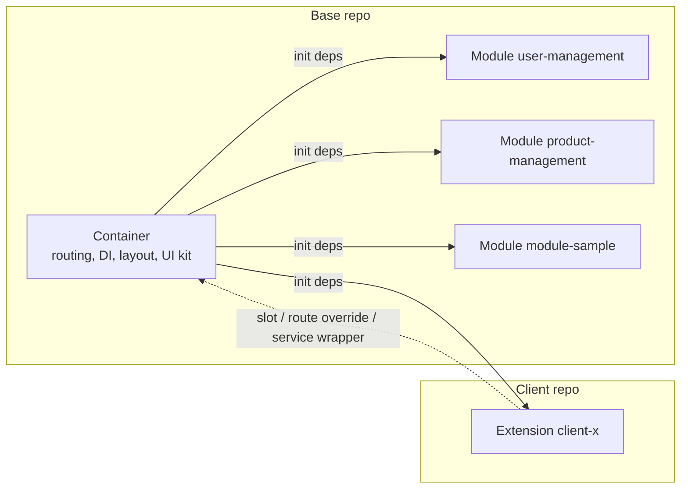

# Panduan Arsitektur — Platform Web Modular

Dokumen ini menjelaskan **bagaimana platform web modular ini disusun**: satu *container* (shell) yang stabil, modul-modul fitur bisnis yang dipilih lewat config, dan satu *extension* per klien untuk customization. Pembaca sasaran adalah developer baru dengan bekal React hooks dan TypeScript dasar; setiap istilah teknis dijelaskan saat pertama muncul. Bagian I (§1–§3) memberi orientasi dan model mental, Bagian II (§4–§15) membahas tiap mekanisme secara teknis. Dokumen ini menjelaskan *cara kerja*; aturan yang mengikat (wajib/dilarang) ada di `CONTRACT`. Padanan bahasa Inggris: `ARCHITECTURE.en.md`.

**Peta pembaca:**

| Jika Anda...                                                  | Mulai dari                       |
| ------------------------------------------------------------- | -------------------------------- |
| Baru di proyek dan butuh gambaran besar                       | Bagian I — Orientasi (§1–§3)     |
| Butuh detail teknis satu mekanisme (DI, routing, slot, build) | Bagian II — Detail (§4–§15)      |
| Butuh aturan normatif (wajib/dilarang)                        | `CONTRACT`                       |
| Butuh langkah deploy/operasional                              | `DEPLOYMENT-GUIDE`               |
| Butuh contoh kode langkah demi langkah                        | `DEVELOPER-GUIDE`                |

---

## 1. Apa yang Dibangun & Mengapa Modular

Platform web modular untuk **beberapa klien**: satu basis kode dipasang untuk banyak klien, dengan pilihan modul dan customization masing-masing. *Modular* berarti aplikasi tidak dibangun sebagai satu blok monolitik, melainkan dirakit dari tiga jenis bagian:

| Bagian        | Peran                                                                                                          |
| ------------- | -------------------------------------------------------------------------------------------------------------- |
| **Container** | Shell aplikasi: boot, config, dependency injection (DI), auth, routing host, layout, dan semua registry        |
| **Module**    | Fitur bisnis mandiri: halaman, menu, service, modal, state, dan terjemahan                                      |
| **Extension** | Customization satu klien: slot, route override, service wrapper, service dan terjemahan tambahan                |

Jargon: *dependency injection* (DI) artinya container menyediakan satu objek berisi semua layanan (disebut `deps`) yang diserahkan ke modul dan extension saat boot, sehingga mereka tidak perlu membuat instance sendiri.

**Karakteristik platform:**

- React 19 + Vite + TypeScript.
- Multi-client: banyak klien memakai container dan modul yang sama; perbedaan ada di extension.
- Puluhan modul bisnis — saat ini contohnya `user-management`, `product-management`, dan `module-sample`.
- Backend microservice diakses lewat **path-based routing** (`/api/<service>`), mis. service `auth` di `/api/auth` (`web-container/src/di/deps.ts:45`).
- Deploy per klien: base dibangun sekali menjadi image base, lalu tiap klien membangun image client `FROM` base image tersebut (lihat `DEPLOYMENT-GUIDE` §1).

**Contoh singkat.** Modul `module-sample` mendaftarkan halaman, menu, service, dan modalnya sendiri lewat `init(deps)` (`web-modules/modules/module-sample/index.tsx:14`). Extension `client-a` tidak menyentuh modul itu; ia mengisi slot `module-sample.overviewPanel` dan meng-override route `/module-sample/extension-points` (`web-extension-client-a/src/index.tsx:32`). Pola ini berulang di seluruh dokumen: **base menyediakan titik sambung, klien menyambung**.

### 1.1 Tanpa Modular vs Dengan Modular

| Aspek                            | Tanpa modular                       | Dengan modular                                       |
| -------------------------------- | ----------------------------------- | ---------------------------------------------------- |
| Perubahan untuk klien A          | Bisa merusak klien B                | Terisolasi di extension klien A                      |
| Bundle                           | Semua fitur ikut dimuat             | Hanya modul yang tercantum di `config.modules`       |
| Onboarding developer klien baru  | Harus menyelami seluruh basis kode  | Cukup repo base (baca) + extension kecil             |
| Ritme product vs kebutuhan klien | Saling mengganggu                   | Berjalan paralel: base stabil, extension terisolasi  |

### 1.2 Tujuh Prinsip Filosofi

Inilah prinsip yang membentuk seluruh keputusan desain. Aturan kerasnya ada di `CONTRACT` §1.

| Prinsip                            | Artinya                                                    | Konsekuensi                                                                      |
| ---------------------------------- | ---------------------------------------------------------- | -------------------------------------------------------------------------------- |
| **Container tidak tahu modul**     | Shell tidak pernah meng-import kode modul                  | Modul ditemukan dari `config.modules` (discovery), bukan hardcode                |
| **Modul tidak tahu extension**     | Modul tidak pernah menyebut nama klien                     | Customization lewat slot, bukan `if (client === 'client-a')`                     |
| **Extension tahu base**            | Extension boleh meng-import public API container dan modul | Extension punya titik masuk yang jelas: `init(deps)`                             |
| **Public API sebagai kontrak**     | Setiap lapisan hanya mengekspos file tertentu              | `@arsi/container`, `@arsi/shared`, `modules/<name>/public.ts` (`CONTRACT` §1.4)  |
| **Config-driven**                  | Pilihan modul dan URL dibaca dari config runtime           | Tanpa hardcode; config di-inject saat container start                            |
| **Fail-fast**                      | Duplikasi service, slot, atau route langsung error         | Kesalahan ketahuan saat boot, bukan diam-diam di production                      |
| **Satu image, banyak environment** | Perbedaan staging/production hanya env var saat start      | Ganti API base/modul tanpa rebuild image                                         |

---

## 2. Peta Repo & Ownership

Di produksi ada **dua jenis repo**: satu **repo base** milik platform team, dan satu **repo klien** per klien milik developer klien. Tabel berikut memetakan isinya.

**Repo base (`arsi-web-base`):**

| Path                           | Isi                                                                                                                                | Pemilik       |
| ------------------------------ | ---------------------------------------------------------------------------------------------------------------------------------- | ------------- |
| `web-container/`               | Shell: boot (`src/bootstrap/`), DI (`src/di/deps.ts`), auth, routing host, layout, registry, API client, i18n, toast/modal/notifications | Platform team |
| `web-modules/`                 | `shared/` (UI kit, hooks, utils) + `modules/<name>/` (fitur bisnis)                                                                | Platform team |
| `web-extension-default/`       | Extension no-op untuk menjalankan base standalone (`client: "base"`)                                                               | Platform team |
| `web-extension-template/`      | Titik awal repo klien baru                                                                                                         | Platform team |
| `docs/`                        | `ARCHITECTURE`, `CONTRACT`, `DEVELOPER-GUIDE`, `DEPLOYMENT-GUIDE`                                                                  | Platform team |
| `Dockerfile` + `.dockerignore` | Build 2 image base: builder (`node:22-alpine`) dan runtime (`nginx:1.27-alpine`)                                                   | Platform team |
| `ci/build-base.sh`             | Skrip build + push image base                                                                                                      | Platform team |

**Repo klien (`arsi-web-client-<x>`, checkout `web-extension-client-<x>`):**

| Path                      | Isi                                                                                | Pemilik         |
| ------------------------- | ---------------------------------------------------------------------------------- | --------------- |
| `manifest.json`           | Identitas klien: `client`, `baseVersion` (pin exact ke tag base), modul, override   | Developer klien |
| `src/index.tsx`           | Entry point `init(deps)` — satu-satunya pintu masuk extension                       | Developer klien |
| `src/components/`         | Komponen khusus klien (mis. `AuditButton`)                                          | Developer klien |
| `src/overrides/<module>/` | Override per modul (mis. `user-management/ClientAUserDetail.tsx`)                   | Developer klien |
| `Dockerfile`              | Image klien: `FROM` base builder → `FROM` base runtime                              | Developer klien |
| `ci/build-client.sh`      | Skrip build + push image klien                                                      | Developer klien |

> **Catatan workspace contoh.** Repo ini adalah workspace sample dengan **layout flat**: `web-container/`, `web-modules/`, `web-extension-default/`, `web-extension-template/`, dan `web-extension-client-a/` bersebelahan di satu folder. Di produksi, `web-extension-client-<x>` adalah isi repo terpisah `arsi-web-client-<x>`; saat dev repo itu di-checkout bersebelahan dengan repo base karena path mapping mengasumsikan posisi *sibling* (`DEPLOYMENT-GUIDE` §3).

### 2.1 Siapa Mengubah Apa

| Perubahan                                | Diubah di                      | Perlu diskusi?             |
| ---------------------------------------- | ------------------------------ | -------------------------- |
| Tambah/ubah modul bisnis                 | `web-modules/modules/<name>`   | Tidak                      |
| Tambah komponen UI bersama               | `web-modules/shared`           | Tidak                      |
| Ubah shell, DI, atau public API container | `web-container`               | Ya — lead dev              |
| Customization satu klien                 | `web-extension-client-<x>`     | Tidak                      |
| Naikkan `baseVersion` yang dipakai klien | `manifest.json` repo klien     | Ya — jadwalkan adopsi base |
| Buat repo klien baru                     | Salin `web-extension-template` | Ya                         |

Prinsip ownership: developer klien **boleh membaca** repo base tetapi **tidak mengubahnya**; kebutuhan yang menyangkut base diusulkan lewat PR ke platform team. Sebaliknya, base tidak pernah menyentuh kode extension.

### 2.2 Yang Tidak Ada di Repo Klien

Repo klien sengaja tetap kecil. Yang tidak ada di sana:

- `web-container/` dan `web-modules/` — tersedia dari base builder image saat build image klien (`/app/web-container`, `/app/web-modules`).
- `moduleLoaders.generated.ts` — digenerate container dari `package.json` tiap modul, bukan disalin ke klien.
- `/config.json` — ditulis `entrypoint.sh` saat container start dari env (`VITE_*`), bukan file yang di-commit.
- Kode klien lain — tidak ada akses lintas klien.

---

## 3. Model Mental 10 Menit

### 3.1 Analogi Gedung

Bayangkan platform ini sebagai sebuah **gedung**:

- **Container** adalah gedung beserta fasilitas umumnya — struktur, listrik, lift, keamanan. Ia menyediakan auth, routing, layout, DI, dan registries; ia tidak tahu isi tiap ruangan.
- **Module** adalah tenant yang menata ruangannya sendiri — fitur bisnis (`user-management`, `module-sample`) lengkap dengan halaman, menu, service, dan state-nya.
- **Extension** adalah dekorasi atau renovasi khusus satu klien — menambah panel, mengganti halaman, atau membungkus logic, tanpa mengubah fondasi gedung.

### 3.2 Tiga Istilah

| Istilah       | Definisi ringkas                                                                                                                                                          | Contoh di repo ini                               |
| ------------- | ------------------------------------------------------------------------------------------------------------------------------------------------------------------------- | ------------------------------------------------ |
| **Container** | Aplikasi React yang melakukan boot, menyediakan config, DI, auth, routing host, layout, dan semua registry. Hanya public API-nya (`@arsi/container`) yang boleh dipakai modul/extension. | `web-container/src/di/deps.ts:23`                |
| **Module**    | Paket fitur bisnis mandiri yang mendaftarkan menu, route, service, modal, dan i18n lewat `init(deps)`; kontraknya `public.ts`. Dipilih per klien lewat `config.modules`. | `web-modules/modules/module-sample/index.tsx:14` |
| **Extension** | Paket customization per klien yang juga punya `init(deps)`; mengisi slot, meng-override route, dan menambah service/i18n. Tidak pernah di-import oleh base.               | `web-extension-client-a/src/index.tsx:32`        |

### 3.3 Diagram Blok



Yang perlu diingat: **container memanggil, modul dan extension mendaftar**. Saat boot, container membuat satu objek `deps` berisi 13 layanan — `config`, `logger`, `api`, `apiRegistry`, `events`, `i18n`, `queryClient`, `toast`, `modal`, `notifications`, `slots`, `routes`, `menu` (`web-container/src/di/deps.ts:23`) — lalu `discover()` memanggil `init(deps)` untuk setiap modul di `config.modules`, dan terakhir untuk extension (`web-container/src/bootstrap/discover.ts:12`). Modul mendaftarkan dirinya; panah putus-putus dari extension menunjukkan bahwa extension *menyesuaikan* yang sudah terdaftar, bukan dipanggil balik oleh container.

### 3.4 Alur Boot dalam Satu Layar

```
main.tsx
  └─ loadConfig()            → fetch /config.json
  └─ bootstrap(config)       → createDeps + discover
       ├─ discover()         → init(deps) tiap modul di config.modules, lalu extension
       └─ createBrowserRouter(...) → susun route dari registry
  └─ createRoot(...).render(<RouterProvider router={router} />)
```

Urutannya penting: config dibaca dulu, `deps` dibuat **sekali**, semua `init` selesai, baru router dibentuk dan React dirender. Detail tiap langkah ada di Bagian II.

### 3.5 Di Mana Mulai Membaca Kode

| Ingin melihat...              | Buka                                             |
| ----------------------------- | ------------------------------------------------ |
| Titik masuk aplikasi dan boot | `web-container/src/main.tsx:11`                  |
| Kontrak `deps` (13 layanan)   | `web-container/src/di/deps.ts:23`                |
| Contoh modul lengkap          | `web-modules/modules/module-sample/index.tsx:14` |
| Contoh extension klien        | `web-extension-client-a/src/index.tsx:32`        |

### 3.6 Satu Alur Nyata

Contoh dari repo ini — login sebagai klien `client-a`, lalu jelajahi aplikasi:

| Kejadian                                         | Yang menanganinya                                                                                                    |
| ------------------------------------------------ | -------------------------------------------------------------------------------------------------------------------- |
| Menu "Users" tampil                              | Modul `user-management` mendaftarkan menunya; extension client-a meng-override label i18n menjadi "Client A Users"   |
| Halaman daftar user (`/users`) dibuka            | Route milik modul `user-management`; extension menambah tombol audit lewat slot `user-management.userTableActions`   |
| Detail user (`/users/:id`) dibuka                | Route di-override extension client-a → komponen `ClientAUserDetail`                                                 |
| Halaman `/module-sample/extension-points` dibuka | Route di-override extension; panel di halaman itu juga diisi lewat slot `module-sample.overviewPanel`                |

Semua yang "ditambahkan klien" terjadi tanpa mengubah kode modul. Inilah hasil akhir arsitektur ini.

Selanjutnya: Bagian II (§4–§15) membahas urutan boot, kontrak `deps` secara rinci, routing, slot, override, sampai build dan deployment.
