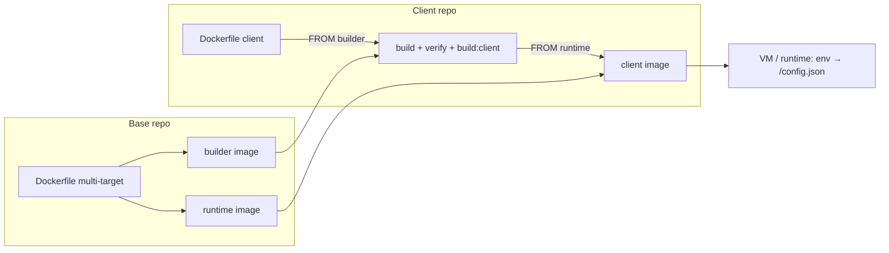

# Deployment Guide — DevOps Engineer

This guide is for **DevOps / platform engineers**: building the base and client images, pushing them to a registry, running them on servers, and keeping them healthy. Every command is designed to be copy-pasted; terms are explained as they appear. The deployment model concept lives in `ARCHITECTURE §8`, the hard rules in `CONTRACT`, and the development workflow in `DEVELOPER-GUIDE`. The Indonesian twin of this document is `DEPLOYMENT-GUIDE.md`.

Conventions: `<...>` is a placeholder to replace; commands are written for bash/zsh, and image references use the `docker.io` prefix (the default registry).

### Tutorial map

| Part | Target | Contents | Registry |
| --- | --- | --- | --- |
| **Tutorial A** — Deploy on a Laptop (Local) | developer laptop | build base + client images locally, run, smoke test, cleanup | no push/pull |
| **Tutorial B** — Deploy on an Ubuntu Server | one Ubuntu VM | Docker Engine + Compose, reverse proxy + TLS, update & rollback | pull from registry |
| **Tutorial C** — Deploy via Azure CI/CD | Azure Pipelines + VM | build/push pipeline, SSH deploy, approval | push + pull |
| **Operations & Reference** | — | environments/promotion, rollback, security, env reference, troubleshooting, cheat sheet | — |

### Prerequisites

| Need | Version | Notes |
| --- | --- | --- |
| Docker Engine | 20+ | multi-stage/multi-target builds; BuildKit not required |
| Docker Compose plugin | v2 (`docker compose`) | Tutorials B–C; Tutorial A does not use Compose |
| Git | 2.x | the default `SHA`/`BUILD_ID` comes from `git rev-parse --short HEAD` |
| Node.js + npm | 22.x + 10+ | for `VERIFY=1` and script version resolution (`node -p`, unless `BASE_VERSION`/`CLIENT_NAME` are passed); Docker uses `node:22-alpine` internally |
| Docker Hub account | — | Tutorials B–C (push/pull); Tutorial A runs fully local without login |
| Reverse proxy + TLS | nginx/Traefik/ALB | set up on the host; the container only serves HTTP:80 |

### Artifacts built

| Artifact | Contents | Tags | Image reference |
| --- | --- | --- | --- |
| Base builder | `node:22-alpine` + base source + `node_modules` + `/app/BASE_VERSION` | `<version>-builder`, `<sha>-builder` | `<registry>/<org>/arsi-web-base` |
| Base runtime | `nginx:1.27-alpine` + base dist (client `base`) + `entrypoint.sh` + `nginx.conf` | `<version>`, `<sha>` | same |
| Client image | base runtime + client dist, `ENV VITE_CLIENT=<client>` | `<buildId>` | `<registry>/<org>/arsi-web-<client>` |

- `<version>` = `web-container/package.json:version` (currently `0.1.0`); `<sha>` = short git SHA at build time; `<buildId>` = free-form build id (CI build ID / short SHA; Tutorial A uses `local`).
- `/config.json` is **not** in the image — `entrypoint.sh` generates it at container start (§1.3).

---

## 1. Concepts & Artifacts

The deployment model follows the two repo types (`ARCHITECTURE §2`): the platform team builds the **base image** once per version, then each client builds a **client image** `FROM` that base image. The client repo does **not** check out the base repo — base sources come from the builder image. In-depth explanation: `ARCHITECTURE §8`.

Four principles shape how operations work:

- **Build the base once, many extensions** — one base build produces two images (builder + runtime); each extension builds its own client image without rebuilding `web-container`/`web-modules`.
- **One image, many environments** — staging and production use the same client image; the only difference is env at start.
- **Config is not part of the image** — `entrypoint.sh` (shipped in the base runtime) writes `/config.json` from env; changing the API base/modules only needs a container recreate, no rebuild.
- **No secrets in the image** — the image contains public assets and public config only; secrets (registry tokens, TLS) live outside the image.

### 1.1 Tags

| Object | Tags | Source |
| --- | --- | --- |
| Base | `<version>`, `<version>-builder` | `web-container/package.json:version` |
| Base (immutable) | `<sha>`, `<sha>-builder` | `git rev-parse --short HEAD` |
| Client | `<buildId>` | `BUILD_ID` argument (CI build ID / short SHA) |

Promotion = **retag/pull the same image**, never rebuild; rollback = deploy the previous tag. Avoid the `latest` tag in production.

### 1.2 Pinning `baseVersion`

`manifest.json:baseVersion` in the client repo pins the exact base tag in use. During a client build, `check:base` compares the manifest value with `/app/BASE_VERSION` in the builder image; a mismatch stops the build with:

```text
[check:base] baseVersion manifest (x) != base image (y)
```

Adopting a new base = a PR that bumps `baseVersion`, then the client image is rebuilt against the new base tag. Other clients are unaffected until they bump their own `baseVersion`.

### 1.3 Runtime config

`entrypoint.sh` reads the following envs at container start, then writes them to `/config.json`:

| Env | Default | Purpose |
| --- | --- | --- |
| `VITE_CLIENT` | `base` | the `client` value in `/config.json`; the client image sets `ENV VITE_CLIENT=<client>` |
| `VITE_MODULES` | `user-management` | CSV of modules **initialized** at runtime, e.g. `user-management,product-management,module-sample` |
| `VITE_API_BASE` | `https://dummyjson.com` | API base URL for `deps.api` and module services |
| `VITE_ENABLE_AUDIT_LIVE` | `true` | feature flag (`featureFlags.enableAuditLive`) |
| `VITE_CONFIG_JSON` | — | full `/config.json` override (JSON object); when set, the individual envs are ignored |

- The file location can be overridden with `CONFIG_FILE` (default `/usr/share/nginx/html/config.json`).
- `VITE_CONFIG_JSON` wins outright and its value **must** be a JSON object (starts `{`, ends `}`); otherwise the container fails to start with `[entrypoint] VITE_CONFIG_JSON must be a JSON object`.
- Every module under `web-modules/modules/` is always bundled; `VITE_MODULES` only selects which ones are active. A module name must match its folder name — otherwise the app fails to boot with `[bootstrap] module "x" is declared in config.modules but has no entry in web-modules/modules`.
- nginx serves `/config.json` with `Cache-Control: no-store`, serves `/assets/` as immutable for 1 year, and provides the SPA fallback via `try_files $uri $uri/ /index.html`.
- The app fetches `/config.json` with `cache: 'no-store'`; the cache-header check is in A.4.

### 1.4 Deploy flow



The diagram structure matches `ARCHITECTURE §8`. The runtime target at the end is: a laptop (Tutorial A), an Ubuntu server (Tutorial B), or a VM deployed by the Azure pipeline (Tutorial C).

---

## Tutorial A — Deploy on a Laptop (Local)

**Goal:** build the base and client images on a laptop, run them at `localhost:8080`, and verify `/config.json` — without pushing to a registry. This is the fastest path to test build/deploy changes before touching a server.

Run it from the workspace root (the folder containing `ci/build-base.sh` and `web-extension-client-a/`). Docker must be running; Node 22 + npm are needed for `VERIFY=1` and the scripts' version resolution (`node -p`). Quick check:

```bash
docker version --format '{{.Server.Version}}'   # Docker Engine is running
node -v                                         # v22.x (for VERIFY=1)
git rev-parse --short HEAD                      # candidate <sha> tag
```

### A.1 Build the base image

```bash
ORG=<org> VERIFY=1 PUSH=0 ./ci/build-base.sh
```

What happens:

- `VERIFY=1` runs the full verification before building: `web-modules` (ci, typecheck, test, lint), `web-extension-default` (ci, typecheck, lint), then `web-container` (link `current-client` → default extension, ci, typecheck, test, `test:entrypoint`, `check:dockerfile`, `check:base`, build the base). `VERIFY=0` skips all of it.
- Two targets are built: `builder` (tags `<version>-builder` + `<sha>-builder`) then `runtime` (tags `<version>` + `<sha>`).
- `PUSH=0` — nothing is sent to a registry.
- `<version>` comes from `web-container/package.json:version` (currently `0.1.0`); `<sha>` from `git rev-parse --short HEAD`.

Expected output:

```text
[build-base] version=0.1.0 sha=<sha> image=docker.io/<org>/arsi-web-base
```

Verify the local tags:

```bash
docker images 'docker.io/<org>/arsi-web-base'
```

Four tags must appear: `0.1.0`, `0.1.0-builder`, `<sha>`, `<sha>-builder`. The first build is slow (downloads the base image + `npm ci` inside the build); later builds reuse cached layers.

### A.2 Build the client image

```bash
cd web-extension-client-a
ORG=<org> PULL=0 PUSH=0 BUILD_ID=local ./ci/build-client.sh
```

- `PULL=0` is mandatory in this tutorial: the base was never pushed, so do not try to pull from a registry — use the local base image from A.1.
- `BUILD_ID=local` names the image `docker.io/<org>/arsi-web-client-a:local`.
- `BASE_VERSION` and `CLIENT_NAME` come from `manifest.json` (`0.1.0` and `client-a`). `check:base` verifies `baseVersion` against `/app/BASE_VERSION` inside the builder image — a version mismatch fails the build.
- The extension verification (`typecheck`, `test --if-present`, `lint`) runs **inside the builder image**, then `CLIENT=client-a npm run build:client`.

Expected output:

```text
[build-client] client=client-a base=0.1.0 image=docker.io/<org>/arsi-web-client-a:local
```

### A.3 Run the container

```bash
docker run -d --name arsi-local -p 8080:80 \
  -e VITE_CLIENT=client-a \
  -e VITE_MODULES=user-management,product-management,module-sample \
  -e VITE_API_BASE=https://dummyjson.com \
  docker.io/<org>/arsi-web-client-a:local
```

`entrypoint.sh` (shipped in the base runtime) writes `/config.json` from the envs above at container start. Changing env = remove the container and run it again; no image rebuild needed.

The base runtime can also run standalone (default extension, client `base`) for a quick smoke test:

```bash
docker run -d --name arsi-base -p 8081:80 docker.io/<org>/arsi-web-base:0.1.0
```

### A.4 Smoke test

```bash
# 1. Config matches the env
curl -sf localhost:8080/config.json | jq -e '.client and .modules and .apiBase'

# 2. Main page returns 200
curl -s -o /dev/null -w "%{http_code}\n" localhost:8080/

# 3. SPA deep-link fallback (must be 200 + index.html, not 404)
curl -s localhost:8080/products/1 | grep -q '<div id="root">'

# 4. Config cache header
curl -sI localhost:8080/config.json | grep -i 'cache-control: no-store'

# 5. Entrypoint log
docker logs arsi-local 2>&1 | grep 'Generated'
```

Expected results:

- `/config.json` contains `"client":"client-a"`, `"modules":["user-management","product-management","module-sample"]`, and `"apiBase":"https://dummyjson.com"`.
- `/` responds `200`; `/products/1` returns `index.html` through the `try_files $uri $uri/ /index.html` fallback.
- The log contains `Generated /usr/share/nginx/html/config.json for client client-a`.
- `/config.json` is served with `Cache-Control: no-store` (browsers do not cache the config).

### A.5 Cleanup

```bash
docker rm -f arsi-local
docker rmi docker.io/<org>/arsi-web-client-a:local
docker rmi docker.io/<org>/arsi-web-base:0.1.0 docker.io/<org>/arsi-web-base:0.1.0-builder
```

The `<sha>` and `<sha>-builder` tags still point to the same base image; remove them too when no longer needed:

```bash
docker rmi docker.io/<org>/arsi-web-base:<sha> docker.io/<org>/arsi-web-base:<sha>-builder
```

Replace `<sha>` with the value from the A.1 output (defaults to `git rev-parse --short HEAD` at build time). Build cache can be cleared with `docker builder prune`.

### A.6 Failed halfway?

| Symptom | Cause & fix |
| --- | --- |
| `pull access denied` / `not found` during the client build | `PULL` defaults to `1`. Run with `PULL=0` (Tutorial A) or log in and push the base first (Tutorials B–C). |
| `[check:base] baseVersion manifest (0.1.0) != base image (x)` | The local base is not the version pinned by the manifest. Rebuild the base in A.1 with the same version, or align `BASE_VERSION`. |
| `Cannot connect to the Docker daemon` | Docker Engine is not running — check `docker version`, start Docker Desktop / `systemctl start docker`. |
| Port 8080 is already in use | Change `-p 8080:80` to `-p 8081:80` and adjust the smoke-test URLs. |
| `node: command not found` during a build | The scripts call `node -p` unconditionally to read versions, before the `VERIFY` block. Install Node 22, or pass `BASE_VERSION` explicitly (and `CLIENT_NAME` for `build-client.sh`). |
| `jq: command not found` | Install `jq` (`brew install jq`, `apt install jq`), or replace it with `grep '"client"'`. |
| `/config.json` still has the old config | The container was not recreated — `docker rm -f arsi-local` then re-run the A.3 command. |
| Image will not run on a server (`exec format error`) | The image architecture follows the build laptop (e.g. `linux/arm64` on Apple Silicon); CI/production is usually `linux/amd64`. Build via CI or set the matching `--platform`. |

### ✅ Tutorial A checklist

- [ ] Four local base tags appear: `<version>`, `<version>-builder`, `<sha>`, `<sha>-builder`.
- [ ] The client image `docker.io/<org>/arsi-web-client-a:local` is built.
- [ ] `curl -sf localhost:8080/config.json | jq -e '.client'` returns `"client-a"`.
- [ ] `/` responds 200 and the `/products/1` deep link returns `index.html`, not 404.
- [ ] `docker logs arsi-local` contains a `Generated ...` line.
- [ ] Cleanup A.5 is done.

Continue to Tutorial B (Ubuntu server) for a real deployment, then Tutorial C (Azure CI/CD) to automate build & deploy.
