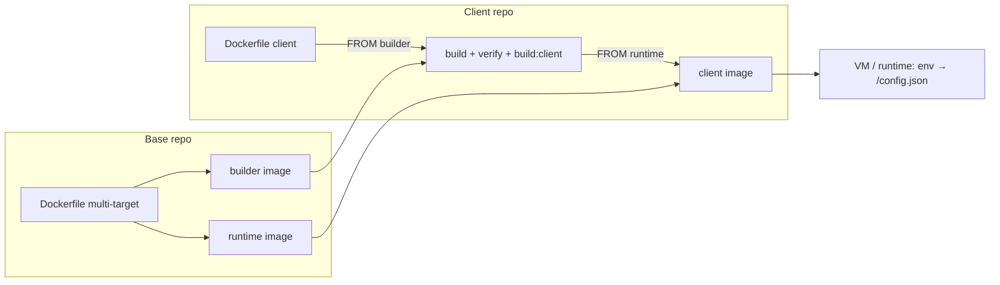

# Panduan Deployment — DevOps Engineer

Panduan ini ditujukan untuk **DevOps / platform engineer**: membangun image base dan image client, mendorongnya ke registry, menjalankannya di server, lalu merawatnya saat berjalan. Semua perintah dirancang copy-paste; istilah dijelaskan secukupnya. Konsep model deploy ada di `ARCHITECTURE §8`, aturan keras di `CONTRACT`, dan alur development di `DEVELOPER-GUIDE`. Padanan bahasa Inggris dokumen ini: `DEPLOYMENT-GUIDE.en.md`.

Konvensi: `<...>` adalah placeholder yang diganti; perintah ditulis untuk bash/zsh, dan referensi image memakai prefix `docker.io` (registry default).

### Peta tutorial

| Bagian | Target | Isi | Registry |
| --- | --- | --- | --- |
| **Tutorial A** — Deploy di Laptop (Local) | laptop developer | build base + client image lokal, jalankan, smoke test, cleanup | tanpa push/pull |
| **Tutorial B** — Deploy di Ubuntu Server | satu VM Ubuntu | Docker Engine + Compose, reverse proxy + TLS, update & rollback | pull dari registry |
| **Tutorial C** — Deploy via Azure CI/CD | Azure Pipelines + VM | pipeline build/push, deploy via SSH, approval | push + pull |
| **Operasi & Referensi** | — | environments/promotion, rollback, security, referensi env, troubleshooting, cheat sheet | — |

### Prasyarat

| Kebutuhan | Versi | Catatan |
| --- | --- | --- |
| Docker Engine | 20+ | build multi-stage/multi-target; BuildKit tidak wajib |
| Docker Compose plugin | v2 (`docker compose`) | Tutorial B–C; Tutorial A tidak memakai Compose |
| Git | 2.x | default `SHA`/`BUILD_ID` diambil dari `git rev-parse --short HEAD` |
| Node.js + npm | 22.x + 10+ | untuk `VERIFY=1` dan resolusi versi skrip (`node -p`, kecuali `BASE_VERSION`/`CLIENT_NAME` diisi); di dalam Docker dipakai `node:22-alpine` |
| Akun Docker Hub | — | Tutorial B–C (push/pull); Tutorial A berjalan penuh lokal tanpa login |
| Reverse proxy + TLS | nginx/Traefik/ALB | disiapkan di host; container hanya melayani HTTP:80 |

### Artefak yang dibangun

| Artefak | Isi | Tag | Referensi image |
| --- | --- | --- | --- |
| Base builder | `node:22-alpine` + source base + `node_modules` + `/app/BASE_VERSION` | `<versi>-builder`, `<sha>-builder` | `<registry>/<org>/arsi-web-base` |
| Base runtime | `nginx:1.27-alpine` + dist base (client `base`) + `entrypoint.sh` + `nginx.conf` | `<versi>`, `<sha>` | idem |
| Client image | base runtime + dist klien, `ENV VITE_CLIENT=<client>` | `<buildId>` | `<registry>/<org>/arsi-web-<client>` |

- `<versi>` = `web-container/package.json:version` (saat ini `0.1.0`); `<sha>` = short git SHA saat build; `<buildId>` = id build bebas (CI build ID / short SHA; Tutorial A memakai `local`).
- `/config.json` **tidak** ada di image — digenerate `entrypoint.sh` saat container start (§1.3).

---

## 1. Konsep & Artefak

Model deploy mengikuti dua jenis repo (`ARCHITECTURE §2`): platform team membangun **image base** sekali per versi, lalu tiap klien membangun **image client** `FROM` image base tersebut. Repo klien **tidak** men-checkout repo base — source base datang dari builder image. Penjelasan mendalam: `ARCHITECTURE §8`.

Empat prinsip yang menentukan cara kerja operasionalnya:

- **Base sekali, banyak extension** — satu build base menghasilkan dua image (builder + runtime); setiap extension membangun image client sendiri tanpa rebuild `web-container`/`web-modules`.
- **Satu image, banyak environment** — staging dan produksi memakai image client yang sama; perbedaannya hanya env saat start.
- **Config bukan bagian image** — `entrypoint.sh` (dibawa base runtime) menulis `/config.json` dari env; ganti API base/modul cukup dengan recreate container, tanpa rebuild.
- **Tidak ada secret di image** — image hanya berisi aset dan config publik; secret (token registry, TLS) ada di luar image.

### 1.1 Tag

| Objek | Tag | Sumber |
| --- | --- | --- |
| Base | `<versi>`, `<versi>-builder` | `web-container/package.json:version` |
| Base (immutable) | `<sha>`, `<sha>-builder` | `git rev-parse --short HEAD` |
| Client | `<buildId>` | argumen `BUILD_ID` (CI build ID / short SHA) |

Promosi = **retag/pull image yang sama**, bukan rebuild; rollback = deploy tag sebelumnya. Hindari tag `latest` di produksi.

### 1.2 Pin `baseVersion`

`manifest.json:baseVersion` di repo klien mengunci exact tag base yang dipakai. Saat build client, `check:base` membandingkan nilai manifest dengan `/app/BASE_VERSION` di builder image; mismatch menghentikan build dengan pesan:

```text
[check:base] baseVersion manifest (x) != base image (y)
```

Adopsi base baru = PR yang menaikkan `baseVersion`, lalu image client dibangun ulang terhadap tag base baru. Klien lain tidak terpengaruh sampai mereka menaikkan `baseVersion` masing-masing.

### 1.3 Runtime config

`entrypoint.sh` membaca env berikut saat container start, lalu menulisnya ke `/config.json`:

| Env | Default | Fungsi |
| --- | --- | --- |
| `VITE_CLIENT` | `base` | nilai `client` di `/config.json`; image client menyetel `ENV VITE_CLIENT=<client>` |
| `VITE_MODULES` | `user-management` | CSV modul yang **di-init** saat runtime, mis. `user-management,product-management,module-sample` |
| `VITE_API_BASE` | `https://dummyjson.com` | base URL API untuk `deps.api` dan service modul |
| `VITE_ENABLE_AUDIT_LIVE` | `true` | feature flag (`featureFlags.enableAuditLive`) |
| `VITE_CONFIG_JSON` | — | override penuh `/config.json` (JSON object); bila diisi, env individual diabaikan |

- Lokasi file bisa dioverride lewat `CONFIG_FILE` (default `/usr/share/nginx/html/config.json`).
- `VITE_CONFIG_JSON` menang mutlak dan nilainya **wajib** object JSON (diawali `{`, diakhiri `}`); kalau tidak, container gagal start dengan `[entrypoint] VITE_CONFIG_JSON must be a JSON object`.
- Semua modul di `web-modules/modules/` selalu ter-bundle; `VITE_MODULES` hanya memilih yang aktif. Nama modul harus sama dengan nama folder — kalau tidak, app gagal boot dengan `[bootstrap] module "x" is declared in config.modules but has no entry in web-modules/modules`.
- nginx mengirim `/config.json` dengan `Cache-Control: no-store`, melayani `/assets/` sebagai immutable 1 tahun, dan fallback SPA memakai `try_files $uri $uri/ /index.html`.
- Aplikasi membaca `/config.json` dengan `cache: 'no-store'`; verifikasi header cache ada di A.4.

### 1.4 Alur deploy



Struktur diagram sama dengan `ARCHITECTURE §8`. Target runtime di akhir alur: laptop (Tutorial A), Ubuntu server (Tutorial B), atau VM yang di-deploy pipeline Azure (Tutorial C).

---

## Tutorial A — Deploy di Laptop (Local)

**Tujuan:** membangun base image dan client image di laptop, menjalankannya di `localhost:8080`, dan memverifikasi `/config.json` — tanpa push ke registry. Ini jalur tercepat untuk menguji perubahan build/deploy sebelum menyentuh server.

Dijalankan dari root workspace (folder yang memuat `ci/build-base.sh` dan `web-extension-client-a/`). Docker harus berjalan; Node 22 + npm dibutuhkan untuk `VERIFY=1` dan resolusi versi skrip (`node -p`). Cek cepat:

```bash
docker version --format '{{.Server.Version}}'   # Docker Engine aktif
node -v                                         # v22.x (untuk VERIFY=1)
git rev-parse --short HEAD                      # calon tag <sha>
```

### A.1 Build base image

```bash
ORG=<org> VERIFY=1 PUSH=0 ./ci/build-base.sh
```

Yang terjadi:

- `VERIFY=1` menjalankan verifikasi penuh sebelum build: `web-modules` (ci, typecheck, test, lint), `web-extension-default` (ci, typecheck, lint), lalu `web-container` (link `current-client` → extension default, ci, typecheck, test, `test:entrypoint`, `check:dockerfile`, `check:base`, build base). `VERIFY=0` melewati semua ini.
- Build dua target: `builder` (tag `<versi>-builder` + `<sha>-builder`) lalu `runtime` (tag `<versi>` + `<sha>`).
- `PUSH=0` — tidak ada yang dikirim ke registry.
- `<versi>` diambil dari `web-container/package.json:version` (saat ini `0.1.0`); `<sha>` dari `git rev-parse --short HEAD`.

Output yang diharapkan:

```text
[build-base] version=0.1.0 sha=<sha> image=docker.io/<org>/arsi-web-base
```

Verifikasi tag lokal:

```bash
docker images 'docker.io/<org>/arsi-web-base'
```

Empat tag harus muncul: `0.1.0`, `0.1.0-builder`, `<sha>`, `<sha>-builder`. Build pertama lama (unduh base image + `npm ci` di dalam build); build berikutnya memakai cache layer.

### A.2 Build client image

```bash
cd web-extension-client-a
ORG=<org> PULL=0 PUSH=0 BUILD_ID=local ./ci/build-client.sh
```

- `PULL=0` wajib di tutorial ini: base belum pernah di-push, jadi jangan coba pull dari registry — pakai image base lokal dari A.1.
- `BUILD_ID=local` menamai image `docker.io/<org>/arsi-web-client-a:local`.
- `BASE_VERSION` dan `CLIENT_NAME` diambil dari `manifest.json` (`0.1.0` dan `client-a`). `check:base` memverifikasi `baseVersion` terhadap `/app/BASE_VERSION` di dalam builder image — beda versi = build gagal.
- Verifikasi extension (`typecheck`, `test --if-present`, `lint`) berjalan **di dalam builder image**, lalu `CLIENT=client-a npm run build:client`.

Output yang diharapkan:

```text
[build-client] client=client-a base=0.1.0 image=docker.io/<org>/arsi-web-client-a:local
```

### A.3 Jalankan container

```bash
docker run -d --name arsi-local -p 8080:80 \
  -e VITE_CLIENT=client-a \
  -e VITE_MODULES=user-management,product-management,module-sample \
  -e VITE_API_BASE=https://dummyjson.com \
  docker.io/<org>/arsi-web-client-a:local
```

`entrypoint.sh` (dibawa base runtime) menulis `/config.json` dari env di atas saat container start. Ganti env = hapus container lalu jalankan ulang; tidak perlu build ulang image.

Base runtime juga bisa dijalankan standalone (extension default, client `base`) untuk smoke test cepat:

```bash
docker run -d --name arsi-base -p 8081:80 docker.io/<org>/arsi-web-base:0.1.0
```

### A.4 Smoke test

```bash
# 1. Config sesuai env
curl -sf localhost:8080/config.json | jq -e '.client and .modules and .apiBase'

# 2. Halaman utama 200
curl -s -o /dev/null -w "%{http_code}\n" localhost:8080/

# 3. Deep link SPA fallback (harus 200 + index.html, bukan 404)
curl -s localhost:8080/products/1 | grep -q '<div id="root">'

# 4. Header cache config
curl -sI localhost:8080/config.json | grep -i 'cache-control: no-store'

# 5. Log entrypoint
docker logs arsi-local 2>&1 | grep 'Generated'
```

Hasil yang diharapkan:

- `/config.json` memuat `"client":"client-a"`, `"modules":["user-management","product-management","module-sample"]`, dan `"apiBase":"https://dummyjson.com"`.
- `/` merespons `200`; `/products/1` mengembalikan `index.html` lewat fallback `try_files $uri $uri/ /index.html`.
- Log memuat `Generated /usr/share/nginx/html/config.json for client client-a`.
- `/config.json` dikirim dengan `Cache-Control: no-store` (browser tidak meng-cache config).

### A.5 Cleanup

```bash
docker rm -f arsi-local
docker rmi docker.io/<org>/arsi-web-client-a:local
docker rmi docker.io/<org>/arsi-web-base:0.1.0 docker.io/<org>/arsi-web-base:0.1.0-builder
```

Tag `<sha>` dan `<sha>-builder` masih menunjuk image base yang sama; hapus juga bila tidak diperlukan:

```bash
docker rmi docker.io/<org>/arsi-web-base:<sha> docker.io/<org>/arsi-web-base:<sha>-builder
```

Ganti `<sha>` dengan nilai dari output A.1 (default `git rev-parse --short HEAD` saat build). Build cache bisa dibersihkan sekaligus dengan `docker builder prune`.

### A.6 Gagal di tengah jalan?

| Gejala | Sebab & solusi |
| --- | --- |
| `pull access denied` / `not found` saat build client | `PULL` default `1`. Jalankan dengan `PULL=0` (Tutorial A) atau login dan push base dulu (Tutorial B–C). |
| `[check:base] baseVersion manifest (0.1.0) != base image (x)` | Base lokal bukan versi yang dipin manifest. Build ulang base A.1 dengan versi yang sama, atau samakan `BASE_VERSION`. |
| `Cannot connect to the Docker daemon` | Docker Engine belum berjalan — cek `docker version`, start Docker Desktop / `systemctl start docker`. |
| Port 8080 sudah dipakai | Ganti `-p 8080:80` menjadi `-p 8081:80` dan sesuaikan URL smoke test. |
| `node: command not found` saat build | Skrip memanggil `node -p` tanpa syarat untuk membaca versi, sebelum blok `VERIFY`. Pasang Node 22, atau isi `BASE_VERSION` eksplisit (dan `CLIENT_NAME` untuk `build-client.sh`). |
| `jq: command not found` | Pasang `jq` (`brew install jq`, `apt install jq`), atau ganti dengan `grep '"client"'`. |
| `/config.json` masih berisi config lama | Container belum di-recreate — `docker rm -f arsi-local` lalu jalankan ulang perintah A.3. |
| Image tidak jalan di server (`exec format error`) | Arsitektur image mengikuti laptop saat build (mis. `linux/arm64` di Apple Silicon); CI/produksi umumnya `linux/amd64`. Bangun lewat CI atau set `--platform` yang sesuai. |

### ✅ Checklist Tutorial A

- [ ] Empat tag base lokal muncul: `<versi>`, `<versi>-builder`, `<sha>`, `<sha>-builder`.
- [ ] Image client `docker.io/<org>/arsi-web-client-a:local` terbentuk.
- [ ] `curl -sf localhost:8080/config.json | jq -e '.client'` mengembalikan `"client-a"`.
- [ ] Halaman `/` merespons 200 dan deep link `/products/1` mengembalikan `index.html`, bukan 404.
- [ ] `docker logs arsi-local` memuat baris `Generated ...`.
- [ ] Cleanup A.5 selesai.

Lanjutkan ke Tutorial B (Ubuntu server) untuk deploy sungguhan, lalu Tutorial C (Azure CI/CD) untuk otomatisasi build & deploy.
