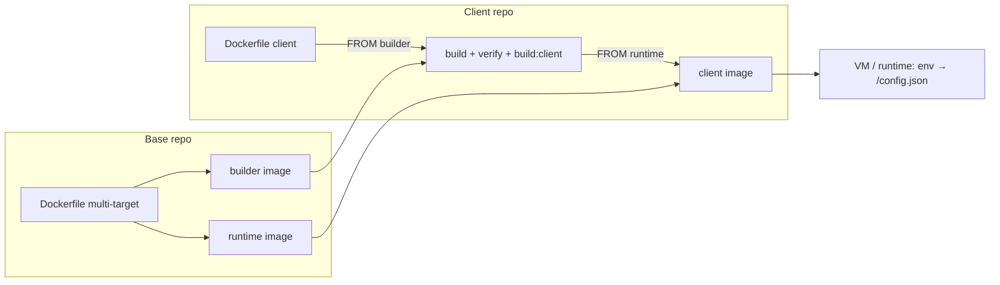

# Panduan Deployment — DevOps Engineer

Panduan ini ditujukan untuk **DevOps / platform engineer**: membangun image base dan image client, mendorongnya ke registry, menjalankannya di server, lalu merawatnya saat berjalan. Semua perintah dirancang copy-paste; istilah dijelaskan secukupnya. Konsep model deploy ada di `ARCHITECTURE §8`, aturan keras di `CONTRACT`, dan alur development di `DEVELOPER-GUIDE`. Padanan bahasa Inggris dokumen ini: `DEPLOYMENT-GUIDE.en.md`.

Konvensi: `<...>` adalah placeholder yang diganti; perintah ditulis untuk bash/zsh, dan referensi image memakai prefix `docker.io` (registry default).

### Peta tutorial

| Bagian | Target | Isi | Registry |
| --- | --- | --- | --- |
| **Tutorial A** — Deploy di Laptop (Local) | laptop developer | build base + client image lokal, jalankan, smoke test, cleanup | tanpa push/pull |
| **Tutorial B** — Deploy di Ubuntu Server | satu VM Ubuntu | Docker Engine + Compose, reverse proxy + TLS, update & rollback | pull dari registry |
| **Tutorial C** — Deploy via Azure CI/CD | Azure Pipelines + VM | pipeline build/push, deploy via SSH, approval | push + pull |
| **Operasi & Referensi** | — | environments/promotion, rollback, security, referensi env, troubleshooting, cheat sheet | — |

### Prasyarat

| Kebutuhan | Versi | Catatan |
| --- | --- | --- |
| Docker Engine | 20+ | build multi-stage/multi-target; BuildKit tidak wajib |
| Docker Compose plugin | v2 (`docker compose`) | Tutorial B–C; Tutorial A tidak memakai Compose |
| Git | 2.x | default `SHA`/`BUILD_ID` diambil dari `git rev-parse --short HEAD` |
| Node.js + npm | 22.x + 10+ | untuk `VERIFY=1` dan resolusi versi skrip (`node -p`, kecuali `BASE_VERSION`/`CLIENT_NAME` diisi); di dalam Docker dipakai `node:22-alpine` |
| Akun Docker Hub | — | Tutorial B–C (push/pull); Tutorial A berjalan penuh lokal tanpa login |
| Reverse proxy + TLS | nginx/Traefik/ALB | disiapkan di host; container hanya melayani HTTP:80 |

### Artefak yang dibangun

| Artefak | Isi | Tag | Referensi image |
| --- | --- | --- | --- |
| Base builder | `node:22-alpine` + source base + `node_modules` + `/app/BASE_VERSION` | `<versi>-builder`, `<sha>-builder` | `<registry>/<org>/arsi-web-base` |
| Base runtime | `nginx:1.27-alpine` + dist base (client `base`) + `entrypoint.sh` + `nginx.conf` | `<versi>`, `<sha>` | idem |
| Client image | base runtime + dist klien, `ENV VITE_CLIENT=<client>` | `<buildId>` | `<registry>/<org>/arsi-web-<client>` |

- `<versi>` = `web-container/package.json:version` (saat ini `0.1.0`); `<sha>` = short git SHA saat build; `<buildId>` = id build bebas (CI build ID / short SHA; Tutorial A memakai `local`).
- `/config.json` **tidak** ada di image — digenerate `entrypoint.sh` saat container start (§1.3).

---

## 1. Konsep & Artefak

Model deploy mengikuti dua jenis repo (`ARCHITECTURE §2`): platform team membangun **image base** sekali per versi, lalu tiap klien membangun **image client** `FROM` image base tersebut. Repo klien **tidak** men-checkout repo base — source base datang dari builder image. Penjelasan mendalam: `ARCHITECTURE §8`.

Empat prinsip yang menentukan cara kerja operasionalnya:

- **Base sekali, banyak extension** — satu build base menghasilkan dua image (builder + runtime); setiap extension membangun image client sendiri tanpa rebuild `web-container`/`web-modules`.
- **Satu image, banyak environment** — staging dan produksi memakai image client yang sama; perbedaannya hanya env saat start.
- **Config bukan bagian image** — `entrypoint.sh` (dibawa base runtime) menulis `/config.json` dari env; ganti API base/modul cukup dengan recreate container, tanpa rebuild.
- **Tidak ada secret di image** — image hanya berisi aset dan config publik; secret (token registry, TLS) ada di luar image.

### 1.1 Tag

| Objek | Tag | Sumber |
| --- | --- | --- |
| Base | `<versi>`, `<versi>-builder` | `web-container/package.json:version` |
| Base (immutable) | `<sha>`, `<sha>-builder` | `git rev-parse --short HEAD` |
| Client | `<buildId>` | argumen `BUILD_ID` (CI build ID / short SHA) |

Promosi = **retag/pull image yang sama**, bukan rebuild; rollback = deploy tag sebelumnya. Hindari tag `latest` di produksi.

### 1.2 Pin `baseVersion`

`manifest.json:baseVersion` di repo klien mengunci exact tag base yang dipakai. Saat build client, `check:base` membandingkan nilai manifest dengan `/app/BASE_VERSION` di builder image; mismatch menghentikan build dengan pesan:

```text
[check:base] baseVersion manifest (x) != base image (y)
```

Adopsi base baru = PR yang menaikkan `baseVersion`, lalu image client dibangun ulang terhadap tag base baru. Klien lain tidak terpengaruh sampai mereka menaikkan `baseVersion` masing-masing.

### 1.3 Runtime config

`entrypoint.sh` membaca env berikut saat container start, lalu menulisnya ke `/config.json`:

| Env | Default | Fungsi |
| --- | --- | --- |
| `VITE_CLIENT` | `base` | nilai `client` di `/config.json`; image client menyetel `ENV VITE_CLIENT=<client>` |
| `VITE_MODULES` | `user-management` | CSV modul yang **di-init** saat runtime, mis. `user-management,product-management,module-sample` |
| `VITE_API_BASE` | `https://dummyjson.com` | base URL API untuk `deps.api` dan service modul |
| `VITE_ENABLE_AUDIT_LIVE` | `true` | feature flag (`featureFlags.enableAuditLive`) |
| `VITE_CONFIG_JSON` | — | override penuh `/config.json` (JSON object); bila diisi, env individual diabaikan |

- Lokasi file bisa dioverride lewat `CONFIG_FILE` (default `/usr/share/nginx/html/config.json`).
- `VITE_CONFIG_JSON` menang mutlak dan nilainya **wajib** object JSON (diawali `{`, diakhiri `}`); kalau tidak, container gagal start dengan `[entrypoint] VITE_CONFIG_JSON must be a JSON object`.
- Semua modul di `web-modules/modules/` selalu ter-bundle; `VITE_MODULES` hanya memilih yang aktif. Nama modul harus sama dengan nama folder — kalau tidak, app gagal boot dengan `[bootstrap] module "x" is declared in config.modules but has no entry in web-modules/modules`.
- nginx mengirim `/config.json` dengan `Cache-Control: no-store`, melayani `/assets/` sebagai immutable 1 tahun, dan fallback SPA memakai `try_files $uri $uri/ /index.html`.
- Aplikasi membaca `/config.json` dengan `cache: 'no-store'`; verifikasi header cache ada di A.4.

### 1.4 Alur deploy



Struktur diagram sama dengan `ARCHITECTURE §8`. Target runtime di akhir alur: laptop (Tutorial A), Ubuntu server (Tutorial B), atau VM yang di-deploy pipeline Azure (Tutorial C).

---

## Tutorial A — Deploy di Laptop (Local)

**Tujuan:** membangun base image dan client image di laptop, menjalankannya di `localhost:8080`, dan memverifikasi `/config.json` — tanpa push ke registry. Ini jalur tercepat untuk menguji perubahan build/deploy sebelum menyentuh server.

Dijalankan dari root workspace (folder yang memuat `ci/build-base.sh` dan `web-extension-client-a/`). Docker harus berjalan; Node 22 + npm dibutuhkan untuk `VERIFY=1` dan resolusi versi skrip (`node -p`). Cek cepat:

```bash
docker version --format '{{.Server.Version}}'   # Docker Engine aktif
node -v                                         # v22.x (untuk VERIFY=1)
git rev-parse --short HEAD                      # calon tag <sha>
```

### A.1 Build base image

```bash
ORG=<org> VERIFY=1 PUSH=0 ./ci/build-base.sh
```

Yang terjadi:

- `VERIFY=1` menjalankan verifikasi penuh sebelum build: `web-modules` (ci, typecheck, test, lint), `web-extension-default` (ci, typecheck, lint), lalu `web-container` (link `current-client` → extension default, ci, typecheck, test, `test:entrypoint`, `check:dockerfile`, `check:base`, build base). `VERIFY=0` melewati semua ini.
- Build dua target: `builder` (tag `<versi>-builder` + `<sha>-builder`) lalu `runtime` (tag `<versi>` + `<sha>`).
- `PUSH=0` — tidak ada yang dikirim ke registry.
- `<versi>` diambil dari `web-container/package.json:version` (saat ini `0.1.0`); `<sha>` dari `git rev-parse --short HEAD`.

Output yang diharapkan:

```text
[build-base] version=0.1.0 sha=<sha> image=docker.io/<org>/arsi-web-base
```

Verifikasi tag lokal:

```bash
docker images 'docker.io/<org>/arsi-web-base'
```

Empat tag harus muncul: `0.1.0`, `0.1.0-builder`, `<sha>`, `<sha>-builder`. Build pertama lama (unduh base image + `npm ci` di dalam build); build berikutnya memakai cache layer.

### A.2 Build client image

```bash
cd web-extension-client-a
ORG=<org> PULL=0 PUSH=0 BUILD_ID=local ./ci/build-client.sh
```

- `PULL=0` wajib di tutorial ini: base belum pernah di-push, jadi jangan coba pull dari registry — pakai image base lokal dari A.1.
- `BUILD_ID=local` menamai image `docker.io/<org>/arsi-web-client-a:local`.
- `BASE_VERSION` dan `CLIENT_NAME` diambil dari `manifest.json` (`0.1.0` dan `client-a`). `check:base` memverifikasi `baseVersion` terhadap `/app/BASE_VERSION` di dalam builder image — beda versi = build gagal.
- Verifikasi extension (`typecheck`, `test --if-present`, `lint`) berjalan **di dalam builder image**, lalu `CLIENT=client-a npm run build:client`.

Output yang diharapkan:

```text
[build-client] client=client-a base=0.1.0 image=docker.io/<org>/arsi-web-client-a:local
```

### A.3 Jalankan container

```bash
docker run -d --name arsi-local -p 8080:80 \
  -e VITE_CLIENT=client-a \
  -e VITE_MODULES=user-management,product-management,module-sample \
  -e VITE_API_BASE=https://dummyjson.com \
  docker.io/<org>/arsi-web-client-a:local
```

`entrypoint.sh` (dibawa base runtime) menulis `/config.json` dari env di atas saat container start. Ganti env = hapus container lalu jalankan ulang; tidak perlu build ulang image.

Base runtime juga bisa dijalankan standalone (extension default, client `base`) untuk smoke test cepat:

```bash
docker run -d --name arsi-base -p 8081:80 docker.io/<org>/arsi-web-base:0.1.0
```

### A.4 Smoke test

```bash
# 1. Config sesuai env
curl -sf localhost:8080/config.json | jq -e '.client and .modules and .apiBase'

# 2. Halaman utama 200
curl -s -o /dev/null -w "%{http_code}\n" localhost:8080/

# 3. Deep link SPA fallback (harus 200 + index.html, bukan 404)
curl -s localhost:8080/products/1 | grep -q '<div id="root">'

# 4. Header cache config
curl -sI localhost:8080/config.json | grep -i 'cache-control: no-store'

# 5. Log entrypoint
docker logs arsi-local 2>&1 | grep 'Generated'
```

Hasil yang diharapkan:

- `/config.json` memuat `"client":"client-a"`, `"modules":["user-management","product-management","module-sample"]`, dan `"apiBase":"https://dummyjson.com"`.
- `/` merespons `200`; `/products/1` mengembalikan `index.html` lewat fallback `try_files $uri $uri/ /index.html`.
- Log memuat `Generated /usr/share/nginx/html/config.json for client client-a`.
- `/config.json` dikirim dengan `Cache-Control: no-store` (browser tidak meng-cache config).

### A.5 Cleanup

```bash
docker rm -f arsi-local
docker rmi docker.io/<org>/arsi-web-client-a:local
docker rmi docker.io/<org>/arsi-web-base:0.1.0 docker.io/<org>/arsi-web-base:0.1.0-builder
```

Tag `<sha>` dan `<sha>-builder` masih menunjuk image base yang sama; hapus juga bila tidak diperlukan:

```bash
docker rmi docker.io/<org>/arsi-web-base:<sha> docker.io/<org>/arsi-web-base:<sha>-builder
```

Ganti `<sha>` dengan nilai dari output A.1 (default `git rev-parse --short HEAD` saat build). Build cache bisa dibersihkan sekaligus dengan `docker builder prune`.

### A.6 Gagal di tengah jalan?

| Gejala | Sebab & solusi |
| --- | --- |
| `pull access denied` / `not found` saat build client | `PULL` default `1`. Jalankan dengan `PULL=0` (Tutorial A) atau login dan push base dulu (Tutorial B–C). |
| `[check:base] baseVersion manifest (0.1.0) != base image (x)` | Base lokal bukan versi yang dipin manifest. Build ulang base A.1 dengan versi yang sama, atau samakan `BASE_VERSION`. |
| `Cannot connect to the Docker daemon` | Docker Engine belum berjalan — cek `docker version`, start Docker Desktop / `systemctl start docker`. |
| Port 8080 sudah dipakai | Ganti `-p 8080:80` menjadi `-p 8081:80` dan sesuaikan URL smoke test. |
| `node: command not found` saat build | Skrip memanggil `node -p` tanpa syarat untuk membaca versi, sebelum blok `VERIFY`. Pasang Node 22, atau isi `BASE_VERSION` eksplisit (dan `CLIENT_NAME` untuk `build-client.sh`). |
| `jq: command not found` | Pasang `jq` (`brew install jq`, `apt install jq`), atau ganti dengan `grep '"client"'`. |
| `/config.json` masih berisi config lama | Container belum di-recreate — `docker rm -f arsi-local` lalu jalankan ulang perintah A.3. |
| Image tidak jalan di server (`exec format error`) | Arsitektur image mengikuti laptop saat build (mis. `linux/arm64` di Apple Silicon); CI/produksi umumnya `linux/amd64`. Bangun lewat CI atau set `--platform` yang sesuai. |

### ✅ Checklist Tutorial A

- [ ] Empat tag base lokal muncul: `<versi>`, `<versi>-builder`, `<sha>`, `<sha>-builder`.
- [ ] Image client `docker.io/<org>/arsi-web-client-a:local` terbentuk.
- [ ] `curl -sf localhost:8080/config.json | jq -e '.client'` mengembalikan `"client-a"`.
- [ ] Halaman `/` merespons 200 dan deep link `/products/1` mengembalikan `index.html`, bukan 404.
- [ ] `docker logs arsi-local` memuat baris `Generated ...`.
- [ ] Cleanup A.5 selesai.

Lanjutkan ke Tutorial B (Ubuntu server) untuk deploy sungguhan, lalu Tutorial C (Azure CI/CD) untuk otomatisasi build & deploy.

---

## Tutorial B — Deploy di Ubuntu Server

**Tujuan:** menjalankan image client yang sudah ada di registry di satu VM Ubuntu, melayani HTTPS lewat reverse proxy nginx + Let's Encrypt, dan menguasai update & rollback. Hasil akhir: container melayani HTTP hanya di `127.0.0.1:8080`, host nginx men-terminasi TLS di 443, dan `ufw` hanya membuka 22/80/443.

Prasyarat: akses SSH + `sudo` ke VM Ubuntu 22.04/24.04 LTS, serta image client sudah di-push ke registry. Bila belum, push dari laptop setelah `docker login docker.io -u <dockerhub-user>`:

```bash
ORG=<org> VERIFY=1 PUSH=1 ./ci/build-base.sh                    # base; harus ada sebelum client
cd web-extension-client-a
ORG=<org> PULL=1 PUSH=1 BUILD_ID=<buildId> ./ci/build-client.sh  # image client
```

Untuk otomatisasi penuh, lanjut ke Tutorial C; tutorial ini menunggu image tersedia di registry. Konvensi contoh: klien `client-a`, domain `app.example.com`, tag `2026.10.10-2`. Semua perintah dijalankan sebagai user `deploy`, kecuali yang ber-`sudo`.

Prinsip yang berlaku sepanjang tutorial:

- **Satu image per VM adalah default produksi** — isolasi kuat dan rollback sederhana; multi-client mungkin (B.11) tetapi berbagi Docker daemon.
- **Image immutable & environment-agnostic** — tag yang sama dipakai di staging dan produksi; yang berbeda hanya env `VITE_*` saat start.
- **TLS di host, container hanya HTTP:80** — publish ke `127.0.0.1` supaya container tidak pernah bisa diakses langsung dari internet.
- **Tidak ada secret di image atau `VITE_*`** — semua nilai berakhir di `/config.json` yang publik.

### B.1 Requirement VM

| Item | Minimum | Rekomendasi |
| --- | --- | --- |
| OS | Ubuntu 22.04/24.04 LTS | Ubuntu 24.04 LTS |
| CPU | 1 vCPU | 2 vCPU |
| RAM | 1 GB | 2 GB |
| Disk | 10 GB | 20 GB SSD |
| Docker Engine | 24+ dengan Compose v2 (`docker compose`) | stabil terbaru |
| IP publik + DNS | — | A record `app.example.com` → IP VM |
| Port terbuka | 22, 80, 443 | 22 dibatasi kantor/VPN bila bisa |

Nilai yang dibutuhkan dari pipeline build sebelum deploy:

| Nilai | Contoh | Sumber |
| --- | --- | --- |
| Image repository | `docker.io/<org>/arsi-web-client-a` | keluaran `build-client.sh` |
| Tag immutable | `2026.10.10-2` / short SHA | `BUILD_ID` CI |
| Client name | `client-a` | `manifest.json:client` |
| Modul aktif | `user-management,product-management,module-sample` | keputusan produk; harus ter-bundle di image |
| API base URL | `https://api.example.com` | environment backend |

### B.2 Persiapan & hardening

```bash
# 1. Update OS
sudo apt-get update && sudo apt-get upgrade -y

# 2. Paket dasar
sudo apt-get install -y ca-certificates curl gnupg jq ufw

# 3. Timezone dan sinkronisasi waktu (log & masa berlaku TLS)
sudo timedatectl set-timezone Asia/Jakarta
sudo timedatectl set-ntp true

# 4. User deploy (lewati bila sudah ada)
sudo adduser --disabled-password --gecos "" deploy
sudo mkdir -p /home/deploy/.ssh && sudo chmod 700 /home/deploy/.ssh
# tempel public key dari workstation:
echo "ssh-ed25519 AAAA... you@workstation" | sudo tee /home/deploy/.ssh/authorized_keys
sudo chmod 600 /home/deploy/.ssh/authorized_keys
sudo chown -R deploy:deploy /home/deploy/.ssh
sudo usermod -aG sudo deploy
```

Hardening SSH — **hanya setelah login memakai key terbukti berhasil** (`ssh deploy@<ip-vm>`):

```bash
# /etc/ssh/sshd_config.d/99-hardening.conf
PasswordAuthentication no
PermitRootLogin no
```

```bash
sudo systemctl restart ssh
```

⚠️ Jangan menutup sesi SSH lama sebelum sesi baru dengan key terbukti bisa login — salah setel di sini bisa mengunci Anda dari VM. Bila VM punya console cloud, itu jalur pemulihannya.

### B.3 Install Docker Engine + Compose plugin

Repo resmi Docker (di Debian ganti `ubuntu` → `debian`):

```bash
sudo install -m 0755 -d /etc/apt/keyrings
curl -fsSL https://download.docker.com/linux/ubuntu/gpg \
  | sudo gpg --dearmor -o /etc/apt/keyrings/docker.gpg
sudo chmod a+r /etc/apt/keyrings/docker.gpg

echo "deb [arch=$(dpkg --print-architecture) signed-by=/etc/apt/keyrings/docker.gpg] \
https://download.docker.com/linux/ubuntu $(. /etc/os-release && echo "$VERSION_CODENAME") stable" \
  | sudo tee /etc/apt/sources.list.d/docker.list > /dev/null

sudo apt-get update
sudo apt-get install -y docker-ce docker-ce-cli containerd.io \
  docker-buildx-plugin docker-compose-plugin

sudo systemctl enable --now docker
sudo usermod -aG docker deploy      # logout/login (atau `newgrp docker`) agar grup berlaku

docker version
docker compose version
```

Catatan:

- Grup `docker` setara root di host. Pada VM single-purpose ini trade-off standar; untuk isolasi lebih ketat pakai rootless Docker (di luar cakupan).
- Pastikan daemon hidup saat boot: `systemctl is-enabled docker`.

### B.4 Akses registry (Docker Hub)

Image client bisa private. Buat **token Docker Hub read-only** (Account Settings → Personal access tokens, atau deploy token organisasi), lalu login sekali di VM:

```bash
# interaktif
docker login docker.io -u <dockerhub-user>

# atau non-interaktif (token dari secret manager)
echo "<read-only-token>" | docker login docker.io -u <dockerhub-user> --password-stdin
```

Kredensial tersimpan di `~/.docker/config.json` milik user yang menjalankan `docker compose` (di sini: `deploy`). Kalau compose dijalankan via `sudo`, kredensial harus ada untuk `root` — jangan campur.

Aturan:

- Pakai token **read-only** di VM. Jangan pernah menyimpan token push-capable di VM produksi.
- VM hanya pull **image client**. Image base `-builder` adalah artefak CI dan tidak dibutuhkan saat runtime.
- Rotasi token berkala; setelah rotasi, login ulang lalu `docker compose pull`.

### B.5 Layout direktori

Satu direktori per client, dimiliki user `deploy`:

```text
/opt/arsi-web/<client>/
├── compose.yaml            # definisi service (tag image dari .env)
├── .env                    # nilai environment (chmod 600)
└── nginx/
    └── arsi-<client>.conf  # site reverse proxy host (B.8)
```

```bash
sudo mkdir -p /opt/arsi-web/<client>/nginx
sudo chown -R deploy:deploy /opt/arsi-web/<client>
cd /opt/arsi-web/<client>
```

`chmod 600 .env`: meskipun nilai `VITE_*` publik, file juga memuat tag image dan bisa memuat nilai operasional lain — jaga tetap privat.

### B.6 `compose.yaml` + `.env`

`.env` (contoh `client-a`):

```dotenv
BUILD_ID=2026.10.10-2
VITE_CLIENT=client-a
VITE_MODULES=user-management,product-management,module-sample
VITE_API_BASE=https://api.example.com
VITE_ENABLE_AUDIT_LIVE=false
```

- `BUILD_ID` = tag immutable dari CI. Compose memakai `${BUILD_ID:?...}` sehingga `up` gagal cepat bila lupa diisi.
- `VITE_CLIENT` = identitas klien di `/config.json`; image client sudah menyimpan nilainya, tetapi compose mengoper nilai dari `.env` — jangan hapus dari `.env`, karena entrypoint akan jatuh ke default `base`.
- `VITE_MODULES` wajib berisi nama modul yang **ter-bundle di image** (nama folder di `web-modules/modules/`); salah nama = app gagal boot (B.12).
- `VITE_ENABLE_AUDIT_LIVE` opsional; compose memakai `false` bila kosong (production-safe), sedangkan fallback entrypoint adalah `true`.

Untuk config penuh dari CI (melampaui empat env di atas), ganti isi `.env` dengan satu JSON:

```dotenv
BUILD_ID=2026.10.10-2
VITE_CONFIG_JSON={"client":"client-a","modules":["user-management","product-management"],"apiBase":"https://api.example.com","featureFlags":{"enableAuditLive":false}}
```

`compose.yaml`:

```yaml
name: arsi-<client>

services:
  web:
    image: docker.io/<org>/arsi-web-<client>:${BUILD_ID:?set BUILD_ID in .env}
    container_name: arsi-web-<client>
    ports:
      - "127.0.0.1:8080:80"          # jangan pernah publish 80 langsung ke internet
    environment:
      VITE_CLIENT: ${VITE_CLIENT}
      VITE_MODULES: ${VITE_MODULES:?set VITE_MODULES in .env}
      VITE_API_BASE: ${VITE_API_BASE:?set VITE_API_BASE in .env}
      VITE_ENABLE_AUDIT_LIVE: ${VITE_ENABLE_AUDIT_LIVE:-false}
    restart: unless-stopped
    healthcheck:
      test: ["CMD", "wget", "-qO-", "http://127.0.0.1/"]
      interval: 30s
      timeout: 5s
      retries: 3
      start_period: 10s
    logging:
      driver: json-file
      options:
        max-size: "10m"
        max-file: "3"
    security_opt:
      - no-new-privileges:true
```

Varian full-override (config dari CI) — ganti blok `environment:` dengan:

```yaml
    environment:
      VITE_CONFIG_JSON: |
        {"client":"client-a","modules":["user-management","product-management"],"apiBase":"https://api.example.com","featureFlags":{"enableAuditLive":false}}
```

Alasan pilihan:

- `127.0.0.1:8080:80` — Docker mem-publish port menembus `ufw`; bind ke loopback membuat satu-satunya pintu publik adalah proxy host (B.8).
- `restart: unless-stopped` — container hidup lagi otomatis setelah reboot VM (daemon Docker me-restart-nya).
- `healthcheck` — memakai `wget` busybox yang dibawa `nginx:alpine`; statusnya tampil di `docker compose ps`.
- `logging` — membatasi `json-file` agar log tidak memenuhi disk.
- `security_opt` — `no-new-privileges` murah; master nginx tetap berjalan sebagai root di dalam container (perilaku image).

Mengganti config cukup recreate container, bukan rebuild image: `docker compose up -d --force-recreate`. Tabel env lengkap ada di bagian Operasi & Referensi.

### B.7 First deploy

```bash
cd /opt/arsi-web/<client>

# 1. Tulis file deploy (isi dari B.6)
nano compose.yaml
nano .env && chmod 600 .env

# 2. Login bila image private (B.4)
docker login docker.io -u <dockerhub-user>

# 3. Pull dan jalankan
docker compose pull
docker compose up -d

# 4. Status dan health
docker compose ps                       # State: running, Health: healthy

# 5. Cek config (client + modules + apiBase harus sama dengan .env)
curl -s http://127.0.0.1:8080/config.json | jq .

# 6. Log entrypoint
docker logs arsi-web-<client> 2>&1 | grep Generated
```

`/config.json` yang diharapkan:

```json
{
  "client": "client-a",
  "modules": ["user-management", "product-management", "module-sample"],
  "apiBase": "https://api.example.com",
  "featureFlags": {
    "enableAuditLive": false
  }
}
```

⚠️ `Health: starting` selama `start_period` (10 detik) itu normal; tunggu sampai `healthy`. Log yang diharapkan: `Generated /usr/share/nginx/html/config.json for client client-a`. Bila DNS/TLS belum siap, verifikasi lewat loopback ini dulu, lalu lanjut B.8.

### B.8 Reverse proxy + TLS (nginx + Certbot)

DNS harus sudah mengarah ke VM sebelum Certbot (tabel di akhir sub-bab ini). Install dan buat site:

```bash
sudo apt-get install -y nginx certbot python3-certbot-nginx
```

`/opt/arsi-web/<client>/nginx/arsi-<client>.conf`:

```nginx
server {
    listen 80;
    server_name app.example.com;

    # Security headers (HSTS ditambahkan certbot setelah TLS berhasil)
    add_header X-Content-Type-Options nosniff always;
    add_header X-Frame-Options SAMEORIGIN always;
    add_header Referrer-Policy strict-origin-when-cross-origin always;

    location / {
        proxy_pass http://127.0.0.1:8080;
        proxy_http_version 1.1;
        proxy_set_header Host $host;
        proxy_set_header X-Real-IP $remote_addr;
        proxy_set_header X-Forwarded-For $proxy_add_x_forwarded_for;
        proxy_set_header X-Forwarded-Proto $scheme;
        proxy_read_timeout 60s;
    }
}
```

```bash
sudo ln -sf /opt/arsi-web/<client>/nginx/arsi-<client>.conf \
  /etc/nginx/sites-enabled/arsi-<client>.conf
sudo rm -f /etc/nginx/sites-enabled/default
sudo nginx -t && sudo systemctl reload nginx

# DNS harus sudah menunjuk app.example.com → VM ini dan port 80 terjangkau
sudo certbot --nginx -d app.example.com --redirect --agree-tos -m ops@example.com
```

Certbot memasang timer systemd yang memperbarui sertifikat otomatis. Verifikasi:

```bash
systemctl list-timers | grep certbot
curl -sI https://app.example.com/ | head -1
```

Catatan:

- Deep link SPA sudah diselesaikan container lewat `try_files $uri $uri/ /index.html`; proxy host cukup meneruskan `location /` apa adanya dan tidak perlu rewrite.
- Header cache diteruskan apa adanya: `/config.json` `no-store`, `/assets/` `public, immutable`. Jangan menambah aturan cache yang bertentangan di host.
- Tambahkan HSTS (`Strict-Transport-Security`) hanya setelah HTTPS terbukti stabil agar klien lama tidak terkunci.

Alternatif Caddy (HTTPS otomatis):

```bash
sudo apt-get install -y debian-keyring debian-archive-keyring apt-transport-https curl
curl -1sLf 'https://dl.cloudsmith.io/public/caddy/stable/gpg.key' \
  | sudo gpg --dearmor -o /usr/share/keyrings/caddy-stable-archive-keyring.gpg
curl -1sLf 'https://dl.cloudsmith.io/public/caddy/stable/debian.deb.txt' \
  | sudo tee /etc/apt/sources.list.d/caddy-stable.list
sudo apt-get update && sudo apt-get install -y caddy
```

`/etc/caddy/Caddyfile`:

```caddyfile
app.example.com {
    encode zstd gzip
    reverse_proxy 127.0.0.1:8080
}
```

```bash
sudo caddy validate --config /etc/caddy/Caddyfile
sudo systemctl reload caddy
```

DNS:

| Record | Nilai |
| --- | --- |
| `A` | `app.example.com` → IP publik VM |
| `AAAA` | opsional, hanya bila VM punya IPv6 |

Tanpa domain, deploy bisa di belakang load balancer internal atau memakai self-signed certificate untuk pengujian (browser akan memperingatkan).

### B.9 Firewall

```bash
sudo ufw allow OpenSSH
sudo ufw allow 80/tcp
sudo ufw allow 443/tcp
sudo ufw enable
sudo ufw status verbose
```

Dua hal penting:

1. **Docker mem-publish port di bawah `ufw`.** Bind container ke `127.0.0.1` (B.6) yang benar-benar mencegah akses publik langsung. Jangan pernah publish `0.0.0.0:8080`.
2. Batasi SSH ke jaringan dikenal bila bisa: `sudo ufw allow from <office-cidr> to any port 22 proto tcp`.

### B.10 Update & rollback

Deploy tag baru (dari keluaran CI):

```bash
cd /opt/arsi-web/<client>

# 1. Set tag immutable baru
sed -i 's/^BUILD_ID=.*/BUILD_ID=2026.10.10-2/' .env

# 2. Pull dan recreate
docker compose pull
docker compose up -d

# 3. Verifikasi
docker compose ps
curl -sf http://127.0.0.1:8080/config.json | jq -e '.client and .modules and .apiBase'
docker logs arsi-web-<client> 2>&1 | grep Generated
```

Satu replica di-recreate di tempat, jadi ada **blip singkat** (hitungan detik) saat nginx restart. Bila butuh zero downtime ketat, jalankan dua container di belakang proxy dan ganti upstream setelah yang baru `healthy` (container lama dipertahankan sampai switch).

Ganti config saja (tanpa image baru):

```bash
nano .env                        # VITE_MODULES / VITE_API_BASE / VITE_CONFIG_JSON
docker compose up -d --force-recreate
```

Rollback = deploy tag sebelumnya:

```bash
sed -i 's/^BUILD_ID=.*/BUILD_ID=<buildId-lama>/' .env
docker compose pull
docker compose up -d
docker compose ps
```

Catat selalu tag known-good terakhir per rilis. Jangan retag/daur ulang versi lama ke nomor baru — deploy tag immutable aslinya.

Opsional `deploy.sh` (pull + up + verifikasi + rollback otomatis):

```bash
#!/usr/bin/env bash
set -euo pipefail

cd "$(dirname "$0")"
NEW_TAG="${1:?usage: ./deploy.sh <image-tag>}"
PREVIOUS_TAG="$(grep -E '^BUILD_ID=' .env | cut -d= -f2)"
echo "[deploy] current=${PREVIOUS_TAG} new=${NEW_TAG}"

sed -i "s/^BUILD_ID=.*/BUILD_ID=${NEW_TAG}/" .env
docker compose pull
docker compose up -d

for _ in $(seq 1 30); do
  if curl -sf http://127.0.0.1:8080/config.json >/dev/null; then
    echo "[deploy] OK — ${NEW_TAG} is serving"
    echo "[deploy] rollback: sed -i 's/^BUILD_ID=.*/BUILD_ID=${PREVIOUS_TAG}/' .env && docker compose up -d"
    exit 0
  fi
  sleep 2
done

echo "[deploy] FAILED — rolling back to ${PREVIOUS_TAG}" >&2
sed -i "s/^BUILD_ID=.*/BUILD_ID=${PREVIOUS_TAG}/" .env
docker compose up -d
exit 1
```

```bash
chmod +x deploy.sh
./deploy.sh 2026.10.10-2
```

### B.11 Multi-client di satu VM

Direkomendasikan hanya untuk non-produksi atau client risiko rendah. Default produksi tetap satu client per VM.

Aturan bila berbagi VM:

- Satu direktori dan satu project Compose per client (`/opt/arsi-web/<client>`), masing-masing `name:` unik di `compose.yaml`.
- Port host unik per client: `127.0.0.1:8081:80`, `127.0.0.1:8082:80`, …
- Hostname unik per client: `app-a.example.com`, `app-b.example.com` → server block proxy terpisah (B.8).
- Perkirakan ~50–100 MB RAM per container nginx idle plus overhead OS/proxy.

```text
/opt/arsi-web/
├── client-a/   compose.yaml (name: arsi-client-a, 127.0.0.1:8081:80)
├── client-b/   compose.yaml (name: arsi-client-b, 127.0.0.1:8082:80)
└── client-c/   compose.yaml (name: arsi-client-c, 127.0.0.1:8083:80)
```

Semua client berbagi Docker daemon dan kernel host — crash atau kehabisan resource di satu image bisa memengaruhi yang lain. Batasi memori per service bila perlu:

```yaml
    deploy:
      resources:
        limits:
          memory: 256M
```

### B.12 Operasi: log, health, disk

**Log:**

```bash
cd /opt/arsi-web/<client>
docker compose logs -f --tail=100          # ikuti log app
docker logs arsi-web-<client> 2>&1 | grep Generated
journalctl -u nginx -f                     # proxy nginx
journalctl -u caddy -f                     # bila memakai Caddy
```

Blok `logging` di compose membatasi `json-file` 3 × 10 MB per container. Untuk log terpusat, tambahkan log shipper atau ganti driver (di luar cakupan).

**Health:**

```bash
docker compose ps
docker inspect --format '{{.State.Health.Status}}' arsi-web-<client>
curl -sf http://127.0.0.1:8080/config.json >/dev/null && echo OK
```

Tambahkan uptime check eksternal ke `https://app.example.com/config.json` (harus HTTP 200 + JSON valid) dan alarm setelah dua kegagalan berturut-turut.

**Disk:**

```bash
df -h /
docker system df
docker image prune -a --filter "until=168h"   # hapus image tak terpakai > 7 hari
```

`docker image prune -a` menghapus setiap image yang tidak dipakai container berjalan — image yang sedang deploy aman. Jadwalkan lewat cron bila disk cepat penuh.

**Perilaku reboot:** `restart: unless-stopped` + `systemctl enable docker` sudah cukup; setelah reboot VM container hidup otomatis. Bila ingin `systemctl` sebagai satu-satunya control surface, bungkus project Compose dengan unit systemd:

```ini
# /etc/systemd/system/arsi-<client>.service
[Unit]
Description=ARSI web <client> (docker compose)
Requires=docker.service
After=docker.service network-online.target
Wants=network-online.target

[Service]
Type=oneshot
RemainAfterExit=yes
WorkingDirectory=/opt/arsi-web/<client>
ExecStart=/usr/bin/docker compose up -d --remove-orphans
ExecStop=/usr/bin/docker compose down
TimeoutStartSec=0
User=deploy
Group=deploy

[Install]
WantedBy=multi-user.target
```

```bash
sudo systemctl daemon-reload
sudo systemctl enable --now arsi-<client>
sudo systemctl status arsi-<client>
```

**Troubleshooting VM:**

| Gejala | Sebab & solusi |
| --- | --- |
| `docker compose pull` → `unauthorized` / `pull access denied` | Image private dan belum/kedaluwarsa login. `docker login docker.io` dengan token read-only sebagai user yang sama yang menjalankan compose (B.4). |
| `502 Bad Gateway` dari proxy | Container mati atau port salah. `docker compose ps`, `curl -s http://127.0.0.1:8080/`; cek mapping `ports`. |
| Situs jalan di VM tapi tidak dari internet | DNS belum mengarah ke VM, atau `ufw` belum membuka 80/443. `dig app.example.com`, `sudo ufw status`. |
| `bind: address already in use` saat `up` | Port host bentrok. `ss -ltnp \| grep 8080`, pilih port lain, sesuaikan upstream proxy. |
| App boot tapi muncul `[bootstrap] module "x" … has no entry` | `VITE_MODULES` memuat nama yang tidak ter-bundle di image. Perbaiki `.env` atau rebuild base dengan module itu. |
| Perubahan config tidak terlihat | Container belum di-recreate, atau cache browser. `docker compose up -d --force-recreate`, hard refresh; `/config.json` `no-store`. |
| Container keluar dengan `[entrypoint] VITE_CONFIG_JSON must be a JSON object` | Nilai `VITE_CONFIG_JSON` bukan object JSON (terpotong, array, salah kutip). Perbaiki, atau kosongkan agar memakai env `VITE_*` individual. |
| App boot tanpa module setelah full override | JSON valid tetapi `modules` kosong/hilang. Tambahkan nama module yang ter-bundle; verifikasi via `curl /config.json`. |
| API call gagal CORS | Origin `VITE_API_BASE` beda dari origin app dan backend tidak mengizinkan. Perbaiki CORS atau sajikan API di domain yang sama. |
| Certbot gagal validasi | DNS belum propagate, port 80 diblokir, atau server block lain menjawab domain itu. Perbaiki DNS/`ufw`, lalu ulangi `certbot --nginx`. |
| HTTPS jalan tapi bookmark HTTP lama rusak | Aktifkan redirect (`certbot --nginx --redirect`) atau tambahkan `return 301 https://$host$request_uri;`. |
| Container restart berulang | Cek `docker logs arsi-web-<client>`; biasanya nilai `.env` salah atau image bukan client yang diharapkan. |
| App mati setelah reboot VM | Daemon Docker tidak enable atau policy `restart` hilang. `systemctl is-enabled docker`, pastikan `restart: unless-stopped`. |
| Disk penuh | Log/image tak terbatas. Cek `docker system df`, pastikan batas log compose, prune image lama (B.12). |
| `curl /config.json` mengembalikan HTML | Proxy merutekan `/config.json` ke catch-all atau SPA. Cek `server_name`/`proxy_pass` dan hapus site default. |

### ✅ Checklist Go-Live Tutorial B

- [ ] `docker compose ps` → `running` + `healthy`.
- [ ] `https://app.example.com/config.json` → `client`/`modules`/`apiBase` benar dan `Cache-Control: no-store`.
- [ ] Login dan semua module di `VITE_MODULES` tampil; deep link tidak 404.
- [ ] API call sukses (tidak ada CORS/4xx/5xx di console browser).
- [ ] TLS valid + auto-renew (`systemctl list-timers | grep certbot`).
- [ ] Tag image immutable tercatat + tag rollback diketahui.
- [ ] `ufw` aktif; container hanya di `127.0.0.1`; `.env` `chmod 600`.
- [ ] Uptime check eksternal ke `/config.json` terpasang.
- [ ] Tidak ada secret di `VITE_*`.

Untuk otomatisasi build & deploy, lanjut ke Tutorial C (Azure CI/CD).
