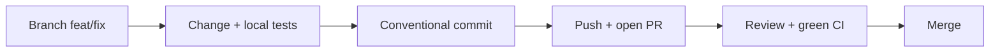

# Developer Guide — From Zero to Contribution

This guide walks a **new developer** from an empty laptop to a first pull request (PR), then stays on the desk as a day-to-day reference. The assumed background is React hooks and basic TypeScript. Modular architecture, dependency injection (DI), and multi-repo setups are explained the first time they appear. The Indonesian twin of this document is `DEVELOPER-GUIDE.md`.

Neighbouring documents:

| Document | Contents | When to read |
| --- | --- | --- |
| `ARCHITECTURE.md` | why the platform is modular and how each mechanism works | when you want the "why" |
| `CONTRACT.md` | hard rules (must/must not); violations get the PR rejected | before and while writing code |
| `DEPLOYMENT-GUIDE.en.md` | image builds, CI, and deployment | when releasing |

## How to Use This Guide

The guide has two parts:

- **Chapters 0–4 — the learning path.** Read them in order. Each chapter is one practical unit with a verifiable outcome.
- **Chapters 5–10 — reference.** Open when needed: conventions, testing, troubleshooting, PR checklist, image build, and living examples.

Every learning-path chapter uses four icons:

| Icon | Meaning |
| --- | --- |
| 🎯 | chapter goal — what you can do once you finish it |
| ✅ | checkpoint — how to prove the chapter worked |
| ⚠️ | common pitfalls — mistakes that happen most often |
| 📖 | concept — the related chapter in `ARCHITECTURE.md` for the "why" |

Cross-references are short: `ARCHITECTURE §4` means §4 of `ARCHITECTURE.md`; `CONTRACT §12.4` means §12.4 of `CONTRACT.md`; `GUIDE §3` means Chapter 3 of this document.

### Prerequisites

| Need | How |
| --- | --- |
| Node.js 22.x | `nvm install 22 && nvm use 22` (or `fnm use 22`); verify with `node -v` |
| npm 10+ | ships with Node; verify with `npm -v` |
| Git | `git --version`; set `git config user.name` and `git config user.email` |
| React hooks + basic TypeScript | background knowledge; no setup needed |
| Docker (optional) | only for the local image build in `GUIDE §9` |
| OS | macOS/Linux native; **Windows requires WSL2** — the repo scripts use `ln -sfn` and POSIX paths |

### Glossary

These nine terms come up constantly. Read them once; come back when you forget.

| Term | Short meaning |
| --- | --- |
| **Container** | The React application shell: boot, config, DI, auth, host routing, layout, and all registries. The container does not know what the modules contain. |
| **Module** | A self-contained business feature package (`user-management`, `module-sample`) that registers its pages, menu, services, and translations through `init(deps)`. |
| **Extension** | A per-client customization package (`web-extension-client-a`): fills slots, overrides routes, adds services — without changing modules. |
| **Slot** | A named "hole" in the UI that a module declares (example: `module-sample.overviewPanel`); an extension fills it with a component. |
| **deps** | One object holding the container's 13 services (`config`, `logger`, `i18n`, `routes`, `slots`, …) handed to every `init(deps)`; the only channel from a module/extension to the container. |
| **manifest** | `manifest.json` in a client repo: client identity, `baseVersion` (an exact pin to the base release), module list, and overrides. |
| **base image** | The Docker image containing the container + modules, built once by the platform team; a client image is built `FROM` that base image. |
| **override** | What an extension does to replace a module's route, label, or logic. Order of effort: slot → route → service wrapper (start with the lightest). |
| **loader map** | The generated file `moduleLoaders.generated.ts` holding each module's dynamic import; a name in `config.modules` must exist here, or boot fails fast. |

---

## Chapter 0 — From Zero to Running

🎯 **Goal:** the app runs on your laptop — the login page renders, the menu matches the module list, and the browser console is clean.

### Step 1 — Set up Node 22 and Git

```bash
nvm install 22 && nvm use 22   # or: fnm use 22
node -v                        # must be v22.x
git --version
```

Every repo uses Node 22. If `node -v` shows another version, the dev server may fail with confusing errors.

### Step 2 — Get the workspace

Two situations:

**A. You are working in this sample workspace** (`modular-web-sample`, flat layout): all folders are already siblings — `web-container`, `web-modules`, `web-extension-client-a`, `web-extension-template`. Skip the clone steps and continue at Step 3.

**B. You are setting up the production repos:** clone the base repo, then clone the extension repo **inside** the base folder:

```bash
mkdir -p ~/works/arsi && cd ~/works/arsi
git clone <repo-arsi-web-base> arsi-web-base
cd arsi-web-base
git clone <repo-arsi-web-client-a> web-extension-client-a
echo "web-extension-*/" >> .git/info/exclude   # keep the extension clone out of the base repo
```

The extension must live **inside** the base folder because two path contracts resolve from there: the symlink `web-container/current-client -> ../web-extension-client-a`, and the extension aliases (`../web-container`, `../web-modules`).

### Step 3 — Install dependencies (order matters)

```bash
(cd web-modules && npm ci)
(cd web-container && npm ci && CLIENT=client-a npm run link:client)
(cd web-extension-client-a && npm ci)
```

The order `web-modules → web-container → extension` matters: `web-modules` is the workspace package the container resolves, and the extension uses both. `CLIENT=client-a npm run link:client` makes the symlink `web-container/current-client` point at `web-extension-client-a` — that is the "active client". Switch clients anytime with `cd web-container && CLIENT=<client> npm run link:client`.

Use `npm ci` (not `npm install`) because lockfiles are committed and must be followed exactly. Re-run `npm ci` after a `git pull` that changed a lockfile.

### Step 4 — (Optional) Set up dev configuration

```bash
cp web-container/.env.example web-container/.env
```

`.env` is gitignored — safe for local experiments. Its contents:

| Env | Meaning |
| --- | --- |
| `VITE_CLIENT` | active client; optional — when empty, the dev server uses the `current-client` symlink |
| `VITE_MODULES` | modules initialized at boot (CSV; default `user-management,product-management,module-sample`) |
| `VITE_API_BASE` | API base URL for module services (example: `https://dummyjson.com`) |
| `VITE_ENABLE_AUDIT_LIVE` | feature flag for the audit feature |
| `VITE_CONFIG_JSON` | full `/config.json` override (JSON object); when set, the envs above are ignored |

The rule: individual envs override the base values in `public/config.json`; `VITE_CONFIG_JSON` wins outright. You never need to edit `public/config.json` per client.

### Step 5 — Start the dev server

```bash
cd web-container
npm run dev          # http://localhost:5173
```

The dev server prints a line like `[dev] client=client-a (sumber: symlink); config.json digenerate dari env`. Make sure the client is the one you expect. `predev` automatically runs `npm run gen:modules` (which builds the loader map); you do not need to run it yourself.

✅ **Chapter 0 checkpoint**

- [ ] `http://localhost:5173` renders the login page with no browser console errors.
- [ ] After login, the sidebar lists the three default modules: `user-management`, `product-management`, `module-sample`.
- [ ] The `[dev]` line in the terminal shows the correct client.

⚠️ **Chapter 0 common pitfalls**

- **Not restarting the dev server** after switching clients or adding a module. The loader map and symlink are read at server start, not on hot reload — stop it (`Ctrl+C`) and run `npm run dev` again.
- **Adding a module without generating the loader map.** `predev`, `pretypecheck`, `pretest`, and `prebuild` run it automatically, but after adding a module outside that flow run `npm run gen:modules`. Never edit `moduleLoaders.generated.ts` by hand — it is generated.
- **Wrong install order** (extension before `web-modules`) makes the resolver fail to find `@arsi/module-*`.
- **`VITE_CLIENT` differing from the symlink.** Config uses `VITE_CLIENT`, but the loaded extension still comes from the symlink; the dev server warns — make both match.

📖 **Concept:** how config is read at boot and why it is runtime, not build-time → `ARCHITECTURE §5–§6`.

---

## Chapter 1 — Guided Codebase Tour

🎯 **Goal:** you have a mental map of the code — which folder is for what, where boot starts, and where modules/extensions register things.

### Step 1 — Learn the key folders

| Folder / file | Contents | Your role |
| --- | --- | --- |
| `web-container/` | Shell: boot (`src/bootstrap/`), `deps` (`src/di/`), host routing, layout, registries | almost always **read-only** (changes need lead approval) |
| `web-modules/shared/` | UI kit and shared utils (`@arsi/shared`) | use it; you may add components |
| `web-modules/modules/<name>/` | One business feature: pages, hooks, services, store, i18n | where you add/change features (`GUIDE §3`) |
| `web-extension-client-a/` | The active client's extension | where client-specific needs are written (`GUIDE §4`) |
| `web-extension-template/` | Template for new client repos | copied when creating a new client |
| `web-extension-default/` | No-op extension to run the base without a client | read-only |
| `docs/` | `ARCHITECTURE`, `CONTRACT`, and this guide | reference |

### Step 2 — Read the leanest module: `module-sample`

Open `web-modules/modules/module-sample/index.tsx` (55 lines). It is the simplest example module, yet every mechanism is there. The key parts:

| Line | What it does |
| --- | --- |
| `:14` | `init(deps)` — the module's only entry point; the container calls it at boot |
| `:20-21` | registers translations (i18n) under the `module-sample` namespace |
| `:23-27` | creates an axios client and registers it as a service named `module-sample` |
| `:29-34` | registers a sidebar menu item |
| `:36-48` | registers page routes (`deps.routes.add`) |
| `:50` | registers a modal |
| `:52-54` | subscribes to a cross-module event |

The pattern never changes: **register, don't build**. A module does not create its own router, i18n, or query client — it calls `deps.*.register(...)`, and the container assembles the UI after every `init` finishes.

### Step 3 — Read the extension: `web-extension-client-a/src/index.tsx`

An extension has the same shape (`init(deps)` at `:32`), but its content is *adjustments* to what already exists:

- `:38-54` — adds/overrides i18n bundles, including the `user-management` menu label "Client A Users".
- `:56-60` — registers a client-specific service with a client-name prefix: `client-a.audit`.
- `:62` — fills the user table slot (`userSlots.userTableActions`) with an audit button.
- `:64-67` — overrides the `/users/:id` route — guarded by `deps.routes.has` so it stays safe when the module is absent.
- `:70` — fills the `sampleSlots.overviewPanel` slot with `ClientASamplePanel`.
- `:78-81` — reacts to the `userEvents.updated` event.

Notice: the extension always **uses** what already exists (module routes, module slots, module public API). Not a single line here changes a module file.

### Step 4 — Keep a "where to start" map

| Want to see... | Open |
| --- | --- |
| App entry point and boot order | `web-container/src/main.tsx:11` |
| The `deps` contract (13 services) | `web-container/src/di/deps.ts:23` |
| A complete module example | `web-modules/modules/module-sample/index.tsx:14` |
| A client extension example | `web-extension-client-a/src/index.tsx:32` |

✅ **Chapter 1 checkpoint**

- [ ] Without opening the guide, you can answer "where are routes registered?" and find `deps.routes.add` at `web-modules/modules/module-sample/index.tsx:36`.
- [ ] You can tell the module role ("provides features") apart from the extension role ("customizes for a client").
- [ ] You know an extension may only import a module's **public API** (`public.ts`), never its internal files.

⚠️ **Chapter 1 common pitfalls**

- **Reading all of `web-container/` first.** Start from `module-sample` then `client-a`; read the container as needed.
- **Assuming modules know each other.** Modules must not import other modules; they communicate through the event bus (`CONTRACT §13`).
- **Looking for a hardcoded module list.** There is none — modules are discovered from `config.modules` through the loader map.
- **Touching module internal files from an extension.** An extension may only import a module's `public.ts` (`CONTRACT §1.4`).

📖 **Concept:** the mental model and every connection mechanism → `ARCHITECTURE §3–§5`; the full dependency rules → `ARCHITECTURE §9` and `CONTRACT §1`.

---

## Chapter 2 — Your First Change

🎯 **Goal:** your first PR — one small change in the `client-a` extension: one i18n string and one slot component, complete with tests, a commit, and a PR description.

The example uses the `client-a` extension because client-specific changes never touch module code. Run every command from `web-extension-client-a/` unless stated otherwise.

### Step 1 — Create a branch

```bash
git checkout -b feat/client-a-panel-copy
```

Branch off the main branch of the right repo: client overrides in the extension repo; modules/shared/container in the base repo. Naming: `feat/<short>` or `fix/<short>`.

### Step 2 — Change one i18n string

Open `web-extension-client-a/src/i18n/id.json` and change the panel title:

```json
"panelTitle": "Panel Klien A",
```

Update `en.json` too (`"panelTitle": "Client A panel"`) so both locales stay in parity. The extension adds translations through `deps.i18n.addResourceBundle` (`src/index.tsx:38-39`) under the `client-a` namespace; components read them with `useTranslation('client-a')`.

### Step 3 — Change one slot component

The component `web-extension-client-a/src/components/ClientASamplePanel.tsx` renders in the `module-sample.overviewPanel` slot — the extension registers it at `src/index.tsx:70`, while the module declares the slot name at `web-modules/modules/module-sample/slots.ts:2`.

Add one line at the end of the `Card`:

```tsx
<p className="mt-2 text-xs text-muted-foreground">{t('sample.panelFooter')}</p>
```

then add the new key to both i18n files:

```json
"panelFooter": "Managed specially for Client A."
```

Save, then open `http://localhost:5173/module-sample` — the panel in the "module-sample.overviewPanel" card changes without a single module file being touched. That is what a slot is for.

### Step 4 — Run tests, typecheck, and lint

```bash
cd web-extension-client-a
npm test
npm run typecheck
npm run lint
```

Run the same commands in whichever repo you changed code in (`web-modules`, `web-container`, or the extension). Make sure all three pass before committing.

### Step 5 — Commit with a conventional message

```bash
git add src/i18n/id.json src/i18n/en.json src/components/ClientASamplePanel.tsx
git commit -m "feat(client-a): add panel footer copy"
```

Commit rules: `feat(<scope>): ...` for features, `fix(<scope>): ...` for fixes. `scope` = the module or client you changed. One commit, one purpose — never mix refactoring with a feature.

### Step 6 — Push and open the PR

```bash
git push -u origin feat/client-a-panel-copy
```

Then open the PR against the right repo (base branch `main`): client override changes → the extension repo; module/shared/container changes → the base repo. The PR description should at least cover: what changed, why, and how to verify it (e.g. "open `/module-sample`, see the panel footer"). The full checklist is in `GUIDE §8`.



✅ **Chapter 2 checkpoint**

- [ ] The PR contains one small change with a description explaining what, why, and how to verify.
- [ ] Tests, typecheck, and lint pass in the affected repo.
- [ ] `git status` is clean of accidental files (`.env`, the `current-client` symlink, `node_modules`).

⚠️ **Chapter 2 common pitfalls**

- **Committing files that must not be committed** — `.env`, the `current-client` symlink, or `node_modules` (all gitignored; if they show up, do not `git add -f`).
- **Forgetting to update `en.json`**, leaving English without the string.
- **Changing module code from the extension repo.** Client needs are solved with slots/routes/service wrappers; module changes go to the base repo as their own PR.
- **Large mixed commits** or vague messages, making review and rollback hard.
- **Force-pushing a shared branch** after review starts — just add another commit.

📖 **Concept:** why an extension can fill slots and override routes without touching modules, and the three override levels → `ARCHITECTURE §4` and `ARCHITECTURE §7`.
