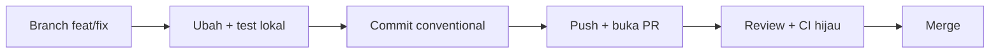

# Panduan Developer — Dari Nol sampai Kontribusi

Panduan ini menuntun **developer baru** dari laptop kosong sampai pull request (PR) pertama, lalu menjadi rujukan saat mengerjakan tugas sehari-hari. Bekal yang diasumsikan: React hooks dan TypeScript dasar. Arsitektur modular, dependency injection (DI), dan repositori terpisah (multi-repo) dijelaskan saat kemunculan pertamanya. Padanan bahasa Inggris dari dokumen ini ada di `DEVELOPER-GUIDE.en.md`.

Dokumen tetangga:

| Dokumen | Isi | Kapan dibaca |
| --- | --- | --- |
| `ARCHITECTURE.md` | kenapa platform ini modular dan bagaimana tiap mekanismenya bekerja | saat ingin tahu "mengapa" |
| `CONTRACT.md` | aturan keras (wajib/dilarang); pelanggarannya membuat PR ditolak | sebelum dan saat menulis kode |
| `DEPLOYMENT-GUIDE.md` | build image, CI, dan deploy | saat akan merilis |

## Cara Pakai Panduan Ini

Panduan dibagi dua bagian:

- **Bab 0–4 — jalur belajar.** Baca berurutan. Setiap bab adalah satu unit praktik dengan hasil yang bisa diperiksa.
- **Bab 5–10 — referensi.** Buka saat butuh: konvensi, testing, troubleshooting, checklist PR, build image, dan contoh hidup.

Setiap bab jalur belajar memakai empat ikon:

| Ikon | Arti |
| --- | --- |
| 🎯 | tujuan bab — apa yang bisa Anda lakukan setelah menyelesaikannya |
| ✅ | checkpoint — cara memastikan bab ini benar-benar berhasil |
| ⚠️ | jebakan umum — kesalahan yang paling sering terjadi |
| 📖 | konsep — bab terkait di `ARCHITECTURE.md` untuk penjelasan "mengapa" |

Rujukan silang ditulis singkat: `ARCHITECTURE §4` berarti bab §4 di `ARCHITECTURE.md`; `CONTRACT §12.4` berarti §12.4 di `CONTRACT.md`; `GUIDE §3` berarti Bab 3 di dokumen ini.

### Prasyarat

| Kebutuhan | Cara |
| --- | --- |
| Node.js 22.x | `nvm install 22 && nvm use 22` (atau `fnm use 22`); verifikasi dengan `node -v` |
| npm 10+ | sudah ikut Node; verifikasi dengan `npm -v` |
| Git | `git --version`; set `git config user.name` dan `git config user.email` |
| React hooks + TypeScript dasar | bekal belajar; tidak ada setup khusus |
| Docker (opsional) | hanya untuk build image lokal di `GUIDE §9` |
| OS | macOS/Linux native; **Windows wajib WSL2** — script repo memakai `ln -sfn` dan path POSIX |

### Glosarium

Sembilan istilah ini akan sering muncul. Baca sekali; kembali ke sini saat lupa.

| Istilah | Arti singkat |
| --- | --- |
| **Container** | Shell aplikasi React: boot, config, DI, auth, routing host, layout, dan semua registry. Container tidak tahu isi modul. |
| **Module** | Paket fitur bisnis mandiri (`user-management`, `module-sample`) yang mendaftarkan halaman, menu, service, dan terjemahannya lewat `init(deps)`. |
| **Extension** | Paket customization satu klien (`web-extension-client-a`): mengisi slot, meng-override route, menambah service — tanpa mengubah modul. |
| **Slot** | "Lubang" bernama di UI yang disediakan modul (contoh `module-sample.overviewPanel`); extension mengisi komponen ke dalamnya. |
| **deps** | Satu objek berisi 13 layanan container (`config`, `logger`, `i18n`, `routes`, `slots`, …) yang diserahkan ke setiap `init(deps)`; satu-satunya kanal modul/extension ke container. |
| **manifest** | `manifest.json` di repo klien berisi identitas klien, `baseVersion` (pin persis ke versi base), daftar modul, dan override. |
| **base image** | Image Docker berisi container + modul, dibangun sekali oleh platform team; image klien dibangun `FROM` image base tersebut. |
| **override** | Tindakan extension mengganti route, label, atau logic milik modul. Urutan usaha: slot → route → service wrapper (mulai dari yang paling ringan). |
| **loader map** | File generated `moduleLoaders.generated.ts` berisi dynamic import tiap modul; nama di `config.modules` harus ada di sini, kalau tidak boot gagal (fail-fast). |

---

## Bab 0 — Dari Nol sampai Jalan

🎯 **Tujuan:** aplikasi berjalan di laptop Anda — halaman login tampil, menu sesuai daftar modul, dan console browser bersih.

### Langkah 1 — Siapkan Node 22 dan Git

```bash
nvm install 22 && nvm use 22   # atau: fnm use 22
node -v                        # harus v22.x
git --version
```

Semua repo memakai Node 22. Kalau `node -v` menunjukkan versi lain, dev server bisa gagal dengan error yang membingungkan.

### Langkah 2 — Dapatkan workspace

Ada dua situasi:

**A. Anda bekerja di workspace sample ini** (`modular-web-sample`, layout flat): semua folder sudah bersaudara — `web-container`, `web-modules`, `web-extension-client-a`, `web-extension-template`. Lewati langkah clone dan lanjut ke Langkah 3.

**B. Anda menyiapkan repo produksi:** clone repo base, lalu clone repo extension **di dalam** folder base:

```bash
mkdir -p ~/works/arsi && cd ~/works/arsi
git clone <repo-arsi-web-base> arsi-web-base
cd arsi-web-base
git clone <repo-arsi-web-client-a> web-extension-client-a
echo "web-extension-*/" >> .git/info/exclude   # clone extension tidak ikut ter-commit ke base
```

Extension harus berada **di dalam** folder base karena dua kontrak path dihitung relatif dari sana: symlink `web-container/current-client -> ../web-extension-client-a`, dan alias extension (`../web-container`, `../web-modules`).

### Langkah 3 — Install dependency (urutan penting)

```bash
(cd web-modules && npm ci)
(cd web-container && npm ci && CLIENT=client-a npm run link:client)
(cd web-extension-client-a && npm ci)
```

Urutan `web-modules → web-container → extension` penting: `web-modules` adalah workspace package yang di-resolve container, dan extension memakai keduanya. `CLIENT=client-a npm run link:client` membuat symlink `web-container/current-client` menunjuk ke `web-extension-client-a` — inilah "klien aktif". Ganti klien kapan saja dengan `cd web-container && CLIENT=<client> npm run link:client`.

Pakai `npm ci` (bukan `npm install`) karena lockfile di-commit dan harus dipatuhi persis. Jalankan ulang `npm ci` setelah `git pull` yang mengubah lockfile.

### Langkah 4 — (Opsional) Atur konfigurasi dev

```bash
cp web-container/.env.example web-container/.env
```

`.env` gitignored — aman untuk eksperimen lokal. Isinya:

| Env | Arti |
| --- | --- |
| `VITE_CLIENT` | klien aktif; opsional — kalau kosong, dev server memakai symlink `current-client` |
| `VITE_MODULES` | daftar modul yang di-init saat boot (CSV; default `user-management,product-management,module-sample`) |
| `VITE_API_BASE` | base URL API untuk service modul (contoh: `https://dummyjson.com`) |
| `VITE_ENABLE_AUDIT_LIVE` | feature flag untuk fitur audit |
| `VITE_CONFIG_JSON` | override penuh `/config.json` (JSON object); bila diisi, env lain di atas diabaikan |

Aturannya: env individual menimpa nilai dasar di `public/config.json`; `VITE_CONFIG_JSON` menang mutlak. Anda tidak perlu mengedit `public/config.json` per klien.

### Langkah 5 — Jalankan dev server

```bash
cd web-container
npm run dev          # http://localhost:5173
```

Dev server mencetak baris seperti `[dev] client=client-a (sumber: symlink); config.json digenerate dari env`. Pastikan kliennya sesuai. `predev` otomatis menjalankan `npm run gen:modules` (menyusun loader map); Anda tidak perlu menjalankannya manual.

✅ **Checkpoint Bab 0**

- [ ] `http://localhost:5173` menampilkan halaman login tanpa error di console browser.
- [ ] Setelah login, menu sidebar memuat tiga modul default: `user-management`, `product-management`, `module-sample`.
- [ ] Baris `[dev]` di terminal menunjukkan klien yang benar.

⚠️ **Jebakan umum Bab 0**

- **Tidak restart dev server** setelah mengganti klien atau menambah modul. Loader map dan symlink dibaca saat server start, bukan saat hot reload — hentikan (`Ctrl+C`) lalu jalankan `npm run dev` lagi.
- **Menambah modul tanpa generate loader map.** `predev`, `pretypecheck`, `pretest`, dan `prebuild` menjalankannya otomatis, tetapi setelah menambah modul di luar alur itu jalankan `npm run gen:modules`. Jangan pernah mengedit `moduleLoaders.generated.ts` manual — file generated.
- **Urutan install salah** (extension sebelum `web-modules`) membuat resolver gagal menemukan `@arsi/module-*`.
- **`VITE_CLIENT` berbeda dari symlink.** Config memakai `VITE_CLIENT`, tetapi extension yang dimuat tetap dari symlink; dev server memberi warning — samakan keduanya.

📖 **Konsep:** bagaimana config dibaca saat boot dan mengapa ia runtime, bukan build-time → `ARCHITECTURE §5–§6`.

---

## Bab 1 — Tur Codebase Berpemandu

🎯 **Tujuan:** Anda punya peta mental kode — tahu folder mana untuk apa, dari mana boot dimulai, dan di mana modul/extension mendaftarkan sesuatu.

### Langkah 1 — Kenali folder penting

| Folder / file | Isi | Peran Anda |
| --- | --- | --- |
| `web-container/` | Shell: boot (`src/bootstrap/`), `deps` (`src/di/`), routing host, layout, registry | hampir selalu **hanya baca** (perubahan = diskusi lead) |
| `web-modules/shared/` | UI kit dan util bersama (`@arsi/shared`) | pakai; boleh menambah komponen |
| `web-modules/modules/<name>/` | Satu fitur bisnis: halaman, hook, service, store, i18n | tempat menambah/mengubah fitur (`GUIDE §3`) |
| `web-extension-client-a/` | Extension milik klien aktif | tempat menulis kebutuhan khusus klien (`GUIDE §4`) |
| `web-extension-template/` | Template repo klien baru | disalin saat membuat klien baru |
| `web-extension-default/` | Extension no-op untuk menjalankan base tanpa klien | baca saja |
| `docs/` | `ARCHITECTURE`, `CONTRACT`, dan panduan ini | rujukan |

### Langkah 2 — Baca modul paling ringkas: `module-sample`

Buka `web-modules/modules/module-sample/index.tsx` (55 baris). Ini contoh modul paling sederhana, tetapi seluruh mekanismenya ada. Bagian pentingnya:

| Baris | Yang dilakukan |
| --- | --- |
| `:14` | `init(deps)` — satu-satunya titik masuk modul; container memanggilnya saat boot |
| `:20-21` | mendaftarkan terjemahan (i18n) namespace `module-sample` |
| `:23-27` | membuat axios client lalu mendaftarkannya sebagai service bernama `module-sample` |
| `:29-34` | mendaftarkan item menu sidebar |
| `:36-48` | mendaftarkan route halaman (`deps.routes.add`) |
| `:50` | mendaftarkan modal |
| `:52-54` | berlangganan event lintas modul |

Polanya selalu sama: **mendaftar, bukan membangun**. Modul tidak membuat router, i18n, atau query client sendiri — ia memanggil `deps.*.register(...)`, lalu container yang menyusun UI setelah semua `init` selesai.

### Langkah 3 — Baca extension: `web-extension-client-a/src/index.tsx`

Extension punya bentuk yang sama (`init(deps)` di `:33`), tetapi isinya *penyesuaian* terhadap yang sudah ada:

- `:39-55` — menambah/menimpa bundle i18n, termasuk label menu `user-management` menjadi "Pengguna Client A".
- `:57-61` — mendaftarkan service khusus klien dengan prefix nama klien: `client-a.audit`.
- `:63` — mengisi slot tabel user (`userSlots.userTableActions`) dengan tombol audit.
- `:65-68` — meng-override route `/users/:id` — dengan guard `deps.routes.has` agar aman bila modulnya tidak aktif.
- `:71` — mengisi slot `sampleSlots.overviewPanel` dengan `ClientASamplePanel`.
- `:93-96` — bereaksi terhadap event `userEvents.updated`.

Perhatikan: extension selalu **memakai** yang sudah ada (route modul, slot modul, public API modul). Tidak ada satu pun baris di sini yang mengubah file modul.

### Langkah 4 — Simpan peta "mulai dari mana"

| Ingin melihat... | Buka |
| --- | --- |
| Titik masuk aplikasi dan urutan boot | `web-container/src/main.tsx:11` |
| Kontrak `deps` (13 layanan) | `web-container/src/di/deps.ts:23` |
| Contoh modul lengkap | `web-modules/modules/module-sample/index.tsx:14` |
| Contoh extension klien | `web-extension-client-a/src/index.tsx:33` |

✅ **Checkpoint Bab 1**

- [ ] Tanpa membuka guide, Anda bisa menjawab "di mana route didaftarkan?" dan menemukan `deps.routes.add` di `web-modules/modules/module-sample/index.tsx:36`.
- [ ] Anda bisa membedakan peran modul ("menyediakan fitur") dan extension ("menyesuaikan untuk klien").
- [ ] Anda tahu extension hanya boleh mengimpor **public API** modul (`public.ts`), bukan file internalnya.

⚠️ **Jebakan umum Bab 1**

- **Membaca seluruh `web-container/` lebih dulu.** Mulailah dari `module-sample` lalu `client-a`; container dibaca sesuai kebutuhan.
- **Mengira modul saling mengenal.** Modul tidak boleh mengimpor modul lain; komunikasi lewat event bus (`CONTRACT §13`).
- **Mencari daftar modul yang di-hardcode.** Tidak ada — modul ditemukan dari `config.modules` lewat loader map.
- **Menyentuh file internal modul dari extension.** Yang boleh diimpor extension hanya `public.ts` modul (`CONTRACT §1.4`).

📖 **Konsep:** model mental dan semua mekanisme sambungan → `ARCHITECTURE §3–§5`; aturan dependensi lengkap → `ARCHITECTURE §9` dan `CONTRACT §1`.

---

## Bab 2 — Perubahan Pertama Anda

🎯 **Tujuan:** PR pertama — satu perubahan kecil di extension `client-a`: satu teks i18n dan satu komponen slot, lengkap dengan test, commit, dan deskripsi PR.

Contoh memakai extension `client-a` karena perubahan khusus klien tidak menyentuh kode modul. Jalankan semua perintah dari `web-extension-client-a/`, kecuali disebut lain.

### Langkah 1 — Buat branch

```bash
git checkout -b feat/client-a-panel-copy
```

Buat branch dari branch utama repo yang tepat: override klien di repo extension; modul/shared/container di repo base. Penamaan: `feat/<ringkas>` atau `fix/<ringkas>`.

### Langkah 2 — Ubah satu teks i18n

Buka `web-extension-client-a/src/i18n/id.json` dan ubah judul panel:

```json
"panelTitle": "Panel Klien A",
```

Ubah juga `en.json` (`"panelTitle": "Client A panel"`) agar paritas bahasa terjaga. Extension menambahkan terjemahan lewat `deps.i18n.addResourceBundle` (`src/index.tsx:39-40`) ke namespace `client-a`; komponen membacanya dengan `useTranslation('client-a')`.

### Langkah 3 — Ubah satu komponen slot

Komponen `web-extension-client-a/src/components/ClientASamplePanel.tsx` dirender di slot `module-sample.overviewPanel` — didaftarkan extension di `src/index.tsx:71`, sedangkan nama slot dideklarasikan modul di `web-modules/modules/module-sample/slots.ts:2`.

Tambahkan satu baris di akhir `Card`:

```tsx
<p className="mt-2 text-xs text-muted-foreground">{t('sample.panelFooter')}</p>
```

lalu tambahkan key barunya di kedua file i18n:

```json
"panelFooter": "Dikelola khusus untuk Client A."
```

Simpan, lalu buka `http://localhost:5173/module-sample` — panel di kartu "module-sample.overviewPanel" berubah tanpa satu pun file modul disentuh. Itulah gunanya slot.

### Langkah 4 — Jalankan test, typecheck, dan lint

```bash
cd web-extension-client-a
npm test
npm run typecheck
npm run lint
```

Jalankan perintah yang sama di repo tempat Anda mengubah kode (`web-modules`, `web-container`, atau extension). Pastikan ketiganya lulus sebelum commit.

### Langkah 5 — Commit dengan conventional commit

```bash
git add src/i18n/id.json src/i18n/en.json src/components/ClientASamplePanel.tsx
git commit -m "feat(client-a): add panel footer copy"
```

Aturan commit: `feat(<scope>): ...` untuk fitur, `fix(<scope>): ...` untuk perbaikan. `scope` = modul atau klien yang diubah. Satu commit satu tujuan — jangan campur refactor dengan fitur.

### Langkah 6 — Push dan buka PR

```bash
git push -u origin feat/client-a-panel-copy
```

Lalu buka PR ke repo yang tepat (base branch `main`): perubahan override klien → repo extension; perubahan modul/shared/container → repo base. Deskripsi PR minimal berisi: apa yang berubah, kenapa, dan cara memverifikasi (mis. "buka `/module-sample`, lihat footer panel"). Checklist lengkap ada di `GUIDE §8`.



✅ **Checkpoint Bab 2**

- [ ] PR berisi satu perubahan kecil dengan deskripsi yang menjelaskan apa, kenapa, dan cara verifikasi.
- [ ] Test, typecheck, dan lint lulus di repo terkait.
- [ ] `git status` bersih dari file yang tidak sengaja (`.env`, symlink `current-client`, `node_modules`).

⚠️ **Jebakan umum Bab 2**

- **Commit file yang tidak boleh** — `.env`, symlink `current-client`, atau `node_modules` (semuanya gitignored; kalau muncul, jangan `git add -f`).
- **Lupa memperbarui `en.json`** sehingga bahasa Inggris kehilangan teks.
- **Mengubah kode modul dari repo extension.** Kebutuhan klien diselesaikan lewat slot/route/service wrapper; perubahan modul dikirim sebagai PR ke repo base.
- **Commit besar bercampur** atau pesan tidak deskriptif, sehingga review dan rollback sulit.
- **Force-push ke branch bersama** setelah review dimulai — cukup tambah commit baru.

📖 **Konsep:** mengapa extension cukup mengisi slot dan meng-override tanpa menyentuh modul, serta tiga tingkat override → `ARCHITECTURE §4` dan `ARCHITECTURE §7`.

---

## Bab 3 — Membuat Module Baru

🎯 **Tujuan:** modul `order-management` tampil di menu, halamannya bisa dibuka, dan semua test lulus — tanpa menyentuh kode container.

Studi kasus bab ini: modul `order-management`. Dua modul nyata menjadi referensi Anda:

- `web-modules/modules/module-sample/` — kerangka paling ringkas, tetapi semua mekanisme ada (`index.tsx`, `public.ts`, `slots.ts`, `events.ts`, `modals.ts`, `queryKeys.ts`, `types.ts`, `i18n/`, `pages/`, `components/`, `hooks/`, `store/`).
- `web-modules/modules/user-management/` — contoh CRUD lengkap dengan store, hook, dan komponen.

Aturan utama modul ada di `CONTRACT §1`: modul **tidak boleh** mengimpor modul lain atau extension. Semua yang dibutuhkan datang dari `deps` saat `init(deps)`.

### Langkah 1 — Buat folder dan `package.json`

```bash
cd web-modules/modules
mkdir order-management
```

Struktur yang dihasilkan (relatif terhadap folder modul):

```
order-management/
├── package.json
├── index.tsx           # entry init(deps) — dipanggil container saat boot
├── public.ts           # kontrak untuk extension
├── types.ts
├── slots.ts
├── events.ts
├── modals.ts
├── queryKeys.ts
├── services/service.order.ts
├── hooks/useOrder.ts
├── store/useOrderStore.ts
├── components/
├── pages/
└── i18n/{en,id}.json
```

`package.json` meniru `module-sample/package.json`; yang berubah hanya `name`:

```json
{
  "name": "@arsi/module-order-management",
  "version": "0.1.0",
  "private": true,
  "type": "module",
  "sideEffects": false,
  "main": "public.ts",
  "types": "public.ts",
  "peerDependencies": { "react": "^19.0.0", "react-dom": "^19.0.0" },
  "dependencies": {
    "@arsi/shared": "^0.1.0",
    "axios": "~1.7.9",
    "react-router-dom": "^6.30.6",
    "zustand": "^5.0.15"
  }
}
```

`name` **wajib** mengikuti `@arsi/module-<nama folder>`. `npm run gen:modules` memvalidasi konvensi ini dan langsung gagal bila tidak cocok. `react`/`react-dom` selalu `peerDependencies` (`CONTRACT §1.6`).

### Langkah 2 — Isi domain: tipe, service, dan query key

- `types.ts` — tipe domain modul (`Order`, `OrderListResponse`, `CreateOrderInput`).
- `services/service.order.ts` — **factory function** yang menerima `AxiosInstance`; tidak mengakses `deps`, React, atau React Query:

```ts
import type { AxiosInstance } from 'axios';
import type { Order, OrderListResponse } from '../types';

export function createOrderService(api: AxiosInstance) {
  return {
    async list(params: { limit?: number; skip?: number } = {}): Promise<OrderListResponse> {
      const { limit = 10, skip = 0 } = params;
      const res = await api.get<OrderListResponse>('/orders', { params: { limit, skip } });
      return res.data;
    },
  };
}

export type OrderService = ReturnType<typeof createOrderService>;
```

- `queryKeys.ts` — root key **wajib** `['<module>', '<entity>']`:

```ts
export const orderKeys = {
  all: ['order-management', 'order'] as const,
  lists: () => [...orderKeys.all, 'list'] as const,
  list: (params?: { limit?: number; skip?: number }) =>
    [...orderKeys.lists(), params ?? {}] as const,
  detail: (id: number) => [...orderKeys.all, 'detail', id] as const,
};
```

Service yang perlu di-invalidate extension **wajib** diekspor lewat `public.ts`. Aturan lengkap: `CONTRACT §4` (service registry) dan `CONTRACT §5` (data fetching).

### Langkah 3 — `index.tsx`: satu titik masuk `init(deps)`

```tsx
import axios from 'axios';
import type { Deps } from '@arsi/container';

import en from './i18n/en.json';
import id from './i18n/id.json';
import { OrderListPage } from './pages/OrderListPage';

let initialized = false;

export default async function init(deps: Deps): Promise<void> {
  if (initialized) {
    return; // React StrictMode bisa memanggil init dua kali
  }
  initialized = true;

  deps.i18n.addResourceBundle('en', 'order-management', en, true, true);
  deps.i18n.addResourceBundle('id', 'order-management', id, true, true);

  const orderClient = axios.create({
    baseURL: deps.config.apiBase,
    timeout: 8000,
  });
  deps.apiRegistry.register('order', orderClient);

  deps.menu.register({
    path: '/orders',
    label: 'menu.orders',
    namespace: 'order-management',
    order: 30,
  });

  deps.routes.add({
    path: '/orders',
    element: <OrderListPage />,
    meta: { group: 'order', module: 'order-management' },
  });
}
```

Aturan `init`:

- **Semua** pendaftaran (i18n, service, menu, route, modal, slot, event) terjadi di dalam `init`, bukan di top-level file.
- `init` **wajib idempotent** — perhatikan guard `initialized`; registry container melempar error untuk pendaftaran duplikat.
- Nama service mengikuti konvensi `CONTRACT §4.6` (modul `order-management` → service `order`).
- Axios client hanya dibuat di sini; komponen mengambilnya lewat hook, bukan `import axios`.

Halaman memakai komponen `@arsi/shared` dan hook modul:

```tsx
export function OrderListPage() {
  const { t } = useTranslation('order-management');
  const { data, isLoading } = useOrderList();
  // PageHeader + DataTable dari @arsi/shared
}
```

Hook menyusun service + React Query — import `useQuery`/`useMutation` selalu dari `@arsi/container`:

```ts
import { useMemo } from 'react';
import { useApiRegistry, useQuery } from '@arsi/container';

import { orderKeys } from '../queryKeys';
import { createOrderService } from '../services/service.order';

function useOrderService() {
  const apiRegistry = useApiRegistry();
  return useMemo(() => createOrderService(apiRegistry.get('order')), [apiRegistry]);
}

export function useOrderList() {
  const service = useOrderService();
  return useQuery({ queryKey: orderKeys.list(), queryFn: () => service.list() });
}
```

### Langkah 4 — `slots.ts`, `events.ts`, `modals.ts`

Kalau modul menyediakan extension point, deklarasikan di sini:

```ts
// slots.ts — titik sambung untuk extension
export const orderSlots = {
  orderTableActions: 'order-management.orderTableActions',
} as const;

// events.ts — komunikasi lintas modul (modul hanya emit)
export const orderEvents = {
  created: 'order-management.order.created',
} as const;

export interface OrderCreatedPayload {
  id: number;
}

// modals.ts — modal yang bisa dibuka lewat deps.modal
export const orderModals = {
  create: 'order-management.create',
} as const;
```

Konvensi nama: slot `<module>.<slotName>`, event `<module>.<entity>.<action>`, modal `<module>.<action>` (`CONTRACT §11`–`§13`). Komponen modul mengonsumsi slot dengan `useSlot`:

```tsx
const Actions = useSlot(orderSlots.orderTableActions);
```

Daftarkan modal dan event listener di `init`:

```tsx
deps.modal.register(orderModals.create, CreateOrderDialog);

deps.events.on<OrderCreatedPayload>(orderEvents.created, (payload) => {
  deps.logger.info('order-management: order dibuat', payload);
});
```

### Langkah 5 — i18n: `i18n/en.json` dan `i18n/id.json`

Namespace = nama folder modul; kunci deskriptif, bukan `text1`:

```json
{
  "title": "Pesanan",
  "menu": { "orders": "Pesanan" },
  "empty": "Belum ada pesanan"
}
```

Kedua file wajib ada — paritas ID/EN juga berlaku di aplikasi.

### Langkah 6 — `public.ts`: kontrak untuk extension

Hanya yang diekspor di sini yang boleh dipakai extension:

```ts
export { OrderListPage } from './pages/OrderListPage';
export { useOrderList } from './hooks/useOrder';
export { createOrderService, type OrderService } from './services/service.order';
export { orderKeys } from './queryKeys';
export { orderSlots } from './slots';
export { orderEvents } from './events';
export { orderModals } from './modals';
export type { Order, OrderListResponse, CreateOrderInput } from './types';
```

Apa pun yang tidak diekspor di sini dianggap internal — extension **dilarang** mengimpornya (`CONTRACT §1.4`).

### Langkah 7 — Wiring: loader map, Dockerfile, dan `config.modules`

1. Generate loader map dari `web-container`:

```bash
cd web-container
npm run gen:modules
```

`gen:modules` menulis `src/bootstrap/moduleLoaders.generated.ts` dari `package.json` semua modul. **Jangan** mengedit file generated manual; pre-hooks (`predev`, `pretypecheck`, `pretest`, `prebuild`) menjalankannya otomatis.

2. Tambahkan baris `COPY` modul baru di `Dockerfile` root repo base, sebelum `npm ci` (ada komentar pengingat di sana):

```dockerfile
COPY web-modules/modules/order-management/package.json ./web-modules/modules/order-management/
```

3. Jalankan guard Dockerfile:

```bash
cd web-container
npm run check:dockerfile
```

4. Daftarkan modul agar ikut boot. Di dev lewat `VITE_MODULES`/`public/config.json`; di produksi lewat `config.modules`. Modul yang tidak terdaftar tidak pernah di-`init` sehingga menu dan route-nya tidak ada.

5. Perbarui lockfile workspace dan commit:

```bash
cd web-modules
npm install        # workspace menautkan @arsi/module-order-management
```

### Langkah 8 — Test dan verifikasi

Modul **wajib** punya test untuk public API-nya (`CONTRACT §17`). Minimal test `init(deps)`: pakai `deps` palsu + `vi.resetModules()` agar guard `initialized` tidak bocor antar test — lihat `web-modules/modules/module-sample/index.test.ts`. Playbook lengkap ada di `GUIDE §6`.

```bash
cd web-modules
npm run typecheck && npm test -- modules/order-management && npm run lint

cd ../web-container
npm run check:dockerfile && npm run typecheck && npm test && npm run build
```

Restart dev server setelah menambah modul (loader map dibaca saat start):

```bash
cd web-container
npm run dev
# buka http://localhost:5173 → menu Orders muncul
```

✅ **Checkpoint Bab 3**

- [ ] Menu sidebar memuat Orders dan `/orders` merender halaman modul.
- [ ] Baris `COPY` modul baru ada di `Dockerfile` dan `npm run check:dockerfile` lulus.
- [ ] `npm run typecheck && npm test && npm run lint` lulus di `web-modules`; test `init` modul baru ada.
- [ ] Modul terdaftar di `config.modules`/`VITE_MODULES`; boot bersih tanpa error console.

⚠️ **Jebakan umum Bab 3**

- **Lupa baris `COPY` di Dockerfile.** Dev jalan, tetapi build image gagal karena `npm ci` tidak menemukan package workspace. `npm run check:dockerfile` menangkapnya lebih awal.
- **Lupa `npm install` lockfile.** Perubahan `package-lock.json` wajib ikut ter-commit; tanpa itu `npm ci` di Docker/CI gagal.
- **Nama package tidak mengikuti `@arsi/module-<folder>`.** `gen:modules` gagal dengan pesan konvensi.
- **Mendaftarkan sesuatu di top-level file**, bukan di `init` — modul tidak boleh berefek samping saat di-import.
- **Lupa restart dev server atau lupa daftar di `config.modules`.** Loader map statis; modul tak terdaftar tidak di-`init`.
- **Mengedit `moduleLoaders.generated.ts` manual** — file generated; perubahan hilang saat regenerate.

📖 **Konsep:** bagaimana container menemukan dan meng-init modul → `ARCHITECTURE §4`–`§5`; aturan dependensi → `CONTRACT §1`.

---

## Bab 4 — Membuat Extension

🎯 **Tujuan:** extension klien aktif menyesuaikan aplikasi — mengisi slot, meng-override route dengan guard, dan menambah service — tanpa mengubah satu file modul pun.

Extension adalah repo `web-extension-client-<x>` dengan satu entry: default export `init(deps)` di `src/index.tsx`. Bentuk nyatanya ada di `web-extension-client-a/`:

```
web-extension-client-a/
├── manifest.json                # identitas klien + baseVersion (pin exact)
├── aliases.cjs / tsconfig.json   # alias ke public.ts modul yang dipakai
└── src/
    ├── index.tsx             # init(deps)
    ├── components/           # komponen khusus klien
    ├── overrides/<module>/   # halaman pengganti
    ├── hooks/                # wrapper service
    └── i18n/{en,id}.json     # namespace client-a
```

`manifest.json` memuat `client`, `baseVersion` (exact), `modules`, `shared`, dan `overrides`:

```json
{
  "client": "client-a",
  "baseVersion": "0.1.0",
  "modules": { "user-management": "^0.1.0", "module-sample": "^0.1.0" },
  "shared": "^0.1.0",
  "overrides": ["user-management", "module-sample"]
}
```

Repo extension **tidak** membawa `web-container`/`web-modules`; keduanya datang dari base image (`ARCHITECTURE §8`).

Urutan usaha selalu dari yang paling ringan. Penjelasan tiap level beserta sifatnya ada di `ARCHITECTURE §7`:

| Kebutuhan | Level | API |
| --- | --- | --- |
| Tambah tombol/kolom di UI modul | 1 — slot | `deps.slots.register` |
| Ganti seluruh halaman | 2 — route override | `deps.routes.override` |
| Ubah aturan bisnis service | 3 — service wrapper | factory modul dibungkus di hook extension |

### Langkah 1 — Level 1: isi slot

Modul mendeklarasikan slot di `slots.ts` dan mengekspornya di `public.ts` (contoh: `sampleSlots.overviewPanel`). Extension mengisinya di `init` (`src/index.tsx:71`):

```tsx
import { sampleSlots } from '@arsi/module-module-sample';

deps.slots.register(sampleSlots.overviewPanel, ClientASamplePanel);
```

- Komponen slot menerima props yang disepakati modul; cek `public.ts` modul untuk tipenya.
- Satu slot hanya boleh diisi satu komponen — pendaftaran kedua melempar error.
- Slot bersifat **aditif**: menambah, bukan mengganti. Untuk mengganti perilaku, naik ke level berikutnya.

### Langkah 2 — Level 2: route override dengan guard

`override` mengganti **seluruh entry** route (sertakan `meta` lagi) dan melempar error bila path belum terdaftar. Karena itu `client-a` memakai helper `overrideIfPresent` (`src/index.tsx:21-31`):

```tsx
function overrideIfPresent(
  deps: Deps,
  path: string,
  definition: Parameters<Deps['routes']['override']>[1],
): void {
  if (!deps.routes.has(path)) {
    deps.logger.warn(`[client-a] route "${path}" belum terdaftar; override dilewati`);
    return;
  }
  deps.routes.override(path, definition);
}
```

Pemakaian:

```tsx
overrideIfPresent(deps, '/users/:id', {
  element: <ClientAUserDetail />,
  meta: { group: 'user', module: 'user-management' },
});
```

Guard **wajib** untuk route milik modul yang bisa dinonaktifkan (`CONTRACT §12.4`). Tanpa guard, mematikan modul lewat `config.modules` membuat boot gagal dengan `[routes] cannot override unknown route`. Urutan init menolong: extension selalu init **setelah** semua modul, jadi hasil `routes.has` sudah final. Extension juga boleh menambah route baru dengan `deps.routes.add` — sertakan `meta.module`; polanya di **Langkah 4**.

### Langkah 3 — Level 3: service wrapper

Extension **tidak boleh** meng-override service core (`auth`, `user`). Pola yang benar: daftarkan service baru ber-namespace `<client>.<service>` (`src/index.tsx:57-61`):

```tsx
const auditClient = axios.create({ baseURL: '/api/audit-client-a', timeout: 5000 });
deps.apiRegistry.register('client-a.audit', auditClient);
```

Bila perlu mengubah logic service modul, bungkus factory-nya di hook milik extension — jangan menyentuh instance yang didaftarkan modul:

```ts
const service = useMemo(() => {
  const base = createSampleService(apiRegistry.get('module-sample'));
  return {
    ...base,
    async getUser(userId: number) {
      if (userId > 3) throw new Error('client-a: hanya user 1-3 yang boleh diakses');
      return base.getUser(userId);
    },
  };
}, [apiRegistry]);
```

Contoh hidup: `web-extension-client-a/src/hooks/useClientASample.ts`. Aturan lengkap: `CONTRACT §4`.

### Langkah 4 — Fitur baru khusus klien (route + menu)

Dipakai saat kebutuhan klien tidak ada padanannya di base: halaman dan menu yang tidak menempel ke module mana pun. Dua registrasi, keduanya di `init(deps)` — contoh dari `web-extension-client-a/src/index.tsx:79-91`:

```tsx
deps.routes.add({
  path: '/client-a/reports',
  element: <ClientAReportsPage />,
  meta: { group: 'client-a', module: 'client-a' },
});

deps.menu.register({
  path: '/client-a/reports',
  label: 'menu.reports',
  namespace: 'client-a',
  order: 90,
});
```

- Namespace fitur = id klien: path `/<client>/...`, `meta: { group: '<client>', module: '<client>' }`, dan bundle i18n ber-namespace `<client>` (label `menu.reports` ada di `i18n/{en,id}.json` client-a).
- `web-extension-template` sudah menyertakan sample serupa yang menurunkan id klien dari `deps.config.client` saat runtime (`src/index.tsx:18-36`, path `/<client>/sample`) — tanpa edit manual. Hapus blok itu bila tidak dipakai.
- ⚠️ Daftarkan route **dan** menu bersamaan: Sidebar merender semua item dari `menu.getAll()` tanpa filter (`web-container/src/layout/Sidebar.tsx:16,33-37`), jadi menu tanpa route (atau sebaliknya) membingungkan pengguna. Path route **wajib** unik — duplikat melempar error di registry.
- ✅ Checkpoint: buka `/<client>/...` — menu muncul di Sidebar dan halaman ter-render.
- 📖 Konsep dan posisinya di antara tiga level override → `ARCHITECTURE §7`; aturan route → `CONTRACT §12.4`.

### Langkah 5 — i18n dan event

Dua penyesuaian yang hampir selalu dipakai:

```tsx
// namespace milik klien
deps.i18n.addResourceBundle('en', 'client-a', en, true, true);

// menimpa label modul (deep merge + overwrite)
deps.i18n.addResourceBundle('en', 'user-management', { title: 'Client A Users' }, true, true);

// mendengar event modul (arah yang diizinkan)
deps.events.on<UserUpdatedPayload>(userEvents.updated, (payload) => {
  void deps.queryClient.invalidateQueries({ queryKey: userKeys.detail(payload.id) });
});
```

Keduanya berasal dari `src/index.tsx`: i18n di `:39-55`, event listener di `:93-96`.

Arah event yang diizinkan (`CONTRACT §13`):

| Arah | Boleh? |
| --- | --- |
| Modul emit → extension listen | ✓ |
| Extension emit → modul listen | ✗ (base tidak boleh tahu extension) |
| Extension emit → extension listen | ✓ (namespace `<client>.<entity>.<action>`) |

### Langkah 6 — Test extension

Test untuk override **wajib** ada. Pola di `web-extension-client-a/src/__tests__/init.test.ts`: `createFakeDeps()` + `vi.resetModules()` + dynamic import, lalu periksa pemanggilan registry:

```ts
expect(slots.register).toHaveBeenCalledWith(userSlots.userTableActions, expect.anything());
expect(routes.override).toHaveBeenCalledWith(
  '/users/:id',
  expect.objectContaining({ element: expect.anything() }),
);
```

Verifikasi:

```bash
cd web-extension-client-a
npm run typecheck && npm test && npm run lint
```

Saat extension pertama kali mengimpor sebuah modul, tambahkan alias `@arsi/module-<folder>` di `aliases.cjs` + `tsconfig.json` extension (lihat `web-extension-client-a/aliases.cjs`).

### Langkah 7 — Lihat override di dev

```bash
cd web-container
CLIENT=client-a npm run link:client   # symlink current-client -> ../web-extension-client-a
npm run dev                          # http://localhost:5173
readlink current-client              # pastikan menunjuk extension yang benar
```

Perubahan di `src/` extension langsung hot-reload; **restart** dev server saat mengganti klien.

✅ **Checkpoint Bab 4**

- [ ] Slot/panel extension muncul di halaman modul tanpa satu file modul pun berubah.
- [ ] Route override terlihat; dengan modul target dinonaktifkan, boot tetap jalan dan guard menulis warning.
- [ ] `npm run typecheck && npm test && npm run lint` lulus di repo extension.
- [ ] Tidak ada service core yang di-override; service baru ber-namespace `client-<x>.<service>`.

⚠️ **Jebakan umum Bab 4**

- **Override route modul opsional tanpa guard** → boot gagal `[routes] cannot override unknown route` (`CONTRACT §12.4`).
- **Mengimpor file internal modul** (`pages/...`, `store/...`) alih-alih `@arsi/module-<folder>` (`public.ts`) — pelanggaran kontrak.
- **Mendaftarkan service dengan nama core** (`user`, `auth`) — pasti bentrok; selalu pakai namespace klien.
- **Lupa `meta` saat override** — atribusi modul hilang karena override mengganti seluruh entry.
- **Menyentuh kode modul untuk kebutuhan klien.** Kebutuhan klien diselesaikan di extension; perubahan modul dikirim sebagai PR ke repo base.
- **Lupa menambah alias modul** saat override pertama kali — typecheck/test extension gagal resolve.

📖 **Konsep:** tiga level override, sifat aditif vs invasif, dan guard module opsional → `ARCHITECTURE §7`.

### Membuat repo client baru dari template

Dipakai saat folder/repo `web-extension-client-<x>` belum ada. Jalankan dari repo base.

1. Buat repo kosong `arsi-web-client-<x>` di GitHub org (mis. `satriolangit`).

2. Salin template — folder klien harus sibling `web-container`/`web-modules`:

```bash
cd arsi-web-base
cp -R web-extension-template web-extension-client-<x>
rm -rf web-extension-client-<x>/node_modules
```

3. Sesuaikan identitas klien:
   - `package.json`: `name` → `@arsi/extension-client-<x>`.
   - `manifest.json`: `client` → `client-<x>` (mis. `client-bca`), `baseVersion` → tag base saat ini (exact, tanpa `^`), lalu `modules`/`shared`/`overrides` sesuai kebutuhan. Pin yang salah ditolak `npm run check:base` saat build image.

4. Jadikan repo Git sendiri, lalu push:

```bash
cd web-extension-client-<x>
git init -b main
git add .
git commit -m "feat: initial extension client-<x>"
git remote add origin <git-url-arsi-web-client-<x>>
git push -u origin main
```

5. Pastikan folder klien tidak bocor ke repo base:
   - `.git/info/exclude` repo base memuat `web-extension-*/` (dibuat di `GUIDE §0`).
   - Verifikasi: `cd ..` lalu `git status` harus **clean**, dan `git check-ignore -v web-extension-client-<x>/` menunjuk `.git/info/exclude`.
   - Ignore hanya berlaku untuk file **untracked**; kalau terlanjur ter-`git add`, keluarkan dengan `git rm -r --cached web-extension-client-<x>`. Jangan pakai `git add -f`.
   - `web-extension-default/` dan `web-extension-template/` sengaja tetap tracked di repo base.

6. Coba di lokal (opsional):

```bash
cd web-extension-client-<x>
npm ci
cd ../web-container
CLIENT=client-<x> npm run link:client && npm run dev
```

Build & push image klien memakai `ci/build-client.sh` (base tidak dibangun ulang); langkah lengkapnya di `DEPLOYMENT-GUIDE` Tutorial A/B.

---

## Bab 5 — Konvensi Cepat

Buka bab ini saat menulis kode. Aturan lengkapnya ada di `CONTRACT §15`; di sini ringkasannya.

**Route & query.** Aturan cepat saat menangani URL:

- Daftarkan **pola** route (`/users/:id`, bukan URL konkret); `has`/`override` mencocokkan string persis.
- Baca param path dengan `useParams`; baca query string (`?state=online`) dengan `useSearchParams`.
- Masukkan nilai filter ke query key React Query (`userKeys.list({ search })`) agar cache tetap benar.

### 5.1 Naming

| Aspek | Format | Contoh |
| --- | --- | --- |
| Folder module | kebab-case | `order-management` |
| File komponen | PascalCase | `OrderTable.tsx` |
| File hook | `use<Name>.ts` | `useOrder.ts` |
| File service | `service.<nama>.ts` | `service.order.ts` |
| File store | `use<Name>Store.ts` | `useOrderStore.ts` |
| Slot | `<module>.<slotName>` | `order-management.orderTableActions` |
| Modal / Event | `<module>.<action>` / `<module>.<entity>.<action>` | `order-management.create`, `order-management.order.updated` |
| Namespace i18n | `<module>` | `order-management` |
| Nama service | `<module>` / `<client>.<service>` | `order`, `client-a.audit` |
| Root query key | `[<module>, <entity>]` | `['order-management', 'order']` |
| Persist key store | `module:<name>` / `container:<name>` | `module:order-management` |
| File konfigurasi | `.cjs` | `aliases.cjs`, `tailwind.config.cjs` |
| File berisi JSX | `.tsx` | `index.tsx`, `OrderListPage.tsx` |

Nama package module **wajib** `@arsi/module-<folder>` — `gen:modules` langsung gagal bila tidak cocok.

### 5.2 Struktur folder module

Kerangka baku sebuah module (`GUIDE §3` menunjukkan cara membuatnya):

```
order-management/
├── package.json      # name: @arsi/module-order-management
├── index.tsx         # init(deps) — semua registrasi
├── public.ts         # satu-satunya pintu untuk extension
├── types.ts          # tipe domain
├── slots.ts          # extension point UI
├── events.ts         # komunikasi lintas module
├── modals.ts         # modal yang bisa dibuka
├── queryKeys.ts      # factory query key
├── services/         # factory function, tanpa deps
├── hooks/            # service + React Query
├── store/            # Zustand, persist key module:<name>
├── components/       # komponen UI modul
├── pages/            # halaman route
└── i18n/{en,id}.json # namespace = nama folder
```

Extension memakai struktur serupa, ditambah `overrides/<module>/` untuk halaman pengganti (`GUIDE §4`).

### 5.3 Import: salah → benar

| ✗ | ✓ |
| --- | --- |
| `import axios from 'axios'` di service/hook | hanya di `index.tsx` saat register service |
| `import { useQuery } from '@tanstack/react-query'` | `import { useQuery } from '@arsi/container'` |
| `import { toast } from 'sonner'` | `useToast()` / `deps.toast` |
| `import i18next from 'i18next'` | `useTranslation()` / `deps.i18n` |
| `import { Button } from '@arsi/shared/components/ui/button'` | `import { Button } from '@arsi/shared'` |
| `import { X } from '@arsi/module-user-management/internal'` (extension) | `import { X } from '@arsi/module-user-management'` |
| `import.meta.env.VITE_*` di module/extension | `deps.config` / `useConfig()` |
| Membuat `QueryClient` sendiri | `useQueryClient()` / `deps.queryClient` |

ESLint menegakkan sebagian besar aturan ini (`no-restricted-imports` per repo).

### 5.4 i18n

- Namespace module = nama folder (`order-management`); namespace extension = id klien (`client-a`).
- Setiap teks UI lewat `t()` — jangan hardcode string.
- `i18n/en.json` dan `i18n/id.json` **wajib** sama-sama ada; paritas ID/EN juga berlaku di aplikasi.
- Kunci deskriptif (`menu.orders`, `empty`), bukan `text1`.
- Extension boleh menimpa label module lewat `addResourceBundle(..., overwrite=true)` (`GUIDE §4`); aturan lengkap `CONTRACT §6`.

### 5.5 Styling Tailwind

Brand: **ARSI Purple `#551AB9`**. Token lengkap: `CONTRACT §10.4`.

| Aturan | Detail |
| --- | --- |
| Warna | **Wajib token** (`bg-primary`, `text-success-strong`); hex mentah / warna palette Tailwind langsung dilarang. |
| Hover/selected | `hover:bg-primary-hover` (tombol), `bg-accent` (surface hover/selected). |
| Status | Pola tint: `bg-success/10 text-success-strong border-success/20` (idem `warning`/`info`/`destructive`). |
| Dark mode | Jangan pakai `dark:` — token yang flip otomatis (`web-container/src/styles/globals.css`). |
| Font | Plus Jakarta Sans self-host; jangan tambah `<link>` Google Fonts. |
| Token baru | Ubah `globals.css` + `tailwind.preset.cjs`; test `web-container/src/styles/tokens.test.ts` wajib lulus. |
| Container | Self-contained: container dilarang import `@arsi/shared` (ESLint). |

### 5.6 Commit & branch

| Hal | Aturan |
| --- | --- |
| Branch | `feat/<ringkas>` atau `fix/<ringkas>`, dari branch utama repo yang tepat |
| Commit | `feat(<scope>): ...` / `fix(<scope>): ...`; `scope` = module atau klien |
| Isi commit | satu tujuan — jangan campur refactor dengan fitur |
| Repo | override klien → repo extension; module/shared/container → repo base |

---

## Bab 6 — Testing Playbook

Kewajiban test ada di `CONTRACT §17`: module **wajib** punya test untuk public API-nya, extension **wajib** punya test untuk override. Bab ini pola yang sudah terbukti di repo sample.

### 6.1 Pola 1 — fake `deps` + `vi.resetModules()`

Test `init(deps)` tidak memakai container sungguhan. Buat `deps` palsu berisi `vi.fn()` untuk registry yang dipakai, lalu import ulang modulnya agar guard `initialized` segar per test:

```ts
async function loadInit() {
  vi.resetModules();                 // guard `initialized` kembali false
  const mod = await import('../index');
  return mod.default;
}

const { deps, apiRegistry, slots, routes } = createFakeDeps(); // deps palsu + vi.fn()
await (await loadInit())(deps);

expect(apiRegistry.register).toHaveBeenCalledWith('client-a.audit', expect.anything());
expect(slots.register).toHaveBeenCalledWith(userSlots.userTableActions, expect.anything());
expect(routes.override).toHaveBeenCalledWith('/users/:id', expect.objectContaining({ element: expect.anything() }));
```

Contoh hidup: `web-extension-client-a/src/__tests__/init.test.ts` dan `web-modules/modules/module-sample/index.test.ts`. Selalu tambah test idempotensi: panggil `init` dua kali, pastikan registrasi tidak berulang (StrictMode).

### 6.2 Pola 2 — test registry container

Perilaku registry diuji langsung di `web-container/src/` dengan memanggil factory-nya tanpa React:

| Registry | File test | Yang dijaga |
| --- | --- | --- |
| Route | `routes/routeRegistry.test.ts` | duplicate `add` → throw; `override` path asing → throw |
| Slot | `slots/slotRegistry.test.ts` | slot terisi dua kali → throw |
| Service | `api/apiRegistry.test.ts` | `get` nama tak dikenal → throw |
| Menu | `menu/menuRegistry.test.ts` | item terurut & unik |
| Event | `events/eventBus.test.ts` | `on`/`emit`/`off` |

Test-test ini menjaga pesan error yang Anda temui di `GUIDE §7`.

### 6.3 Pola 3 — service & query key

Service adalah factory yang menerima `AxiosInstance`, jadi test-nya cukup mock axios:

```ts
const api = { get: vi.fn(), post: vi.fn() };
const service = createOrderService(api as unknown as AxiosInstance);
await service.list({ limit: 5 });
expect(api.get).toHaveBeenCalledWith('/orders', { params: { limit: 5, skip: 0 } });
```

Query key diuji sebagai nilai: root key ber-namespace dan turunannya stabil (`queryKeys.test.ts`).

### 6.4 Pola 4 — komponen & contract test

Komponen di-mock `@arsi/container` — hanya hook yang dipakai (mis. `useTranslation` mengembalikan `t: (key) => key`). `public.test.ts` menjaga kontrak `public.ts` (nama slot/modal/event, query key root, fungsi yang diekspor) — lihat `module-sample/public.test.ts`.

### 6.5 Kapan unit vs smoke?

| Perubahan Anda | Verifikasi minimal |
| --- | --- |
| Logika service/hook/store/komponen | unit test repo terkait + `typecheck` + `lint` |
| Wiring module baru (loader map, Dockerfile, config) | `check:dockerfile`, test boot/discover, restart dev |
| Versi base / `manifest.json` | `check:base` (berjalan saat build image) |
| Sebelum rilis / perubahan dependency | build image lokal + smoke test (`GUIDE §9`) |

Semua test jalan per repo: `cd web-modules && npm test`, `cd web-container && npm test`, `cd web-extension-client-a && npm test`.

---

## Bab 7 — Troubleshooting

Cari gejalanya, lalu ikuti kolom solusi. Bila pesan error tidak ada di sini, cek `CONTRACT` terkait dan tanyakan di kanal tim — jangan menebak.

| Gejala | Penyebab | Solusi |
| --- | --- | --- |
| ``[bootstrap] module "x" is declared in config.modules but is not wired in moduleLoaders.generated.ts (run `npm run gen:modules`)`` | Module terdaftar di config tapi loader map stale. | `cd web-container && npm run gen:modules`, restart dev server; cek nama package `@arsi/module-<folder>`. |
| `[routes] cannot override unknown route "<path>"` | Extension meng-override route module yang tidak aktif/belum terdaftar. | Bungkus override dengan guard `deps.routes.has` + `logger.warn` (`CONTRACT §12.4`); cek path persis. |
| Config dev tidak sesuai (client/modules/apiBase salah) | `.env` dan `public/config.json` tertimpa tidak seperti dugaan. | Env individual menimpa base `public/config.json`; `VITE_CONFIG_JSON` menang penuh. Periksa baris `[dev]`/`[dev-config]`, perbaiki `.env`, restart. |
| `[check:base] baseVersion manifest (x) != base image (y)` | Pin `manifest.json` tidak sama dengan tag base yang dibangun. | Samakan `baseVersion` dengan tag base, atau bangun/pakai tag base yang benar (`GUIDE §9`). |
| `npm ci` gagal: `can only install packages when your package.json and package-lock.json are in sync` / `Missing: ... from lock file` | Lockfile tidak ikut berubah (pull baru, dependency/module baru). | Jalankan `npm install` di repo yang berubah, commit `package-lock.json`; di CI/Docker selalu `npm ci`. |
| `[apiRegistry] service "x" is not registered` | Service didaftarkan di `init` yang belum jalan, atau salah nama. | Cek urutan modul di config dan nama di `register`/`get` (`CONTRACT §4.6`). |
| `[slots] slot "x" already has a component registered` | Slot diisi dua kali atau `init` berjalan ulang tanpa guard. | Pastikan guard `initialized`; satu slot hanya untuk satu extension. |
| `init` jalan dua kali saat dev | React StrictMode. | Container sudah memastikan boot sekali lewat `bootstrapPromise`; module/extension tetap wajib punya guard `initialized` (`GUIDE §3`). |
| Perubahan tidak muncul setelah ganti client | Symlink `current-client` dibaca saat server start. | `readlink web-container/current-client`; ulangi `CLIENT=<client> npm run link:client`, restart dev. |
| Warna tidak berubah saat ganti tema | Hex mentah atau utility `dark:` di komponen. | Ganti dengan token (`GUIDE §5.5`); jalankan `tokens.test.ts`. |
| Test extension: `Cannot read properties of null (reading 'useCallback')` | Dua salinan React (shared/Radix vs extension). | Alias `react`/`react-dom` di `vitest.config.ts` extension + `server.deps.inline` untuk `@arsi/shared` & `@radix-ui`. |
| Docker build gagal setelah tambah module/dependency | `package.json` module belum di-COPY atau lockfile belum di-commit. | Tambah baris `COPY`, commit lockfile, jalankan `cd web-container && npm run check:dockerfile`. |
| `Invalid hook call` / `useNavigate() may be used only in the context of a <Router>` | Dua salinan React/React Router di bundle. | Tambahkan library ke `resolve.dedupe` di `vite.config.ts` + `vitest.config.ts` (`CONTRACT §1.6`). |
| Module baru tidak muncul di menu | Tidak terdaftar di `config.modules`/`VITE_MODULES` atau loader map stale. | Daftarkan modulnya, `npm run gen:modules`, restart dev (`GUIDE §3`). |

---

## Bab 8 — Checklist PR

Pakai sebelum membuka PR. Ini versi ringkas untuk developer; checklist resmi ada di `CONTRACT §20`.

**Umum**

- [ ] Deskripsi PR menjelaskan apa yang berubah, kenapa, dan cara memverifikasi.
- [ ] `git status` bersih dari `.env`, symlink `current-client`, `node_modules`.
- [ ] `typecheck`, `test`, `lint` lulus di repo yang diubah.

**Module**

- [ ] Import hanya dari layer yang diizinkan; tidak mengimpor module lain.
- [ ] Tidak ada akses `deps` di top-level; semua registrasi di `init(deps)`.
- [ ] `init` idempoten (guard `initialized`).
- [ ] Service berupa factory, tidak akses `deps`, tidak impor React/React Query.
- [ ] Nama service, slot, modal, event, dan query key ber-namespace; route unik + `meta.module`.
- [ ] Semua teks UI lewat i18n (`en` + `id`).
- [ ] UI memakai `@arsi/shared`; styling memakai token (`GUIDE §5.5`).
- [ ] Dependency baru mengikuti `CONTRACT §1.6` (react tetap peer, dedupe lintas tree).
- [ ] `public.ts` diperbarui; wiring (alias/loader map/Dockerfile/config) lengkap.
- [ ] Test ditambahkan (service/query key/store/public API/komponen sesuai perubahan).
- [ ] `check:dockerfile` dan `build` lulus bila menyentuh wiring/build.

**Extension**

- [ ] Hanya default export `init(deps)`; semua registrasi di dalamnya + idempoten.
- [ ] Import module hanya dari `@arsi/module-<name>` (public API).
- [ ] Tidak override service core; service baru bernama `<client>.<service>`.
- [ ] Override route memakai guard `routes.has`; `meta` disertakan.
- [ ] Override i18n/styling memakai token; slot hanya yang dideklarasikan module.
- [ ] Tidak listen event extension lain; tidak membuat module listen event extension.
- [ ] `manifest.json` diperbarui (`client`, `baseVersion`, `modules`, `overrides`).
- [ ] Test override ditambahkan; `typecheck`/`test`/`lint` lulus.
- [ ] `check:base` lulus saat build image client (`GUIDE §9`).

---

## Bab 9 — Build Image Lokal & Smoke Test

Verifikasi paling dekat ke produksi: bangun image base + client di laptop, jalankan container, cek `/config.json`. Tanpa push ke registry. Ini ringkasannya; langkah lengkap ada di `DEPLOYMENT-GUIDE` Tutorial A.

### 9.1 Prasyarat

- Docker berjalan (`docker version`).
- Jalankan dari root repo base (untuk base) / root repo extension (untuk client).
- Base dan extension memakai `ORG` yang sama agar tag lokal saling ketemu.

### 9.2 Build image base

```bash
cd arsi-web-base
ORG=<org-dockerhub> VERIFY=1 PUSH=0 ./ci/build-base.sh
```

- `VERIFY=1` menjalankan typecheck/test/lint + `check:dockerfile` + build base default sebelum image dibuat (opsional; `VERIFY=0` lebih cepat).
- Hasil: `docker.io/<org>/arsi-web-base:0.1.0` dan `:0.1.0-builder` (versi dari `web-container/package.json`).
- `PUSH=0` — image tetap lokal, dipakai langkah berikutnya.

### 9.3 Build image client

```bash
cd arsi-web-base/web-extension-client-a
ORG=<org-dockerhub> PULL=0 PUSH=0 BUILD_ID=local ./ci/build-client.sh
```

- `PULL=0` = jangan tarik base dari registry; pakai image lokal §9.2.
- Verifikasi + `check:base` + build Vite berjalan di dalam builder image.
- Hasil: `docker.io/<org>/arsi-web-client-a:local`.

### 9.4 Jalankan & smoke test

```bash
docker run -d --name arsi-local -p 8080:80 \
  -e VITE_MODULES=user-management,product-management,module-sample \
  -e VITE_API_BASE=https://dummyjson.com \
  docker.io/<org>/arsi-web-client-a:local

sleep 2
curl -s http://localhost:8080/config.json                        # client + modules + apiBase
curl -s -o /dev/null -w "%{http_code}\n" http://localhost:8080/  # 200
docker logs arsi-local 2>&1 | grep Generated
docker rm -f arsi-local
```

Checkpoint: `/config.json` memuat client/modules sesuai env, halaman utama 200, dan log entrypoint bersih.

### 9.5 Catatan

- **Negative test `check:base`**: ubah sementara `manifest.json:baseVersion` ke `9.9.9` → build gagal dengan pesan mismatch; kembalikan nilainya.
- **Apple Silicon**: image lokal `linux/arm64`; CI/produksi umumnya `linux/amd64` — andalkan CI atau set platform.
- Detail tag, registry, CI, dan rollback: `DEPLOYMENT-GUIDE` Tutorial A/B/C.

---

## Bab 10 — Referensi & Contoh Hidup

### 10.1 Peta dokumen

| Dokumen | Isi | Kapan dibuka |
| --- | --- | --- |
| `ARCHITECTURE.md` | model mental, boot, tiap mekanisme (slot/route/service/event), deployment | saat bertanya "mengapa begini" |
| `CONTRACT.md` | aturan keras: layer, naming, testing, review | sebelum menulis kode & saat review |
| `DEPLOYMENT-GUIDE.md` | Tutorial A (laptop), B (Ubuntu server), C (Azure CI/CD) | saat build/rilis/deploy |
| `GUIDE §1–§4` | jalur belajar dari nol sampai extension | saat onboarding |

Rujukan section penting: `CONTRACT §1` (layer), `§4` (service), `§12.4` (guard override), `§17` (testing), `§20` (review checklist); `ARCHITECTURE §4–§8`.

### 10.2 Contoh hidup di kode

| Ingin melihat | Buka |
| --- | --- |
| Module CRUD lengkap (list/detail/create/edit/delete, filter, pagination) | `web-modules/modules/product-management/` |
| Form RHF + Zod + validasi i18n | `product-management/schemas/productSchema.ts`, `components/ProductForm.tsx` |
| Optimistic cache + rollback | `product-management/hooks/useProduct.ts` |
| Modal dengan payload (konfirmasi hapus) | `product-management/components/ProductDeleteDialog.tsx` |
| Module sederhana + slot + semua dependency container | `web-modules/modules/module-sample/` |
| Extension 3 tingkat (slot → override route → service wrapper) | `web-extension-client-a/src/index.tsx`, `components/ClientASamplePanel.tsx`, `hooks/useClientASample.ts` |
| Test extension (fake deps + idempotensi) | `web-extension-client-a/src/__tests__/init.test.ts` |
| Registry container + test-nya | `web-container/src/{routes,slots,api,menu,events}/` |
| Shared UI kit | `web-modules/shared/` |
| Global search Topbar → event container → filter module | `web-container/src/layout/GlobalSearch.tsx`, `web-container/src/events/containerEvents.ts`, `product-management/events/containerSearch.ts` |
| Notifikasi bell (module/extension → container) | `web-container/src/notifications/`, `user-management/components/SendNotificationButton.tsx`, `web-extension-client-a/src/components/AuditButton.tsx` |

### 10.3 "Mau tahu X, buka mana?"

| Pertanyaan | Jawaban singkat |
| --- | --- |
| Di mana route/menu didaftarkan? | `init(deps)` module — `deps.routes.add`, `deps.menu.register` (`GUIDE §1`) |
| Kenapa module saya tidak boot? | Cek `config.modules` + loader map (`GUIDE §7`) |
| Bagaimana mengganti halaman module? | Route override dengan guard (`GUIDE §4`, `ARCHITECTURE §7`) |
| Bagaimana mengubah logic service module? | Service wrapper di extension (`GUIDE §4`) |
| Bagaimana menambah modul baru? | `GUIDE §3` |
| Bagaimana merilis? | `DEPLOYMENT-GUIDE` Tutorial A/B/C |

### 10.4 Setelah guide ini

- Baca `CONTRACT §20` sebelum review pertama Anda.
- Telusuri satu execution flow nyata dari `ARCHITECTURE §3.6`.
- Ikuti rilis pertama Anda lewat `DEPLOYMENT-GUIDE` Tutorial A.
