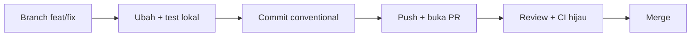

# Panduan Developer — Dari Nol sampai Kontribusi

Panduan ini menuntun **developer baru** dari laptop kosong sampai pull request (PR) pertama, lalu menjadi rujukan saat mengerjakan tugas sehari-hari. Bekal yang diasumsikan: React hooks dan TypeScript dasar. Arsitektur modular, dependency injection (DI), dan repositori terpisah (monorepo) dijelaskan saat kemunculan pertamanya. Padanan bahasa Inggris dari dokumen ini ada di `DEVELOPER-GUIDE.en.md`.

Dokumen tetangga:

| Dokumen | Isi | Kapan dibaca |
| --- | --- | --- |
| `ARCHITECTURE.md` | kenapa platform ini modular dan bagaimana tiap mekanismenya bekerja | saat ingin tahu "mengapa" |
| `CONTRACT.md` | aturan keras (wajib/dilarang); pelanggarannya membuat PR ditolak | sebelum dan saat menulis kode |
| `DEPLOYMENT-GUIDE.md` | build image, CI, dan deploy | saat akan merilis |

## Cara Pakai Panduan Ini

Panduan dibagi dua bagian:

- **Bab 0–4 — jalur belajar.** Baca berurutan. Setiap bab adalah satu unit praktik dengan hasil yang bisa diperiksa.
- **Bab 5–10 — referensi.** Buka saat butuh: konvensi, testing, troubleshooting, checklist PR, build image, dan contoh hidup.

Setiap bab jalur belajar memakai empat ikon:

| Ikon | Arti |
| --- | --- |
| 🎯 | tujuan bab — apa yang bisa Anda lakukan setelah menyelesaikannya |
| ✅ | checkpoint — cara memastikan bab ini benar-benar berhasil |
| ⚠️ | jebakan umum — kesalahan yang paling sering terjadi |
| 📖 | konsep — bab terkait di `ARCHITECTURE.md` untuk penjelasan "mengapa" |

Rujukan silang ditulis singkat: `ARCHITECTURE §4` berarti bab §4 di `ARCHITECTURE.md`; `CONTRACT §12.4` berarti §12.4 di `CONTRACT.md`; `GUIDE §3` berarti Bab 3 di dokumen ini.

### Prasyarat

| Kebutuhan | Cara |
| --- | --- |
| Node.js 22.x | `nvm install 22 && nvm use 22` (atau `fnm use 22`); verifikasi dengan `node -v` |
| npm 10+ | sudah ikut Node; verifikasi dengan `npm -v` |
| Git | `git --version`; set `git config user.name` dan `git config user.email` |
| React hooks + TypeScript dasar | bekal belajar; tidak ada setup khusus |
| Docker (opsional) | hanya untuk build image lokal di `GUIDE §9` |
| OS | macOS/Linux native; **Windows wajib WSL2** — script repo memakai `ln -sfn` dan path POSIX |

### Glosarium

Sembilan istilah ini akan sering muncul. Baca sekali; kembali ke sini saat lupa.

| Istilah | Arti singkat |
| --- | --- |
| **Container** | Shell aplikasi React: boot, config, DI, auth, routing host, layout, dan semua registry. Container tidak tahu isi modul. |
| **Module** | Paket fitur bisnis mandiri (`user-management`, `module-sample`) yang mendaftarkan halaman, menu, service, dan terjemahannya lewat `init(deps)`. |
| **Extension** | Paket customization satu klien (`web-extension-client-a`): mengisi slot, meng-override route, menambah service — tanpa mengubah modul. |
| **Slot** | "Lubang" bernama di UI yang disediakan modul (contoh `module-sample.overviewPanel`); extension mengisi komponen ke dalamnya. |
| **deps** | Satu objek berisi 13 layanan container (`config`, `logger`, `i18n`, `routes`, `slots`, …) yang diserahkan ke setiap `init(deps)`; satu-satunya kanal modul/extension ke container. |
| **manifest** | `manifest.json` di repo klien berisi identitas klien, `baseVersion` (pin persis ke versi base), daftar modul, dan override. |
| **base image** | Image Docker berisi container + modul, dibangun sekali oleh platform team; image klien dibangun `FROM` image base tersebut. |
| **override** | Tindakan extension mengganti route, label, atau logic milik modul. Urutan usaha: slot → route → service wrapper (mulai dari yang paling ringan). |
| **loader map** | File generated `moduleLoaders.generated.ts` berisi dynamic import tiap modul; nama di `config.modules` harus ada di sini, kalau tidak boot gagal (fail-fast). |

---

## Bab 0 — Dari Nol sampai Jalan

🎯 **Tujuan:** aplikasi berjalan di laptop Anda — halaman login tampil, menu sesuai daftar modul, dan console browser bersih.

### Langkah 1 — Siapkan Node 22 dan Git

```bash
nvm install 22 && nvm use 22   # atau: fnm use 22
node -v                        # harus v22.x
git --version
```

Semua repo memakai Node 22. Kalau `node -v` menunjukkan versi lain, dev server bisa gagal dengan error yang membingungkan.

### Langkah 2 — Dapatkan workspace

Ada dua situasi:

**A. Anda bekerja di workspace sample ini** (`modular-web-sample`, layout flat): semua folder sudah bersaudara — `web-container`, `web-modules`, `web-extension-client-a`, `web-extension-template`. Lewati langkah clone dan lanjut ke Langkah 3.

**B. Anda menyiapkan repo produksi:** clone repo base, lalu clone repo extension **di dalam** folder base:

```bash
mkdir -p ~/works/arsi && cd ~/works/arsi
git clone <repo-arsi-web-base> arsi-web-base
cd arsi-web-base
git clone <repo-arsi-web-client-a> web-extension-client-a
echo "web-extension-*/" >> .git/info/exclude   # clone extension tidak ikut ter-commit ke base
```

Extension harus berada **di dalam** folder base karena dua kontrak path dihitung relatif dari sana: symlink `web-container/current-client -> ../web-extension-client-a`, dan alias extension (`../web-container`, `../web-modules`).

### Langkah 3 — Install dependency (urutan penting)

```bash
(cd web-modules && npm ci)
(cd web-container && npm ci && CLIENT=client-a npm run link:client)
(cd web-extension-client-a && npm ci)
```

Urutan `web-modules → web-container → extension` penting: `web-modules` adalah workspace package yang di-resolve container, dan extension memakai keduanya. `CLIENT=client-a npm run link:client` membuat symlink `web-container/current-client` menunjuk ke `web-extension-client-a` — inilah "klien aktif". Ganti klien kapan saja dengan `cd web-container && CLIENT=<client> npm run link:client`.

Pakai `npm ci` (bukan `npm install`) karena lockfile di-commit dan harus dipatuhi persis. Jalankan ulang `npm ci` setelah `git pull` yang mengubah lockfile.

### Langkah 4 — (Opsional) Atur konfigurasi dev

```bash
cp web-container/.env.example web-container/.env
```

`.env` gitignored — aman untuk eksperimen lokal. Isinya:

| Env | Arti |
| --- | --- |
| `VITE_CLIENT` | klien aktif; opsional — kalau kosong, dev server memakai symlink `current-client` |
| `VITE_MODULES` | daftar modul yang di-init saat boot (CSV; default `user-management,product-management,module-sample`) |
| `VITE_API_BASE` | base URL API untuk service modul (contoh: `https://dummyjson.com`) |
| `VITE_ENABLE_AUDIT_LIVE` | feature flag untuk fitur audit |
| `VITE_CONFIG_JSON` | override penuh `/config.json` (JSON object); bila diisi, env lain di atas diabaikan |

Aturannya: env individual menimpa nilai dasar di `public/config.json`; `VITE_CONFIG_JSON` menang mutlak. Anda tidak perlu mengedit `public/config.json` per klien.

### Langkah 5 — Jalankan dev server

```bash
cd web-container
npm run dev          # http://localhost:5173
```

Dev server mencetak baris seperti `[dev] client=client-a (sumber: symlink); config.json digenerate dari env`. Pastikan kliennya sesuai. `predev` otomatis menjalankan `npm run gen:modules` (menyusun loader map); Anda tidak perlu menjalankannya manual.

✅ **Checkpoint Bab 0**

- [ ] `http://localhost:5173` menampilkan halaman login tanpa error di console browser.
- [ ] Setelah login, menu sidebar memuat tiga modul default: `user-management`, `product-management`, `module-sample`.
- [ ] Baris `[dev]` di terminal menunjukkan klien yang benar.

⚠️ **Jebakan umum Bab 0**

- **Tidak restart dev server** setelah mengganti klien atau menambah modul. Loader map dan symlink dibaca saat server start, bukan saat hot reload — hentikan (`Ctrl+C`) lalu jalankan `npm run dev` lagi.
- **Menambah modul tanpa generate loader map.** `predev`, `pretypecheck`, `pretest`, dan `prebuild` menjalankannya otomatis, tetapi setelah menambah modul di luar alur itu jalankan `npm run gen:modules`. Jangan pernah mengedit `moduleLoaders.generated.ts` manual — file generated.
- **Urutan install salah** (extension sebelum `web-modules`) membuat resolver gagal menemukan `@arsi/module-*`.
- **`VITE_CLIENT` berbeda dari symlink.** Config memakai `VITE_CLIENT`, tetapi extension yang dimuat tetap dari symlink; dev server memberi warning — samakan keduanya.

📖 **Konsep:** bagaimana config dibaca saat boot dan mengapa ia runtime, bukan build-time → `ARCHITECTURE §5–§6`.

---

## Bab 1 — Tur Codebase Berpemandu

🎯 **Tujuan:** Anda punya peta mental kode — tahu folder mana untuk apa, dari mana boot dimulai, dan di mana modul/extension mendaftarkan sesuatu.

### Langkah 1 — Kenali folder penting

| Folder / file | Isi | Peran Anda |
| --- | --- | --- |
| `web-container/` | Shell: boot (`src/bootstrap/`), `deps` (`src/di/`), routing host, layout, registry | hampir selalu **hanya baca** (perubahan = diskusi lead) |
| `web-modules/shared/` | UI kit dan util bersama (`@arsi/shared`) | pakai; boleh menambah komponen |
| `web-modules/modules/<name>/` | Satu fitur bisnis: halaman, hook, service, store, i18n | tempat menambah/mengubah fitur (`GUIDE §3`) |
| `web-extension-client-a/` | Extension milik klien aktif | tempat menulis kebutuhan khusus klien (`GUIDE §4`) |
| `web-extension-template/` | Template repo klien baru | disalin saat membuat klien baru |
| `web-extension-default/` | Extension no-op untuk menjalankan base tanpa klien | baca saja |
| `docs/` | `ARCHITECTURE`, `CONTRACT`, dan panduan ini | rujukan |

### Langkah 2 — Baca modul paling ringkas: `module-sample`

Buka `web-modules/modules/module-sample/index.tsx` (55 baris). Ini contoh modul paling sederhana, tetapi seluruh mekanismenya ada. Bagian pentingnya:

| Baris | Yang dilakukan |
| --- | --- |
| `:14` | `init(deps)` — satu-satunya titik masuk modul; container memanggilnya saat boot |
| `:20-21` | mendaftarkan terjemahan (i18n) namespace `module-sample` |
| `:23-27` | membuat axios client lalu mendaftarkannya sebagai service bernama `module-sample` |
| `:29-34` | mendaftarkan item menu sidebar |
| `:36-48` | mendaftarkan route halaman (`deps.routes.add`) |
| `:50` | mendaftarkan modal |
| `:52-54` | berlangganan event lintas modul |

Polanya selalu sama: **mendaftar, bukan membangun**. Modul tidak membuat router, i18n, atau query client sendiri — ia memanggil `deps.*.register(...)`, lalu container yang menyusun UI setelah semua `init` selesai.

### Langkah 3 — Baca extension: `web-extension-client-a/src/index.tsx`

Extension punya bentuk yang sama (`init(deps)` di `:32`), tetapi isinya *penyesuaian* terhadap yang sudah ada:

- `:38-54` — menambah/menimpa bundle i18n, termasuk label menu `user-management` menjadi "Pengguna Client A".
- `:56-60` — mendaftarkan service khusus klien dengan prefix nama klien: `client-a.audit`.
- `:62` — mengisi slot tabel user (`userSlots.userTableActions`) dengan tombol audit.
- `:64-67` — meng-override route `/users/:id` — dengan guard `deps.routes.has` agar aman bila modulnya tidak aktif.
- `:70` — mengisi slot `sampleSlots.overviewPanel` dengan `ClientASamplePanel`.
- `:78-81` — bereaksi terhadap event `userEvents.updated`.

Perhatikan: extension selalu **memakai** yang sudah ada (route modul, slot modul, public API modul). Tidak ada satu pun baris di sini yang mengubah file modul.

### Langkah 4 — Simpan peta "mulai dari mana"

| Ingin melihat... | Buka |
| --- | --- |
| Titik masuk aplikasi dan urutan boot | `web-container/src/main.tsx:11` |
| Kontrak `deps` (13 layanan) | `web-container/src/di/deps.ts:23` |
| Contoh modul lengkap | `web-modules/modules/module-sample/index.tsx:14` |
| Contoh extension klien | `web-extension-client-a/src/index.tsx:32` |

✅ **Checkpoint Bab 1**

- [ ] Tanpa membuka guide, Anda bisa menjawab "di mana route didaftarkan?" dan menemukan `deps.routes.add` di `web-modules/modules/module-sample/index.tsx:36`.
- [ ] Anda bisa membedakan peran modul ("menyediakan fitur") dan extension ("menyesuaikan untuk klien").
- [ ] Anda tahu extension hanya boleh mengimpor **public API** modul (`public.ts`), bukan file internalnya.

⚠️ **Jebakan umum Bab 1**

- **Membaca seluruh `web-container/` lebih dulu.** Mulailah dari `module-sample` lalu `client-a`; container dibaca sesuai kebutuhan.
- **Mengira modul saling mengenal.** Modul tidak boleh mengimpor modul lain; komunikasi lewat event bus (`CONTRACT §13`).
- **Mencari daftar modul yang di-hardcode.** Tidak ada — modul ditemukan dari `config.modules` lewat loader map.
- **Menyentuh file internal modul dari extension.** Yang boleh diimpor extension hanya `public.ts` modul (`CONTRACT §1.4`).

📖 **Konsep:** model mental dan semua mekanisme sambungan → `ARCHITECTURE §3–§5`; aturan dependensi lengkap → `ARCHITECTURE §9` dan `CONTRACT §1`.

---

## Bab 2 — Perubahan Pertama Anda

🎯 **Tujuan:** PR pertama — satu perubahan kecil di extension `client-a`: satu teks i18n dan satu komponen slot, lengkap dengan test, commit, dan deskripsi PR.

Contoh memakai extension `client-a` karena perubahan khusus klien tidak menyentuh kode modul. Jalankan semua perintah dari `web-extension-client-a/`, kecuali disebut lain.

### Langkah 1 — Buat branch

```bash
git checkout -b feat/client-a-panel-copy
```

Buat branch dari branch utama repo yang tepat: override klien di repo extension; modul/shared/container di repo base. Penamaan: `feat/<ringkas>` atau `fix/<ringkas>`.

### Langkah 2 — Ubah satu teks i18n

Buka `web-extension-client-a/src/i18n/id.json` dan ubah judul panel:

```json
"panelTitle": "Panel Klien A",
```

Ubah juga `en.json` (`"panelTitle": "Client A panel"`) agar paritas bahasa terjaga. Extension menambahkan terjemahan lewat `deps.i18n.addResourceBundle` (`src/index.tsx:38-39`) ke namespace `client-a`; komponen membacanya dengan `useTranslation('client-a')`.

### Langkah 3 — Ubah satu komponen slot

Komponen `web-extension-client-a/src/components/ClientASamplePanel.tsx` dirender di slot `module-sample.overviewPanel` — didaftarkan extension di `src/index.tsx:70`, sedangkan nama slot dideklarasikan modul di `web-modules/modules/module-sample/slots.ts:2`.

Tambahkan satu baris di akhir `Card`:

```tsx
<p className="mt-2 text-xs text-muted-foreground">{t('sample.panelFooter')}</p>
```

lalu tambahkan key barunya di kedua file i18n:

```json
"panelFooter": "Dikelola khusus untuk Client A."
```

Simpan, lalu buka `http://localhost:5173/module-sample` — panel di kartu "module-sample.overviewPanel" berubah tanpa satu pun file modul disentuh. Itulah gunanya slot.

### Langkah 4 — Jalankan test, typecheck, dan lint

```bash
cd web-extension-client-a
npm test
npm run typecheck
npm run lint
```

Jalankan perintah yang sama di repo tempat Anda mengubah kode (`web-modules`, `web-container`, atau extension). Pastikan ketiganya lulus sebelum commit.

### Langkah 5 — Commit dengan conventional commit

```bash
git add src/i18n/id.json src/i18n/en.json src/components/ClientASamplePanel.tsx
git commit -m "feat(client-a): add panel footer copy"
```

Aturan commit: `feat(<scope>): ...` untuk fitur, `fix(<scope>): ...` untuk perbaikan. `scope` = modul atau klien yang diubah. Satu commit satu tujuan — jangan campur refactor dengan fitur.

### Langkah 6 — Push dan buka PR

```bash
git push -u origin feat/client-a-panel-copy
```

Lalu buka PR ke repo yang tepat (base branch `main`): perubahan override klien → repo extension; perubahan modul/shared/container → repo base. Deskripsi PR minimal berisi: apa yang berubah, kenapa, dan cara memverifikasi (mis. "buka `/module-sample`, lihat footer panel"). Checklist lengkap ada di `GUIDE §8`.



✅ **Checkpoint Bab 2**

- [ ] PR berisi satu perubahan kecil dengan deskripsi yang menjelaskan apa, kenapa, dan cara verifikasi.
- [ ] Test, typecheck, dan lint lulus di repo terkait.
- [ ] `git status` bersih dari file yang tidak sengaja (`.env`, symlink `current-client`, `node_modules`).

⚠️ **Jebakan umum Bab 2**

- **Commit file yang tidak boleh** — `.env`, symlink `current-client`, atau `node_modules` (semuanya gitignored; kalau muncul, jangan `git add -f`).
- **Lupa memperbarui `en.json`** sehingga bahasa Inggris kehilangan teks.
- **Mengubah kode modul dari repo extension.** Kebutuhan klien diselesaikan lewat slot/route/service wrapper; perubahan modul dikirim sebagai PR ke repo base.
- **Commit besar bercampur** atau pesan tidak deskriptif, sehingga review dan rollback sulit.
- **Force-push ke branch bersama** setelah review dimulai — cukup tambah commit baru.

📖 **Konsep:** mengapa extension cukup mengisi slot dan meng-override tanpa menyentuh modul, serta tiga tingkat override → `ARCHITECTURE §4` dan `ARCHITECTURE §7`.
